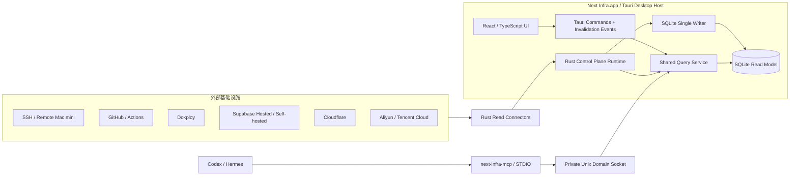

# RFC-0001：Next Infra 单机 Tauri 控制平面架构

**作者：** Maintainer / Codex  
**状态：** Draft（草案）  
**最后更新：** 2026-08-02

## 1. 背景

个人基础设施分散在云主机、远程 Mac mini、GitHub 仓库与 Actions、Dokploy、Supabase、Cloudflare、阿里云和腾讯云中。各系统拥有独立的资源身份、权限模型、状态语义和 API，难以回答以下跨平台问题：

- 当前有哪些资源，哪些已经失联或长期未刷新？
- 某个 GitHub 仓库通过哪条工作流部署到哪台主机？
- 某个域名、Dokploy Application、Supabase 实例和云主机如何关联？
- 最近发生了哪些真实基础设施变化？
- Hermes 或 Codex 如何在不直接获得所有厂商凭据的情况下查询这些信息？

项目首版面向单个 macOS 用户，以本机自托管方式运行。用户已经明确选择 Tauri v2 与 React/TypeScript，并要求先完成高可视化查看能力，再另行设计操作能力。

## 2. 问题陈述

项目必须统一呈现异构资源，但不能把不同厂商强行压缩成一个最低公共 CRUD 模型，也不能让 Desktop UI、MCP 和每个 Connector 分别实现一套查询逻辑。

本机单实例与服务器团队平台的最优架构不同。PostgreSQL、独立认证服务、远程 MCP 网关、多进程队列和浏览器 HTTP 控制台会引入没有实际收益的部署与攻击面。另一方面，单纯把全部逻辑写入 Tauri Command 又会让领域核心、窗口生命周期和 WebView 框架耦合，难以独立测试和演进。

因此需要同时满足：

- Tauri 是首版产品宿主，而不是领域边界。
- UI 关闭后，采集和 MCP 查询仍然可用。
- SQLite 只能由一个 Control Plane Runtime 管理。
- React、MCP 都复用同一个 Query Service。
- 前端不能直接访问 SQLite、Keychain、SSH 和 Provider SDK。

## 3. 已确认约束

- 单实例、单用户、本机自托管。
- 首个受支持平台为当前 arm64 macOS。
- Desktop 使用 Tauri v2 + React/TypeScript。
- Core、Store、Sync、Connector 与 Query Service 使用 Rust，且不依赖 Tauri。
- SQLite 是首版本地存储。
- Codex/Hermes 使用只读 STDIO MCP。
- 首版不开放 loopback HTTP API、浏览器 UI 或远程 MCP。
- 第一阶段不修改外部基础设施。

## 4. 目标

1. 建立统一、带来源和时间语义的基础设施资源图。
2. 通过 Tauri Desktop UI 提供 Inventory、Topology、Timeline 和 Connector Health 视图。
3. 通过稳定、紧凑、只读的 MCP 工具供 Hermes 与 Codex 查询。
4. 让 Desktop UI 与 MCP 复用同一个 Rust Query Service 和响应边界。
5. 让主窗口关闭后，Control Plane Runtime 继续在托盘中同步和服务 MCP。
6. 新增 Connector 时不修改核心查询语义。
7. 明确数据新鲜度、同步覆盖和推断关系，避免把未知状态显示成事实。
8. 对本机磁盘、秘密、IPC 和外部 API 权限采取保守默认值。

## 5. 非目标

- 多用户、团队、租户、RBAC、SSO 或公网访问。
- 首版浏览器 UI、localhost HTTP API 或远程 Streamable HTTP MCP。
- 替代 Terraform/OpenTofu 的期望状态管理。
- 替代 Prometheus、Grafana、Loki 或厂商监控平台。
- 长期保存完整日志、指标、工件和未经清洗的 Provider 响应。
- 首版写入、重启、部署或删除外部资源。
- 首版动态加载第三方二进制插件。
- 自动把名称、IP 相似的资源无条件合并。
- 因使用 Tauri 而把领域逻辑放入 UI Command handler。

## 6. 术语和组件边界

本节只摘要主要组件；完整规范名称、状态和值域见[术语表](./glossary.md)。

### 6.1 Desktop Host

`Next Infra.app`，即 Tauri 应用进程。它负责：

- macOS App 生命周期、单实例、主窗口和托盘。
- 启动和持有 Control Plane Runtime。
- 注册受限 Tauri Commands。
- 把低频状态失效事件发送给 React UI。
- 提供自动登录启动、系统通知和显式退出入口。

Desktop Host 不是领域层，也不直接实现 Provider 业务规则。

### 6.2 Control Plane Runtime

不依赖 Tauri 的 Rust 运行时，负责：

- 调度与同步生命周期。
- Connector 管理、限流、清洗和标准化。
- SQLite 单写入者和只读查询。
- 统一 Query Service。
- Unix Domain Socket 本地 RPC。
- 日志、维护、备份和睡眠恢复。

它由 Desktop Host 承载，但应能在 Rust 集成测试中独立启动。

### 6.3 Desktop Adapter

一组薄 Tauri Command/Event adapter：

- Command 将已验证参数转换为 Query Service 或本地配置请求。
- Command 不包含 SQL、Provider SDK 调用和业务判断。
- Event 只表示“某类数据已变化”，不是权威状态载荷。
- UI 收到 Event 后通过 Command 重新读取版本化快照。

### 6.4 MCP Bridge

独立的 `next-infra-mcp` 可执行文件。它通过 STDIO 与 Codex/Hermes 通信，再通过 Unix Domain Socket 查询当前用户的 Desktop Host。

MCP Bridge 不打开 SQLite、不读取 Keychain、不运行 Connector，也不承载后台调度。

## 7. 总体架构

下图给出最小总览；进程所有权、Runtime 内部结构、同步路径、查询汇合和生命周期见[结构图](./architecture-diagrams.md)。



## 8. Desktop Host 生命周期

### 8.1 单实例

- 同一用户只允许一个 Desktop Host 持有 SQLite 和 Unix Socket。
- Tauri 单实例能力负责把第二次桌面启动转发给现有实例并显示主窗口。
- 第二实例转发的参数、deep link 和文件路径均视为不可信；首版只接受“激活现有窗口”或固定后台启动意图，不把转发载荷解释为查询、配置或操作。
- SQLite 文件锁和 Socket owner 校验是第二层防护，不能只依赖 UI 单实例插件。
- MCP Bridge 是短生命周期客户端进程，不计入 Desktop Host 单实例。

### 8.2 启动

启动顺序：

1. 获取应用实例锁。
2. 验证数据目录和权限。
3. 打开 SQLite，执行兼容性自检和已批准 migration。
4. 启动 Writer、Query Service、Socket 和 Scheduler。
5. 注册 Tauri Commands/Events。
6. 根据启动模式显示窗口或仅驻留托盘。

自动登录启动应由用户显式启用。后台启动使用无主窗口模式，避免每次登录打断用户。

### 8.3 关闭窗口

- 关闭主窗口只隐藏现有窗口，不销毁 WebView，也不退出 Desktop Host。
- Control Plane Runtime、SQLite、Scheduler 和 Unix Socket 继续运行。
- 再次点击 Dock、托盘或启动应用时恢复主窗口。
- React UI 重新打开后必须从 Query Service 获取当前快照，不依赖之前内存状态。

### 8.4 显式退出

只有菜单中的“退出 Next Infra”或系统终止事件才进入关闭流程：

1. 停止接收新同步和新的本地变更。
2. 取消或限时等待活动 Connector 请求。
3. 排空 Writer 队列。
4. 提交 SyncRun 最终状态并执行受控 WAL checkpoint。
5. 关闭 Unix Socket、SQLite 和日志。

显式退出在关闭 Socket 前写入 `user_quit` 自动拉起抑制标记。该标记跨后续 MCP Bridge 进程生效，只能由用户主动启动 Desktop App，或已经由用户启用的下一次登录自动启动清除；MCP 自动拉起不能清除它。操作系统关机、崩溃和升级重启不写入该标记。

退出是用户可见操作，不在后台静默重启应用。

### 8.5 睡眠与唤醒

本机睡眠期间无法保证轮询。Runtime 必须：

- 用 wall-clock 与 monotonic 差值识别长时间暂停。
- 唤醒后先更新 Freshness，不把未执行轮询解释为资源故障。
- 对 Connection 错峰执行一次 catch-up，而不是同时补跑所有错过周期。
- 遵守原有 rate limit 和退避，不按错过次数重复执行。

### 8.6 崩溃恢复

- WAL 和事务保证只暴露已提交批次。
- 启动时把遗留 `running` SyncRun 标记为 interrupted，而非 succeeded/failed。
- cursor 只在事务提交后前移。
- 不把 WebView reload 当成 Runtime 重启。

## 9. React/Tauri 交互

### 9.1 Commands

React 使用受限 Tauri Commands 执行：

- 有界资源查询。
- Topology、Timeline、Connector Status 查询。
- 本地 Connection 配置管理。
- 用户触发的本地同步。
- Secret 一次性提交给 Rust/Keychain。

每个 Command 都必须有：

- 明确输入 DTO 和大小限制。
- 明确输出 DTO 和 schema version。
- 参数验证与错误清洗。
- Tauri capability/allowlist 限制。
- 对应 Query Service 测试。

Query DTO 以 Rust 契约为权威，并在构建阶段生成或校验 TypeScript binding；禁止在 React 中手工维护一份可能漂移的同名 schema。耗时操作不能阻塞 WebView：例如手动同步 Command 只负责入队并返回 `sync_run_id`，进度由查询和失效通知驱动。

### 9.2 Events

Tauri Events 只发送低频失效通知，例如：

```text
resources_changed
sync_status_changed
connection_health_changed
```

Event 只包含版本号或最小 scope，不携带完整资源列表。UI 收到 Event 后重新调用 Query Command。这样不会依赖 Event 顺序、避免丢事件导致错误状态，也不会复制 MCP 与 UI 的查询语义。

### 9.3 UI 页面

首版页面：

1. Overview：异常、过期数据、失败 Workflow、不可达主机。
2. Inventory：资源搜索、过滤、分组和新鲜度。
3. Topology：以一个资源为中心的有界关系图。
4. Resource Detail：摘要、关系、版本、Change、来源。
5. Timeline：跨平台结构化变化。
6. Connectors：同步状态、覆盖范围、权限和错误。
7. Settings：非秘密配置、秘密录入、自动启动和数据保留策略。

React 组件测试可以在浏览器式测试环境中使用 Mock Desktop Adapter；真实 Desktop 验收必须启动 Tauri App，不能仅以 Vite 页面通过代替。

页面信息层级、视觉编码、Topology 展开规则和所有数据状态由[界面与可视化设计](./visualization-and-interaction.md)约束。首个 UI 纵切必须使用 Fixture 数据验证有界 Topology，不能把项目最具辨识度的可视化推迟到所有真实 Connector 完成以后。

## 10. Agent 接入

```text
Codex / Hermes
    -> 启动 next-infra-mcp
    -> STDIO MCP
    -> 私有 Unix Domain Socket
    -> Desktop Host / Query Service
```

规则：

- 用户安装 Codex/Hermes 集成时，显式选择是否允许 MCP Bridge 启动 Desktop Host；该授权是本地集成设置，不由 Agent 参数控制。
- Bridge 启动时若 Socket 不存在且已授权，只能通过冻结的可信 App Bundle 路径后台启动唯一 Desktop Host，并在有限时间内等待 Socket。
- Bridge 不能自行承载 Control Plane Runtime，也不能启动参数提供的任意可执行路径。
- 未授权、启动失败或超时返回结构化 `host_unavailable`。
- 发现有效 `user_quit` 抑制标记时，即使之前授予过自动拉起权限，Bridge 也返回 `host_unavailable`；新建 Bridge 进程不得绕过该标记。
- 已连接的 Desktop Host 被用户显式退出后，Bridge 不循环重新拉起应用。
- Bridge 与 Host 执行协议版本握手；不兼容时返回升级指引。
- Bridge 的稳定安装路径和随 App 更新策略必须在 Goal 1 冻结前确定。
- 远程 Streamable HTTP MCP 不进入首版。

## 11. 本地存储

SQLite 是单机事实投影和有限历史存储。运行约束：

- WAL mode。
- foreign keys on。
- busy timeout。
- 一个串行 Writer。
- 只读查询连接。
- 同步批次单事务提交。
- 定期 passive checkpoint，显式退出前执行受控 checkpoint。

资源未发生语义变化时不产生新版本，只更新最后观察时间。默认不保存原始 Provider JSON，只保存字段白名单化后的规范化属性。

Desktop Adapter 和 MCP Bridge 都不能持有数据库连接。详细语义见[资源与存储模型](./resource-and-storage-model.md)。

## 12. Connector 扩展

首版 Connector 与主程序一起编译。每个 Connector 声明：

- 支持的资源类型与 schema version。
- 认证方式和所需最小权限。
- 全量、增量和分页能力。
- 敏感字段清洗规则。
- 速率限制与建议同步频率。
- 关系发现能力。
- 覆盖范围和不支持项。

运行时插件只有在第三方独立发布 Connector 的真实需求出现后再设计。Rust 动态库 ABI 不作为扩展基础；未来更适合进程外协议或 WASI。

详细契约见[连接器与同步契约](./connector-and-sync-contract.md)。

## 13. 本地目录、凭据和权限

推荐使用系统目录解析库获得以下逻辑位置：

```text
Application Support/next-infra/
  next-infra.db
  backups/
  logs/
  run/
    control.sock
```

要求：

- 应用目录权限为当前用户独占。
- 数据库、备份、日志和 Socket 不允许其他本地用户读取。
- Secret 不进入上述目录，只保存 Keychain item 引用。
- React 只能通过受限 Command 一次性提交 Secret，不能读取已保存值。
- 导出功能默认移除内部属性、路径和 SecretRef。
- WebView 禁止加载远程应用代码，外部链接通过受控 opener 交给系统浏览器。

## 14. 推荐工程边界

以下只是未来工程布局，不代表本轮创建代码：

```text
crates/
  next-infra-core/          # 领域模型与端口
  next-infra-store/         # SQLite 与 migration
  next-infra-sync/          # Scheduler、Writer、diff
  next-infra-query/         # Shared Query Service
  next-infra-connectors/    # 编译期 Connector
  next-infra-local-rpc/     # Unix Socket 协议
  next-infra-mcp/           # MCP Server 逻辑
apps/
  desktop/                  # Tauri v2 + React/TypeScript
  mcp-bridge/               # STDIO 可执行文件
```

Tauri Command handler 位于 `apps/desktop`，只能调用 `next-infra-query` 或明确的本地配置 service。Core crate 禁止依赖 Tauri 类型。

## 15. 优势

- 产品形态符合单机个人基础设施控制台，而不是本地服务器网页。
- React 通过 Tauri IPC 访问 Rust，不需要 localhost HTTP、CORS、Cookie 或 CSRF。
- 托盘常驻和自动启动解决窗口关闭后继续同步与服务 MCP 的需求。
- UI、MCP 共享 Query Service，不产生语义漂移。
- MCP Bridge 不接触 SQLite 与 Provider Secret。
- SQLite 和变化时存版本符合当前磁盘空间条件。
- Core 与 Tauri 解耦，仍可独立测试或以后增加 headless host。

## 16. 劣势与风险

- Tauri 增加 App Bundle、签名、公证、更新和 WebView 生命周期工作。
- Desktop Host 退出或崩溃时，UI 和 MCP 同时不可用。
- MCP Bridge 是第二个发布物，需要稳定安装路径和版本协商。
- 自动登录启动、托盘和窗口关闭语义必须进行真实 macOS 验收。
- SQLite 单写入者要求 Connector 不能直接写库。
- 本机睡眠会造成采集间隔，系统必须明确显示 Freshness。
- 恶意的同用户本地进程不在完整防御范围内。
- SSH 即使只读也属于远程命令执行，必须固定探针并禁止模型传入命令。
- 跨平台关系无法完全自动发现，人工 Binding 和证据展示是必需能力。
- Hermes 当前未安装，协议设计不能替代真实验收。

## 17. 替代方案考量

### 17.1 Rust daemon + 浏览器 UI

可以让后台服务与窗口完全独立，但需要 loopback HTTP、浏览器安全边界和额外的进程安装管理。当前产品明确为本机单用户桌面控制台，因此 Tauri Host 更贴合需求，不采用该方案作为首版默认。

### 17.2 Tauri Command 直接承载全部逻辑

代码量最少，但领域、数据库和 Connector 会与 Tauri 宏和窗口生命周期耦合。采用独立 Control Plane Runtime 和薄 Desktop Adapter。

### 17.3 Tauri UI + 独立常驻 daemon

可以获得更强崩溃隔离，但形成两个长期进程、两套启动和升级生命周期。首版由 Tauri Host 承载 Runtime；只有真实隔离需求出现后再拆分。

### 17.4 MCP Bridge 直接读取 SQLite

会绕过 Query Service、写入所有权、缓存和版本兼容，并增加多进程锁问题。Bridge 必须通过本地 RPC 查询 Desktop Host。

### 17.5 PostgreSQL + Docker Compose

适合多人服务、横向扩展和高并发写入，但当前单用户本机模式不需要这些能力，因此不采用。

### 17.6 图数据库

资源关系查询适合图模型，但本地规模可以用 SQLite 关系表和递归查询满足。首版不引入独立图数据库。

## 18. 未决问题

以下问题不阻塞本轮文档 Review，但必须在 Goal 1 开始前或对应目标前确认：

1. `next-infra-mcp` 在 App Bundle、用户级 bin 目录或独立安装包中的稳定路径。
2. Desktop App 与 MCP Bridge 的原子升级和协议兼容策略。
3. 自动登录启动默认关闭、首次引导推荐开启，还是默认开启并允许关闭；它与 MCP 的受控自动拉起授权必须分开设置。
4. macOS 首版采用本地开发签名、Developer ID，还是在发布阶段再加入公证。
5. Keychain item 的稳定命名、访问控制和后台启动时的可用性策略。
6. Tauri 与插件具体版本的固定策略。
7. 首批真实 Connector 是否按 GitHub/Actions、SSH、Dokploy、Cloudflare 顺序实施。
8. 是否把本机自身作为 `local.host` 纳入首版。
9. 默认历史保留期和 1 GiB 软预算是否需要进一步缩小。
10. Hermes 何时安装，以便安排真实 MCP 兼容性验收。

## 19. 设计验收标准

- Tauri 是 Desktop Host，Core/Store/Sync/Query 不依赖 Tauri。
- 关闭窗口不停止 Runtime；显式退出具有可验证的优雅关闭流程。
- 同一用户只有一个 Runtime 持有 SQLite 和 Unix Socket。
- React 通过薄 Command adapter 查询；Event 只通知失效，不传递权威状态。
- MCP Bridge 通过 Unix Socket 复用 Query Service，不直接读取 SQLite/Keychain。
- 首版不存在 loopback HTTP API、浏览器 UI 和远程 MCP 依赖。
- 外部写操作不属于首版 Connector 接口。
- 凭据、原始响应、日志和历史数据都有明确边界。
- 同步覆盖不足时不会把缺失资源误判为删除。
- 睡眠、唤醒、崩溃、受控自动拉起、显式退出抑制和 App 不可用都有明确语义。
- 后续实施目标串行、有依赖且可独立验证。

## 20. 外部参考

- [Tauri：Calling Rust from the Frontend](https://v2.tauri.app/develop/calling-rust/)
- [Tauri：Autostart](https://v2.tauri.app/plugin/autostart/)
- [Tauri：Features and Plugins](https://v2.tauri.app/plugin/)
- [Codex MCP](https://developers.openai.com/codex/extend/mcp)
- [Hermes Agent MCP](https://github.com/nousresearch/hermes-agent/blob/main/website/docs/user-guide/features/mcp.md)
- [Model Context Protocol Rust SDK](https://github.com/modelcontextprotocol/rust-sdk)
