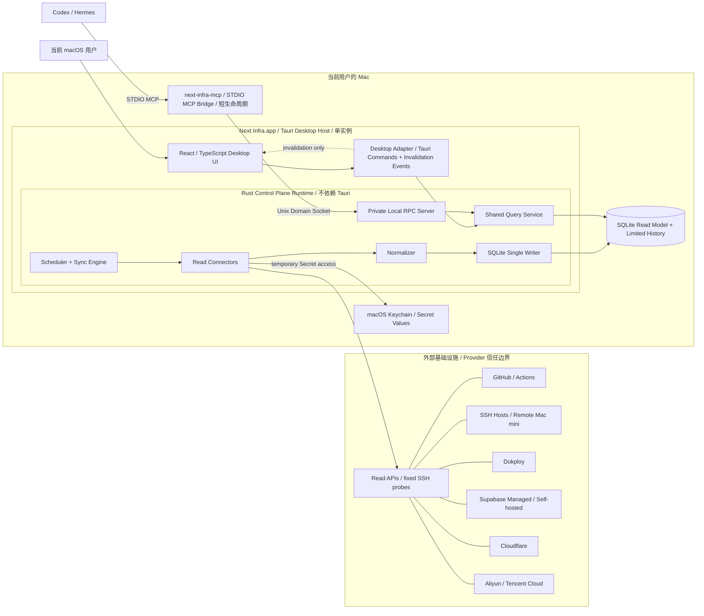
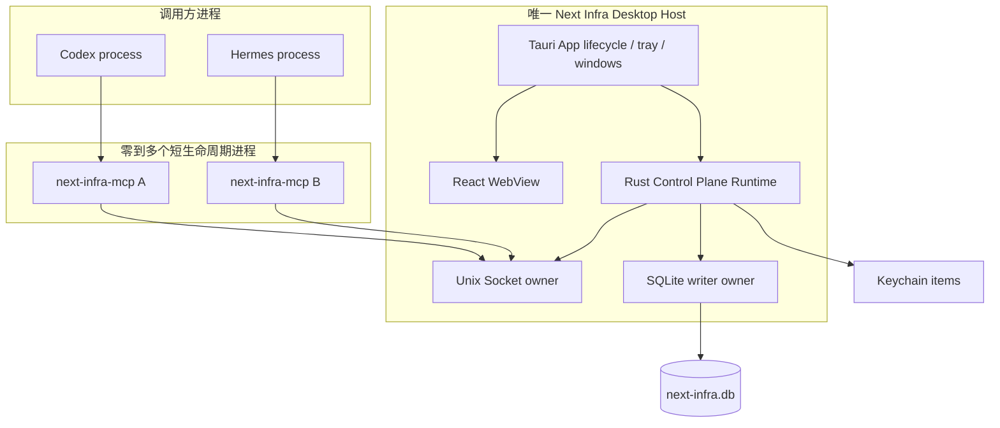
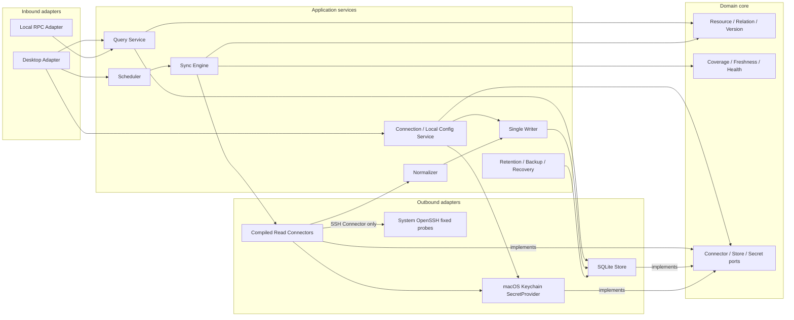
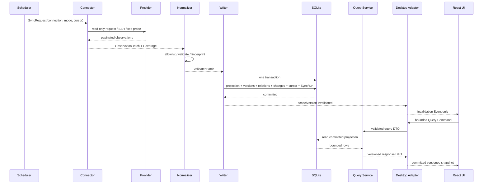
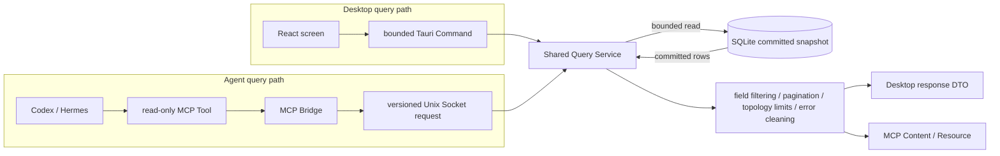
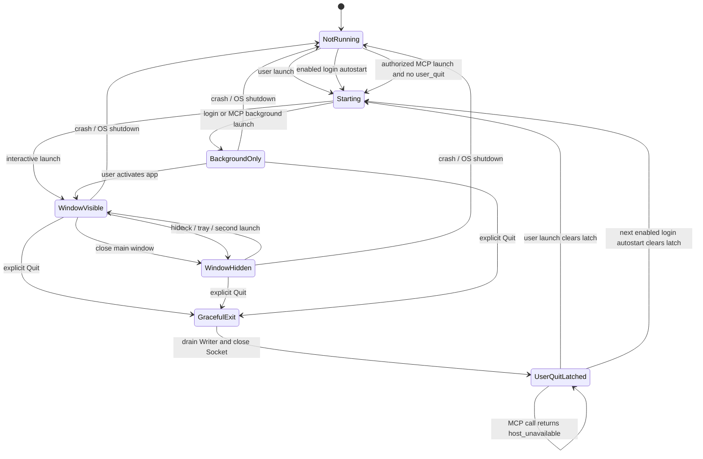
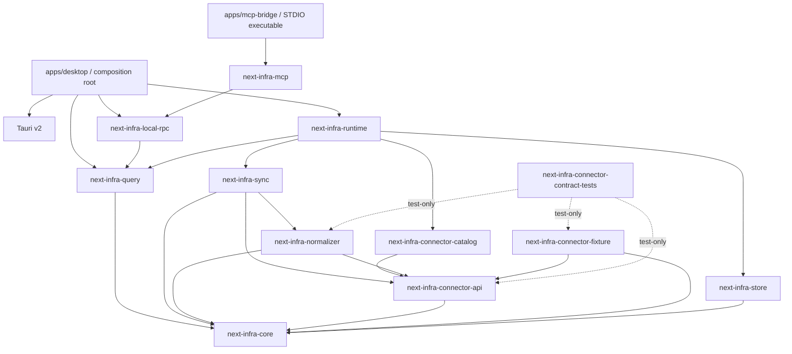

# Next Infra 结构图

**状态：** Draft（与 RFC-0001 同步）  
**范围：** 首版单机 Tauri 架构的系统上下文、运行时组件、读写路径和生命周期

本文是 [RFC-0001](./RFC-0001-single-node-architecture.md) 的可视化投影。RFC 负责解释决策与约束；本文负责让组件所有权、进程边界和调用方向一眼可见。若两者冲突，以 RFC 为准并同步修正本文。

规范术语见[术语表](./glossary.md)。图中的箭头表示调用或数据方向，不表示所有节点都必须成为独立进程或 Rust crate。

## 1. 一图总览



从这张图应直接读出五个结论：

1. 只有 Desktop Host 是 Next Infra 的长生命周期应用实例。
2. Tauri 负责宿主与适配，不定义领域模型、同步或查询语义。
3. React 与 Agent 最终进入同一个 Query Service。
4. MCP Bridge 不读取 SQLite、Keychain，也不运行 Connector。
5. 外部 Provider 只通过只读 Connector 进入首版系统。

## 2. 进程与所有权边界



所有权规则：

- 同一用户只有一个 Desktop Host、一个 Control Plane Runtime、一个 Socket owner 和一个 SQLite Writer。
- 可以同时存在多个 MCP Bridge，但它们只是本地查询客户端。
- 操作系统可能为 WebView 创建辅助进程；它们不算第二个 Desktop Host，也不能拥有 SQLite、Socket 或 Keychain 访问边界。
- 第二次启动 Desktop App 只激活现有实例，不能创建新的 Runtime。

## 3. Runtime 组件结构



边界规则：

- Inbound adapter 只做传输、参数校验、DTO 转换和错误清洗。
- Application service 编排用例，但不把 Provider 特性塞进通用查询协议。
- Domain core 不依赖 Tauri、MCP、SQLite、Keychain 或具体 Provider SDK。
- Outbound adapter 实现 Core 定义的端口；Connector 不能直接持有数据库写连接。
- 本图是逻辑依赖约束，具体 crate 切分在 Goal 1 冻结。

## 4. 同步写入与 UI 失效路径



关键约束：

- Event 不携带权威资源列表，只告诉 UI 哪一类查询已经失效。
- UI 和 MCP 永远只读取已提交快照，不观察半个同步批次。
- cursor 与 SyncRun completion 必须和资源投影在同一事务中提交。
- 未变化资源只更新 `last_seen_at`，不制造新 ResourceVersion。

## 5. Desktop 与 Agent 查询汇合



“共享查询服务”不代表 Desktop DTO 与 MCP Content 必须逐字相同；两者可以有不同传输投影，但字段语义、Freshness、Coverage、分页和硬上限必须来自同一 Query Service。

## 6. Desktop Host 生命周期



- 关闭窗口是隐藏，不是退出。
- single-instance plugin 必须最先注册；BackgroundOnly 初始不创建 WebView，登录启动和 MCP 启动都不能把参数当授权。
- `user_quit` 只由显式退出写入；崩溃、关机和升级重启不写入。
- MCP 自动拉起不能清除 `user_quit`。
- 崩溃恢复依靠 WAL、事务、interrupted SyncRun 和 cursor 提交规则，而不是假装上次同步成功。
- 完整事件映射与验收矩阵见 [`DEC-G1-02`](./decisions/DEC-G1-02-desktop-lifecycle.md)。

## 7. Goal 1 工程依赖方向

以下依赖方向与 package 边界已由 [`DEC-G1-01`](./decisions/DEC-G1-01-toolchain-and-crates.md) 冻结：



禁止方向：

```text
core/store/sync/query/runtime/local-rpc/mcp/connector-* -> Tauri
React -> SQLite / Keychain / Provider SDK / system shell
MCP Bridge -> SQLite / Keychain / Connector
Connector -> SQLite writer
```

`apps/mcp-bridge` 是独立 Cargo package 和 `next-infra-mcp` binary；它不得成为 Tauri sidecar、Desktop binary target 或 App Bundle 内容。

## 8. 图的变更规则

- 新增长生命周期进程、网络监听端口、数据库 owner 或信任边界时，必须先修改 RFC，再修改本文。
- 新增 Connector 通常只扩展 Provider 与 Outbound adapter，不应改变 Desktop/MCP 查询汇合点。
- 新增写操作必须进入独立 RFC；不得把只读箭头悄悄改成双向控制箭头。
- 图中术语必须来自[术语表](./glossary.md)，不得为同一组件创建新的别名。
