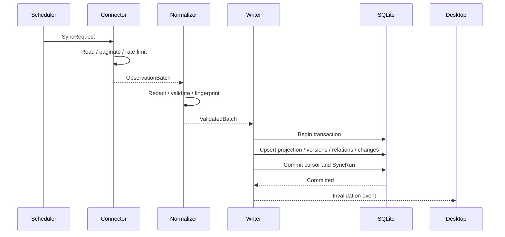

# Connector 与同步契约

本文定义只读 Connector 的责任、输入输出、同步生命周期、并发边界、错误模型和首批 Provider 覆盖顺序。

## 1. Connector 的责任边界

Connector 负责：

- 验证 Connection 非秘密配置和 SecretRef 可用性。
- 按 Provider 规则执行只读请求、分页、游标、退避和限流。
- 把 Provider 响应转换为规范化资源与关系候选。
- 在返回 Core 前清除秘密和高风险字段。
- 声明同步覆盖范围和任何不完整原因。
- 输出稳定外部 ID、Provider 状态和观察时间。

Connector 不负责：

- 直接写 SQLite。
- 决定跨 Connector 资源是否合并。
- 生成全局 Change、Tombstone 或健康聚合。
- 把任意命令暴露给 UI、CLI 或 Agent。
- 在首版调用外部写 API。
- 持久化明文凭据或原始 Provider 响应。

## 2. 概念接口

以下是契约示意，不是本轮需要实现的 Rust 代码：

```rust
trait ReadConnector {
    fn descriptor(&self) -> ConnectorDescriptor;
    async fn validate(&self, context: ValidationContext) -> ConnectorResult<ValidationReport>;
    async fn sync(&self, request: SyncRequest) -> ConnectorResult<ObservationBatch>;
}
```

`ConnectorDescriptor` 声明：

- Connector 类型、版本和配置 schema。
- 支持的资源 kind 与 attribute schema version。
- 认证类型和最小权限说明。
- 支持的 `full | incremental | targeted` 模式。
- 敏感字段策略。
- 默认并发、速率限制和同步周期建议。
- 可产生的 Relation kind。
- 当前覆盖和已知缺口。

`ObservationBatch` 包含：

- `resources`。
- `relations`：Provider 关系候选必须带稳定 `evidence_key` 和本次 SyncRun provenance。
- `coverage`。
- `next_cursor`。
- `warnings`。
- `redaction_report`。
- `provider_request_summary`，只含次数、耗时、状态码分类，不含 URL 查询秘密或响应体。

## 3. 同步生命周期



完整流程：

1. Scheduler 创建 SyncRun，并根据 Connection 锁避免同源重入。
2. Connector 通过 SecretProvider 临时读取秘密。
3. Connector 执行增量或全量读取，遵循 Provider rate limit。
4. Connector 在内存中字段白名单化并返回 ObservationBatch。
5. Normalizer 验证 kind、ID、schema、关系端点和敏感字段策略。
6. Writer 在一个 SQLite 事务中更新投影、版本、关系、Change、cursor 和 SyncRun。
7. 提交成功后发送内部失效事件；Tauri Desktop Adapter 通知 UI 重新查询当前快照。
8. 按保留策略异步维护历史，但不得阻塞本次结果可见性。

## 4. 并发模型

- 不同 Connection 可以并行读取。
- 同一个 Connection 默认只能有一个活动 SyncRun。
- Connector 内部并发受 descriptor 与 Provider rate limit 共同限制。
- 所有持久化通过单个 Writer 队列串行执行。
- 高优先级 targeted refresh 可以排在普通历史维护前，但不能打断正在提交的事务。
- Desktop Host 显式退出时，Control Plane Runtime 停止接收新同步，给活动读取有限的取消窗口，再安全结束 Writer。

## 5. 错误模型

Connector 错误必须结构化分类：

- `authentication_failed`
- `credential_unavailable`
- `permission_denied`
- `rate_limited`
- `network_unreachable`
- `host_key_mismatch`
- `provider_unavailable`
- `invalid_response`
- `schema_incompatible`
- `partial_pagination`
- `cancelled`
- `internal`

错误消息必须清洗 Token、Authorization Header、Cookie、密码、私钥路径中的敏感片段和 Provider 响应正文。

重试规则：

- 网络超时、429 和明确的 5xx 可以按 Provider 提示退避。
- 认证、权限、Host Key、schema 错误不自动高频重试。
- Keychain 暂时不可用或需要用户解锁时返回 `credential_unavailable`，不得循环弹窗或退化为错误的 Provider 密码。
- 重试不能把一个 partial run 伪装成 authoritative full run。
- UI 显示“资源状态未知/数据过期”和“Connector 失败”的区别。

## 6. SSH Connector

### 6.1 连接方式

首版调用系统 OpenSSH，不在 Rust 中重新实现 SSH 协议栈。Connection 引用 SSH config alias，并允许非秘密参数覆盖：

- host alias。
- 连接超时。
- 探针 profile。
- 允许读取的服务清单。

认证由 SSH Agent、Keychain 或用户已有 IdentityFile 完成。Next Infra 不复制私钥，也不接受私钥内容作为 Connector 配置。

### 6.2 固定探针

探针按版本注册，例如：

- `host.identity.v1`
- `host.uptime.v1`
- `host.filesystems.v1`
- `host.process_summary.v1`
- `macos.launchd_services.v1`
- `linux.systemd_services.v1`

每个探针必须定义固定命令、超时、最大输出、支持平台、解析器和清洗策略。UI、MCP 和用户输入都不能覆盖命令文本。

### 6.3 安全规则

- 强制 Host Key 验证，禁止默认使用 `StrictHostKeyChecking=no`。
- 默认使用非 root 用户。
- 对输出大小设置上限。
- 不读取任意文件、环境变量、shell history 或秘密目录。
- 一个探针失败不应丢弃其他成功探针，但整个 run 需要标记 partial。

## 7. Provider Connector 路线

### 7.1 GitHub / Actions

首个 API Connector，覆盖：

- Repository、default branch、visibility 摘要。
- Workflow、Workflow Run、Job 摘要。
- Environment、Deployment 状态。
- Repository 与 Workflow 的明确关系。

默认不下载或持久化完整 Actions 日志和工件。认证优先采用 GitHub App 或细粒度 Token，秘密存入 Keychain。

### 7.2 Dokploy

覆盖 Project、Application、Database 元数据、Deployment、Server、Domain。必须使用显式响应 DTO 和字段白名单，因为 Provider 对象可能包含数据库密码等秘密。未知字段一律丢弃。

### 7.3 Cloudflare

首期覆盖 Account、Zone、DNS Record、Tunnel 和 Worker 摘要。Token 必须限制为需要的资源和 Read 权限。不会同步 Token、证书私钥或完整 Worker Secret。

### 7.4 Supabase

必须拆成两种 Connector：

- `supabase-managed`：使用官方 Management API 读取组织和项目。
- `supabase-self-hosted`：通过已配置的服务 API、容器摘要、PostgreSQL 元数据或 SSH 探针组合读取。

两者不能共享一个假定存在的控制面 API，也不能把托管项目字段强行用于自建实例。

### 7.5 阿里云与腾讯云

Provider 本身只是顶层命名空间，内部按产品模块扩展。首批建议：

- 计算实例。
- VPC、子网、安全组。
- 负载均衡。
- 公网 IP 与 DNS 摘要。

每个产品模块在 Connector Coverage 中单独显示 `supported | partial | unsupported`。不使用“已支持阿里云/腾讯云”这种无法验证的笼统状态。

## 8. 跨 Provider 关系

关系来源优先级：

1. Provider 明确返回的关系。
2. 用户配置的 Binding。
3. 基于稳定字段的可解释推断。

推断规则示例：

- Dokploy Application 的 repository URL 匹配 GitHub Repository。
- Cloudflare DNS target 匹配已知 Application domain 或 Host public IP。
- Dokploy Server 地址匹配 SSH Host 或云实例公开地址。

同名、相同展示名称和临时 IP 不能单独作为高置信关系。推断只创建 Relation，不合并 Resource。

## 9. 调度策略

首版以轮询为主，因为本地 Desktop Host 不暴露公网入口，通常无法稳定接收 Provider Webhook。

- 每个 Connection 有独立周期、抖动和退避状态。
- Desktop Host 启动或从睡眠恢复时不同时冲击所有 Provider；按优先级错峰，每个 Connection 最多执行一次 catch-up。
- 手动刷新属于本地同步操作，可由 UI 触发。
- 只读 MCP 首版不提供 `refresh` 工具，避免 Agent 制造 API 风暴。
- ETag、If-Modified-Since、增量 cursor 和 Provider rate-limit header 在支持时必须使用。

## 10. Connector Contract Test

所有 Connector 必须通过同一套契约测试：

- 稳定外部 ID。
- 稳定 Relation evidence key；相同关系重复同步不产生重复 Relation 或 RelationVersion。
- 响应顺序变化不改变 fingerprint。
- 秘密字段被清除。
- 分页中断返回 partial coverage。
- 429 遵循 reset/backoff。
- 相同输入产生确定性规范化输出。
- 不支持字段不会进入 attributes。
- 全量、增量、targeted 模式的删除语义正确。
- 错误内容不泄露凭据。
- Fixture 不包含真实 Token、主机名、IP 或个人资源 ID。

## 11. 未来写操作边界

以后增加写操作时使用新的 `ActionConnector`，而不是给 `ReadConnector` 增加可选 `execute` 方法。写操作必须包含：

- typed action schema。
- state precondition。
- plan 和可读 diff。
- 风险级别。
- `allow_once | allow_for_session | reject | edit_plan` 决策。
- idempotency key。
- execute 后 targeted read-back verification。
- 本地审计记录。

写操作在独立 RFC 获批前不得进入实现目标。

## 12. 验收条件

- Connector 无数据库写权限和任意 shell 能力。
- 所有批次显式声明 Coverage。
- 只有权威完整扫描影响缺失计数。
- Provider 错误和秘密在进入日志前清洗。
- 系统支持网络读取并行、SQLite 单写入。
- Provider 覆盖按资源模块可验证，而不是按品牌笼统声明。
