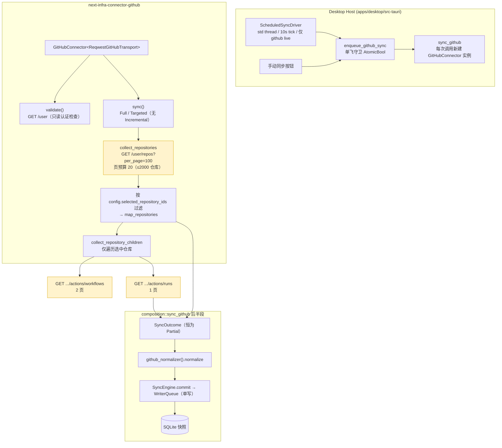

# GitHub 连接器架构与数据量梳理

**日期：** 2026-08-07（v2：纵切裁剪为 actions 维度，见 [`CON-G5-07-2026-08-07.md`](../tasks/CON-G5-07-2026-08-07.md)）
**范围：** `crates/next-infra-connector-github` + Desktop Host 侧的触发/落库路径（`composition::sync_github`）
**边界：** 只读 Provider；无写操作；凭据只经 `SecretValue` 短暂传递。

## 1. 架构总览（当前：仓库 → workflow → workflow_run 三段纵切）

## 2. 数据流步骤

1. **触发**：定时（15 分钟间隔，descriptor 推荐 900s）或手动。单飞守卫保证同一时刻只有一个 GitHub 同步。
2. **validate（建连时）**：`GET /user` + config 校验（必须含非空 `selected_repository_ids`）。
3. **sync（Full 模式，当前唯一实际路径）**：
   - 取 `/user/repos`（**全部可访问仓库**，最多 20 页 × 100 = 2000 个），然后**只对选中的仓库**继续收集；
   - 每个选中仓库依次取 workflows → workflow_runs（2026-08-07 起**不再取 environments / deployments / jobs**）；
   - 每页结果立即归一化、去重、限量。
4. **落库**：归一化后的 `ValidatedBatch` → `SyncEngine.commit` → 单写队列 → SQLite；同步记录含 coverage/warnings/errors。
5. **结果**：有界纵切**恒为 Partial** → 健康度恒为 Degraded，具体原因见 warnings（Connectors 页"最近警告"列）。

## 3. 资源与关系模型

| 资源类型 | 来源 | 属性（workflow_run 已裁剪） |
| --- | --- | --- |
| `github.repository` | /user/repos（过滤后） | repository_id / visibility / default_branch / archived / disabled / created_at / updated_at |
| `github.workflow` | actions/workflows | workflow_id / path / state / created_at / updated_at |
| `github.workflow_run` | actions/runs | **run_id / workflow_id / run_number / status / conclusion / created_at**（身份 + 成功/失败状态） |

关系：`repository →(contains) workflow`、`workflow →(executes) workflow_run`。

## 4. 预算与上限（真实约束）

| 约束 | 值 | 影响 |
| --- | --- | --- |
| `/user/repos` 页预算 | 20 页 × **per_page=100** | 最多取 2000 个可访问仓库（哪怕只选 1 个，也会拉全量列表再过滤） |
| workflows 页预算 | 2 页 × 30（GitHub 默认 per_page） | ≤60 个 workflow/仓库 |
| runs 页预算 | 1 页 × 30 | ≤30 个 workflow_run/仓库 |
| 单次同步请求预算 | **200 次** | 超出即 Partial + warning "request budget was exhausted" |
| 超时 | 15s/请求 | 超时 → NetworkUnreachable |
| 触发频率 | 900s（descriptor） | 每次都是 Full 全量 |

**每个选中仓库的实际最大规模**：1 仓库 + ≤60 workflows + ≤30 runs ≈ **≤91 个资源、≤4 个请求**。200 请求预算可覆盖约 40 个仓库（原 jobs 维度的放大倍数已移除）。

## 5. 剩余的数据量特征（2026-08-07 裁剪后）

1. **jobs/environments/deployments 已移除**：每个 run 不再单独请求 jobs，数据量与请求数大幅下降。
2. **跨运行无 ETag 复用（关键低效点仍在）**：`composition::sync_github` 每次同步**新建 `GitHubConnector` 实例**，其 `page_cache`/`route_cache` 随实例销毁——**304 缓存只在一次同步运行内有效，两次定时同步之间完全不复用**，每 15 分钟仍全量重取（仅 repositories/workflows/runs 三组）。
3. **无 Incremental 模式**：每轮都是 Full 全量。

## 6. 可选的数据量控制手段（待决策，未实现）

| 手段 | 效果 | 改动面 |
| --- | --- | --- |
| 跨同步持久化 ETag/游标（SQLite `connector_state` 已存在） | 未变化数据走 304，跳过下载 | connector 缓存持久化 + composition 复用 |
| 限制 runs 深度（如只取最近 N 条） | 进一步控制 run 数量 | 预算常量或 config 参数 |
| 降低同步频率 / 手动触发为主 | 减少全量次数 | descriptor/调度 |

## 7. 相关文件

| 文件 | 角色 |
| --- | --- |
| `crates/next-infra-connector-github/src/connector.rs` | 纵切主流程、Collector、预算守卫、config 契约 |
| `crates/next-infra-connector-github/src/client.rs` | 分页抓取、状态分类、预算/ETag |
| `crates/next-infra-connector-github/src/transport.rs` | reqwest 传输、15s 超时、4MB body 上限 |
| `crates/next-infra-connector-github/src/{repository,actions}/` | DTO/mapper/上限常量（environment/deployment 已删除） |
| `crates/next-infra-connector-github/src/descriptor.rs` | 声明 repository/workflow/workflow_run 三个模块 |
| `apps/desktop/src-tauri/src/composition/mod.rs` | `sync_github`、`github_normalizer`、建连 |
| `apps/desktop/src-tauri/src/scheduled_sync.rs` | 定时驱动 |
