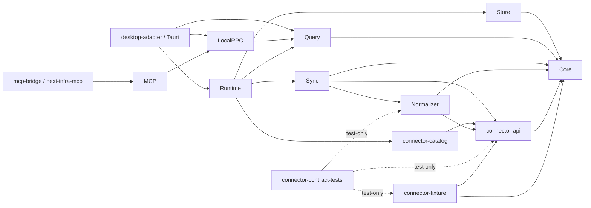

# DEC-G1-01：工具链、Workspace 与可执行目标边界

- **状态：** Accepted
- **决策日期 / 官方信息核验日：** 2026-08-02
- **适用范围：** Goal 1 工程骨架；后续 Goal 只能按本文依赖方向增量演进
- **权威边界：** 本文只冻结工具链、Tauri 官方依赖、Rust/应用目标与 Rust → TypeScript binding；不授权创建工程

## 1. 唯一决策

Next Infra 使用 Rust `1.92.0`、Edition 2024、Node.js `24.12.0`、pnpm `11.9.0`、Tauri v2 精确 patch 版本和 `ts-rs 12.0.1`。仓库采用一个 Cargo virtual workspace；长生命周期 Desktop Host 与短生命周期 `next-infra-mcp` 是两个独立 Cargo package / binary target。领域、存储、同步、查询与 Runtime 不得依赖 Tauri，Bridge 不得被打入 Desktop App Bundle。

选择当前已测环境而非追逐最新版本，目的是让 Goal 1 有可复现起点。版本升级必须显式触发本文复核，不能在普通功能任务中顺带发生。

## 2. 当前环境与兼容性结论

以下结果由本机只读命令实测，不是推测：

| 项目 | 当前值 | Goal 1 结论 |
| --- | --- | --- |
| macOS / 架构 | 26.5.2（25F84）/ arm64 | 当前开发与 smoke 基线；不是用户支持矩阵 |
| Xcode | 26.6（17F113） | 满足当前 macOS Tauri 构建前提 |
| rustc / Cargo | 1.92.0 / 1.92.0，`aarch64-apple-darwin` | 精确冻结，附带 rustfmt、Clippy |
| Node.js | 24.12.0 | 精确冻结；官方将 v24 标为 LTS |
| Corepack | 0.34.5 | 仅记录环境，不作为项目依赖；只用它激活指定 pnpm |
| pnpm | 11.9.0 | 精确冻结；其官方 registry metadata 要求 Node `>=22.13` |

兼容性结论：Rust `1.92.0` 高于本决策中 Tauri/官方插件声明的最低 Rust `1.77.2`，也高于 `ts-rs 12.0.1` 的最低 Rust `1.78.0`；Node `24.12.0` 满足 pnpm `11.9.0` 的 engine。当前组合无已知版本阻塞。

官方依据：

- [Rust 1.92.0 release notes](https://doc.rust-lang.org/stable/releases.html#version-1920-2025-12-11)；[Rust 2024 Edition Guide](https://doc.rust-lang.org/edition-guide/rust-2024/index.html)
- [Node.js release status](https://nodejs.org/en/about/previous-releases)；[pnpm 11.9.0 registry metadata](https://www.npmjs.com/package/pnpm/v/11.9.0)
- [Tauri v2 prerequisites](https://v2.tauri.app/start/prerequisites/)；[Tauri official plugins](https://v2.tauri.app/plugin/)

## 3. 冻结版本与声明位置

所有表中版本都是精确版本，不使用 `^`、`~`、通配符或浮动 tag。

| 依赖 | 精确版本 | 未来声明位置 | 官方记录 |
| --- | --- | --- | --- |
| Rust toolchain | `1.92.0` | 根 `rust-toolchain.toml`，`profile=minimal`，components 为 `rustfmt, clippy` | [release notes](https://doc.rust-lang.org/stable/releases.html#version-1920-2025-12-11) |
| Rust edition / resolver | `2024` / `3` | 根 `Cargo.toml` 的 `workspace.package.edition` / `workspace.resolver` | [Edition Guide](https://doc.rust-lang.org/edition-guide/rust-2024/index.html) |
| Node.js | `24.12.0` | 根 `.node-version`；`engines.node` 为 `>=24.12.0 <25` | [v24 LTS](https://nodejs.org/en/about/previous-releases) |
| pnpm | `11.9.0` | 根 `package.json#packageManager` 为 `pnpm@11.9.0` | [npm registry](https://www.npmjs.com/package/pnpm/v/11.9.0) |
| `tauri` | `2.11.5` | 根 `workspace.dependencies`，Desktop 使用 `workspace = true` | [crates.io](https://crates.io/crates/tauri/2.11.5) |
| `tauri-build` | `2.6.3` | 根 `workspace.dependencies`，仅 Desktop build-dependency | [crates.io](https://crates.io/crates/tauri-build/2.6.3) |
| `@tauri-apps/api` | `2.11.1` | Desktop dependency | [npm registry](https://www.npmjs.com/package/@tauri-apps/api/v/2.11.1) |
| `@tauri-apps/cli` | `2.11.4` | Desktop devDependency | [npm registry](https://www.npmjs.com/package/@tauri-apps/cli/v/2.11.4) |
| `tauri-plugin-single-instance` | `2.4.3` | Rust workspace dependency，仅 Desktop | [crates.io](https://crates.io/crates/tauri-plugin-single-instance/2.4.3) |
| `tauri-plugin-autostart` / JS package | `2.5.1` / `2.5.1` | Rust workspace dependency / Desktop dependency | [Rust](https://crates.io/crates/tauri-plugin-autostart/2.5.1) · [JS](https://www.npmjs.com/package/@tauri-apps/plugin-autostart/v/2.5.1) |
| `tauri-plugin-opener` / JS package | `2.5.4` / `2.5.4` | Rust workspace dependency / Desktop dependency | [Rust](https://crates.io/crates/tauri-plugin-opener/2.5.4) · [JS](https://www.npmjs.com/package/@tauri-apps/plugin-opener/v/2.5.4) |
| `ts-rs` | `12.0.1` | Rust workspace dependency；仅 Query binding feature 使用 | [crates.io](https://crates.io/crates/ts-rs/12.0.1) |

`single-instance` 没有 JavaScript API，因此没有 `@tauri-apps/plugin-single-instance` 依赖，也不需要对应 capability；依据见[官方插件文档](https://v2.tauri.app/plugin/single-instance/)。托盘使用 Tauri 自带 `tray-icon` feature，不新增插件。

Goal 1 只允许上述三个官方插件。暂不引入 Shell、SQL、Store、Updater、Process、Notification、Provider SDK 或 Git 依赖。Opener 只用于受 capability 限制的外部 `https` 链接；Autostart 的 capability 与行为由 Desktop Host 后续任务实现。

### 3.1 锁定规则

1. Rust 直接依赖集中在 `[workspace.dependencies]` 并用 `=x.y.z`；成员 crate 使用 `workspace = true`。
2. Node 直接依赖写完整版本号；提交 `Cargo.lock` 与 `pnpm-lock.yaml`。
3. CI 和验收一律使用 `cargo --locked`、`pnpm --frozen-lockfile`；禁止静默重解锁。
4. 禁止 `[patch.crates-io]`、Git revision 和未经记录的 registry 替换进入项目文件。本机 rsproxy 只可作为下载镜像，版本核验以 crates.io/npm 官方 metadata 为准。
5. Rust/Node/pnpm/Tauri 任一版本变化都必须独立提交，并执行第 8 节完整验证。

## 4. Cargo Workspace 与应用目标

根目录是 virtual workspace，不产生根 binary。Goal 1 由 `RHM-G1-01` 创建下列成员骨架；空骨架不包含业务实现。

| 路径 | Cargo package | 目标 / 职责 |
| --- | --- | --- |
| `crates/next-infra-core` | `next-infra-core` | Domain、ports、错误与身份语义；无基础设施依赖 |
| `crates/next-infra-store` | `next-infra-store` | SQLite adapter，实现 Core store ports |
| `crates/next-infra-connector-api` | `next-infra-connector-api` | Connector 契约 |
| `crates/next-infra-normalizer` | `next-infra-normalizer` | Observation → Domain 规范化 |
| `crates/next-infra-connector-fixture` | `next-infra-connector-fixture` | 确定性 fixture；不得成为默认生产依赖 |
| `crates/next-infra-connector-contract-tests` | `next-infra-connector-contract-tests` | 只承载 Connector contract tests |
| `crates/next-infra-connector-catalog` | `next-infra-connector-catalog` | Connector 工厂注册表，不含 Provider 实现 |
| `crates/next-infra-sync` | `next-infra-sync` | 同步编排；通过 Core port 写入 |
| `crates/next-infra-query` | `next-infra-query` | Query Service、QDTO、binding owner |
| `crates/next-infra-runtime` | `next-infra-runtime` | 单进程生命周期与 service composition；不含窗口/托盘/Socket/STDIO |
| `crates/next-infra-local-rpc` | `next-infra-local-rpc` | 版本化 Local RPC transport adapter |
| `crates/next-infra-mcp` | `next-infra-mcp` | MCP 协议与 Local RPC 映射；无 binary |
| `apps/desktop/src-tauri` | `next-infra-desktop-adapter` | `[[bin]] next-infra`；唯一 Tauri composition root |
| `apps/mcp-bridge` | `next-infra-mcp-bridge` | `[[bin]] next-infra-mcp`；独立 STDIO 入口 |

`apps/desktop` 同时是私有 pnpm package，前端包名固定为 `@next-infra/desktop`。Provider-specific、binding inference 与额外测试 crate 不在 Goal 1 预创建，待对应 Goal 的契约冻结后再增加。

## 5. 唯一允许的内部依赖方向

箭头表示“左侧依赖右侧”；未列出的 production edge 默认禁止。



关键约束：

- `core/store/sync/query/runtime/local-rpc/mcp/connector-*` 均不得依赖 Tauri。
- Query 和 Sync 依赖 Core port，不依赖具体 Store；Runtime 注入 `next-infra-store`。
- Runtime 不依赖 Local RPC 或 MCP；Desktop composition root 启动 Runtime 与 Local RPC。
- MCP Bridge 只依赖 `next-infra-mcp`，不得直接依赖 Store、Runtime、Keychain、Connector、Tauri 或 Provider SDK。
- `connector-contract-tests` 不能被任何 production package 反向依赖。

## 6. Desktop 与 Bridge 的安装边界

Desktop package 的 `default-run` 与 Tauri `mainBinaryName` 都固定为 `next-infra`。Bridge 必须位于 `apps/mcp-bridge` 的独立 Cargo package，binary 名固定为 `next-infra-mcp`。

禁止把 Bridge 放入：

- `apps/desktop/src-tauri/src/bin/**`；
- Desktop Cargo examples；
- `tauri.conf.json > bundle.externalBin` 或任何 sidecar 配置；
- `.app/Contents/MacOS`、Resources 或其他 Desktop bundle 内容。

Goal 1 只保证 `cargo build -p next-infra-mcp-bridge --bin next-infra-mcp --locked` 可独立产物，不执行用户级安装、不写 `~/.local/bin`，也不向 Hermes/Codex 写配置。稳定安装路径、可信 app 记录、原子替换、签名和 Desktop/Bridge 升级顺序由 `DEC-G1-03` 决定；在该决策前保持 **TBD**。

## 7. Rust QDTO → TypeScript Binding

唯一选择是 `ts-rs = 12.0.1`：QDTO 权威定义位于 `crates/next-infra-query/src/dto/**`，在 `typescript-bindings` feature 下派生并导出到 `apps/desktop/src/generated/query/**`。生成物必须提交、标记为不可手改，并由 QDTO Owner 与 Rust 变更原子提交。

生成过程必须满足：

1. Rust `serde` 序列化形状是权威；TS 不重声明同名接口。
2. `cargo test -p next-infra-query --features typescript-bindings --test export_types` 确定性覆盖生成目录。
3. 随后 `git diff --exit-code -- apps/desktop/src/generated/query` 检测漂移，最后执行 Desktop TypeScript build。
4. Secret 字段不进入 QDTO，因此也不可能进入生成类型。

候选对比：

| 候选 | 结论 | 原因 |
| --- | --- | --- |
| `ts-rs 12.0.1` | **采用** | stable、Tauri-independent、支持 serde shape，适合 DTO 单向导出 |
| `specta 2.0.0-rc.25` + `tauri-specta 2.0.0-rc.25` | 暂不采用 | 两者仍是 RC，且 tauri-specta 会把 DTO 管线耦合到 Tauri command surface |
| 手写 TS / 双 schema | 禁止 | 无法可靠发现 Rust/TS 漂移，产生第二权威源 |

## 8. Goal 1 验证合同

实施者必须执行并保留以下结果；命令名也是后续脚本的冻结接口：

```bash
rtk rustc --version --verbose
rtk cargo --version
rtk node --version
rtk corepack --version
rtk pnpm --version
rtk cargo metadata --locked --format-version 1
rtk cargo test -p next-infra-core --locked
rtk cargo test -p next-infra-query --features typescript-bindings --test export_types --locked
rtk git diff --exit-code -- apps/desktop/src/generated/query
rtk cargo test --workspace --all-targets --locked
rtk cargo clippy --workspace --all-targets --locked -- -D warnings
rtk pnpm --dir apps/desktop install --frozen-lockfile
rtk pnpm --dir apps/desktop build
rtk cargo build -p next-infra-mcp-bridge --bin next-infra-mcp --locked
rtk pnpm --dir apps/desktop tauri build
rtk pnpm --dir apps/desktop test:bundle-boundary
```

`test:bundle-boundary` 必须检查 Desktop bundle 只含 `next-infra` 主 executable，且任意 bundle 目录均不存在 `next-infra-mcp`。`cargo metadata` 的自动架构检查必须证明只有 `next-infra-desktop-adapter` 的 normal/build dependency closure 出现 Tauri；Core/Store/Sync/Query/Runtime 与 Bridge closures 中出现 Tauri 即失败。

## 9. 升级触发器、非目标与 TBD

以下任一事件触发独立工具链升级决策：Rust/Tauri 安全公告或编译缺陷；Node v24 离开 LTS；pnpm engine/lockfile 格式改变；官方插件要求更高 MSRV；macOS/Xcode 使当前组合无法 build/smoke；`ts-rs` 无法表达已冻结 QDTO；增加新的 Tauri 官方插件。

明确非目标：不初始化 workspace、不安装依赖、不实现 crate、UI、RPC、MCP 或 Provider；不定义 release cadence、自动 updater、签名/公证、用户支持周期、Windows/Linux 支持矩阵；不决定 Bridge 稳定安装路径。

保持 TBD：最低支持 macOS 与 Intel Mac；用户可见 Node/Rust 支持承诺；Bridge 安装/发现/原子升级方案；Tauri updater 与发布签名策略。这些选择不得由 Goal 1 实施者自行补全。
