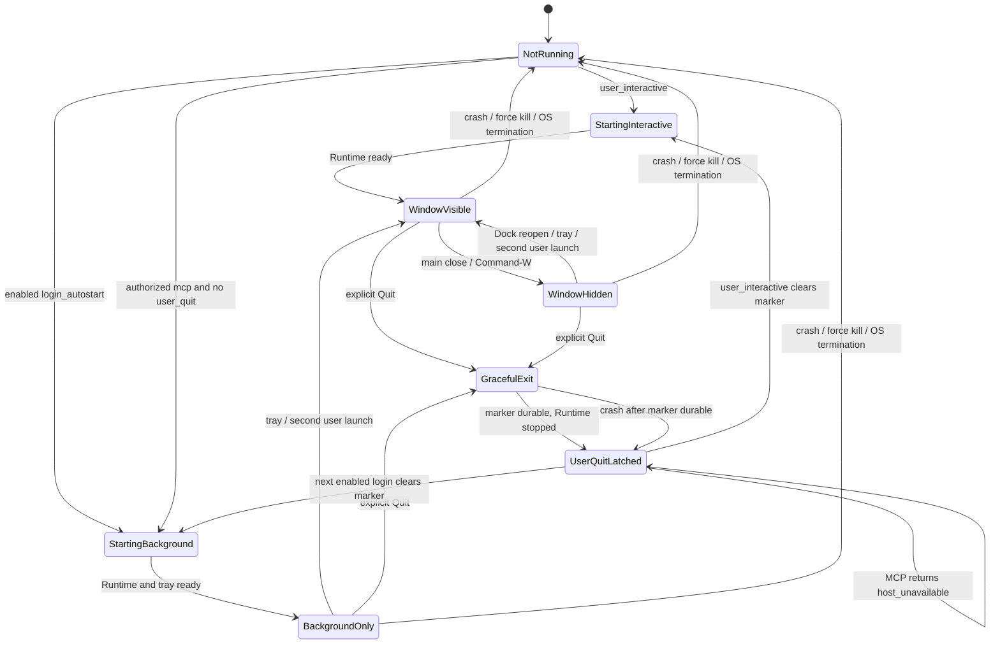

# DEC-G1-02：Desktop 生命周期策略

**状态：** Accepted（已由 `DEC-G1-05` 合并） · **平台：** 首版 arm64 macOS · **范围：** `Next Infra.app` / Desktop Host
**最后核对：** 2026-08-02

## 1. 决策

Next Infra 首版采用一个由 Tauri v2 承载的长生命周期 Desktop Host。生命周期行为固定如下：

1. 使用官方 `tauri-plugin-single-instance`，并把它注册为第一个 Tauri plugin。只有主实例可以获取 Runtime 实例锁、打开 SQLite 或创建 Unix Socket；SQLite 锁和 Socket owner 校验继续作为第二层防护。
2. 主窗口的关闭按钮和 `Command-W` 都执行 `close -> prevent_close -> hide`。它们不销毁 WebView、不停止 Control Plane Runtime，也不写入 `user_quit`。
3. Desktop Host 存活期间始终保留 tray icon：左键恢复主窗口，右键菜单至少包含 `Show Next Infra` 和 `Quit Next Infra`。交互式启动显示主窗口并使用 Regular activation policy。
4. 登录自动启动或受控 MCP 启动进入 BackgroundOnly：不创建 WebView、不抢焦点、隐藏 Dock icon，但保留 tray。首次用户激活后切换为 Regular、显示 Dock icon 并创建主窗口；此后 close 仍保留 Dock icon，支持 Dock reopen。
5. 自动登录默认关闭，只能由用户显式启用。首版使用 Rust 侧官方 `tauri-plugin-autostart` 和 `MacosLauncher::LaunchAgent`，固定登录参数为 `--background --launch-source=login`。React 只能调用 Next Infra 的受限本地配置 Command，不直接获得 autostart plugin 的 JavaScript capability。自动登录与 MCP 自动拉起是两个独立开关。
6. Dock reopen 使用 macOS 专用 `RunEvent::Reopen`；tray、Dock reopen 和交互式第二实例最终进入同一个 `restore_main_window` 用例：切换为 Regular、显示 Dock、创建或 unminimize/show/focus 主窗口，并要求 UI 重新查询 Query Service。
7. 设备睡眠/唤醒以 `NSWorkspace.willSleepNotification` 和 `didWakeNotification` 为权威信号，并保留 wall-clock/monotonic gap 检测作为漏事件兜底；不把 Tauri `RunEvent::Resumed` 单独解释为设备唤醒，也不把屏幕睡眠解释为设备睡眠。
8. 只有用户显式 Quit 进入有界优雅退出并创建 SQLite 外的 `user_quit` 持久抑制文件；close、reload、crash、升级重启及 logout/power-off 都不创建它。
9. 只有用户交互式启动或下一次已启用的登录自动启动可以清除 `user_quit`；MCP、升级、崩溃恢复、第二实例和 sleep/wake 永远不能清除。

## 2. 官方依据与项目选择

| 官方能力 | 官方文档确认的行为 | Next Infra 的唯一选择 |
| --- | --- | --- |
| Tauri single-instance | 官方 plugin 保证单实例，要求尽早注册，并把第二实例的 `args` 与 `cwd` 交给现有实例 callback | 注册为第一个 plugin；callback 不解释查询、配置、路径或 deep link，只做固定后台 no-op 或窗口激活 |
| Tauri window events | `WindowEvent::CloseRequested` 可通过 `prevent_close()` 阻止关闭；Window 提供 `hide/show/unminimize/set_focus` | 主窗口 close 一律 prevent + hide；正常路径不调用 destroy |
| macOS reopen | Tauri `RunEvent::Reopen` 对应 AppKit `applicationShouldHandleReopen`，Finder 或 Dock 重新激活已运行 App 时触发 | 无可见窗口时恢复主窗口；有可见窗口时只激活/聚焦 |
| Tauri tray | Rust tray API支持菜单和 click event，官方示例使用 unminimize/show/focus 恢复窗口 | tray 在所有 Running 状态存在；左键恢复，右键菜单，左键不自动弹菜单 |
| Tauri autostart | 官方 plugin 在 macOS 支持 `MacosLauncher::LaunchAgent` 和固定启动参数 | 默认关闭；Rust-only 管理；固定 BackgroundOnly 参数，不给 WebView plugin 直通权限 |
| AppKit termination | AppKit 允许延迟或取消 termination；Tauri `ExitRequested` 可 prevent exit，但 restart code 不接受 prevent | 普通 Quit 先 prevent，再异步完成有界 shutdown；升级 restart 必须先完成 Runtime shutdown，之后才调用 restart |
| macOS sleep/wake | `NSWorkspace` 在其专用 notification center 发布 will-sleep、did-wake 和 will-power-off | 使用原生通知；will-power-off 区分系统退出，不设置 `user_quit` |
| macOS background visibility | Apple 要求后台处理对用户保持可发现并能停止；tray/menu bar icon 属于可见 presence | BackgroundOnly 必须有 tray；用户 Quit 后不遗留独立后台进程 |

主要来源：[Single Instance](https://v2.tauri.app/plugin/single-instance/)、[Autostart](https://v2.tauri.app/plugin/autostart/)、[System Tray](https://v2.tauri.app/learn/system-tray/)、[`RunEvent`](https://docs.rs/tauri/latest/x86_64-apple-darwin/tauri/enum.RunEvent.html)、[`WindowEvent`](https://docs.rs/tauri/latest/tauri/enum.WindowEvent.html)、[`AppHandle`](https://docs.rs/tauri/latest/x86_64-apple-darwin/tauri/struct.AppHandle.html)，以及 Apple 的 [reopen](https://developer.apple.com/documentation/appkit/nsapplicationdelegate/applicationshouldhandlereopen%28_%3Ahasvisiblewindows%3A%29)、[termination](https://developer.apple.com/documentation/appkit/nsapplicationdelegate/applicationshouldterminate%28_%3A%29)、[`NSWorkspace`](https://developer.apple.com/documentation/appkit/nsworkspace) 和 [后台进程指南](https://developer.apple.com/documentation/appkit/managing-ongoing-background-processes-in-your-mac)。

这些资料证明平台能力，但 close-to-hide、默认关闭 autostart、超时预算和 `user_quit` 规则是 Next Infra 的产品与安全选择，不是 Tauri 或 macOS 的默认保证。实际版本由 `DEC-G1-01` 固定后必须重新核对对应版本 API。

## 3. 状态模型

启动来源只有三种：

| `LaunchSource` | 产生方式 | 初始展示 | 是否可清除 `user_quit` | 权限含义 |
| --- | --- | --- | --- | --- |
| `user_interactive` | Finder、Dock、Spotlight、用户执行已安装 App | `WindowVisible` | 是 | 只表达用户希望运行 App，不授予 Provider 权限 |
| `login_autostart` | 已启用的官方 autostart LaunchAgent | `BackgroundOnly` | 是 | 只表达已启用登录启动，不等于 MCP 自动拉起授权 |
| `mcp_authorized` | Bridge 按 `DEC-G1-03` 的可信路径受控启动 | `BackgroundOnly` | 否 | Host 仍需检查 `user_quit`；命令行参数本身不构成授权 |

固定参数只用于展示模式分流，不是安全凭证。同用户进程可以伪造参数，因此任何会扩大权限的判断必须来自持久本地配置与可信安装记录，而不能来自 `argv`。

Host 状态机：



睡眠是与展示状态正交的 PowerState：`Awake -> Sleeping -> Awake`。进入 Sleeping 时保留原来的 `BackgroundOnly | WindowVisible | WindowHidden`，唤醒后返回原展示状态，不创建或显示窗口。

## 4. 事件与状态表

| 事件 | 前置状态 | 必须动作 | 后置状态 | Runtime | `user_quit` |
| --- | --- | --- | --- | --- | --- |
| 用户冷启动 | `NotRunning` | 成为主实例；按启动顺序启动 Runtime；显示窗口 | `WindowVisible` | 新建一个 | 清除 |
| 已启用的登录启动 | `NotRunning` | BackgroundOnly 启动；无 WebView、无焦点；创建 tray | `BackgroundOnly` | 新建一个 | 清除 |
| 已授权 MCP 启动，marker 不存在 | `NotRunning` | BackgroundOnly 启动；等待 Query/Socket ready | `BackgroundOnly` | 新建一个 | 保持不存在 |
| MCP 启动，marker 存在或不可解析 | `UserQuitLatched` | 不打开 SQLite/Socket；退出；Bridge 返回 `host_unavailable` | `UserQuitLatched` | 不启动 | 保留 |
| 第二个交互式实例 | 任意 Running | 第二实例退出；现有实例 restore 主窗口 | `WindowVisible` | 不变 | 不变 |
| 第二实例携带精确 login/MCP background tuple | 任意 Running | 第二实例退出；不显示窗口；不解释其它参数 | 原状态 | 不变 | 不变 |
| 第二实例携带未知参数、路径或 deep link | 任意 Running | 丢弃载荷；仅按交互式激活处理 | `WindowVisible` | 不变 | 不变 |
| 主窗口 close / `Command-W` | `WindowVisible` | `prevent_close` 后 hide；不得 destroy | `WindowHidden` | 继续 | 不变 |
| Dock reopen | `WindowHidden` | unminimize/show/focus；UI re-query | `WindowVisible` | 继续 | 不变 |
| tray 左键或 `Show Next Infra` | `BackgroundOnly` 或 `WindowHidden` | 切换 Regular/Dock；创建或恢复窗口；UI re-query | `WindowVisible` | 继续 | 不变 |
| WebView reload | 任意 Running | 只重建前端状态并重新 Query | 原展示状态 | 不重启 | 不变 |
| device will-sleep | 任意 Running/Awake | 记录时钟；暂停发起新的 scheduled run；不延迟系统睡眠 | 同展示状态/Sleeping | 被系统挂起 | 不变 |
| device did-wake | 任意 Running/Sleeping | 先重算 Freshness，再错峰 catch-up | 原展示状态/Awake | 继续 | 不变 |
| 用户 Quit、Dock Quit、`Command-Q`、tray Quit | 任意 Running | 持久化 marker；进入有界 shutdown | `UserQuitLatched` | 停止 | 创建/覆盖 |
| 系统 logout / power-off | 任意 Running | `willPowerOff` 标记 system reason；best-effort shutdown | `NotRunning` | 停止或被系统终止 | 不创建、不清除 |
| 升级 restart | 任意 Running | 先显式 shutdown，再请求 restart | `Starting*` | 旧 Runtime 停止后重建 | 不创建、不清除 |
| crash、panic、SIGKILL、突然终止 | 任意 Running | 不假设 cleanup callback；下次执行 WAL 恢复 | `NotRunning` | 消失 | 不创建、不清除 |
| marker 写入失败 | 任意 Running，用户 Quit | 取消这次受控 Quit并显示本地错误；不得先关 Socket | 原状态 | 继续 | 保持原值 |

## 5. 单实例与恢复规则

1. Single Instance plugin 必须第一个注册；主实例还持有 Runtime 实例锁，并在打开 SQLite、绑定 Socket 前确认 owner。
2. callback 严格 allowlist：精确 login 参数或 `DEC-G1-03` 冻结的 MCP tuple 为后台 no-op；其它 `args/cwd` 一律丢弃，仅执行 `restore_main_window`。
3. `restore_main_window` 必须幂等：依状态执行 activate、unminimize、show，或从 BackgroundOnly 切换 Regular/Dock 后创建窗口；随后 UI 必须重新查询 Query Service。
4. `WindowEvent::Destroyed` 不是正常 close。意外发生时记录 lifecycle invariant error；Runtime/tray 继续，下一次 restore 从 bundle 重建窗口。

## 6. Runtime 启动顺序

只有赢得主实例资格的进程执行以下顺序；任一步失败都不得继续暴露半启动 Runtime：

1. 分类 `LaunchSource`；确认首个 Single Instance plugin 已生效并获取 Runtime 实例锁。
2. 验证 Application Support、`state/`、`run/` 的 owner/权限；MCP 遇到 marker 或不可解析 marker 立即退出，interactive/login 原子清除 marker。
3. 打开 SQLite，执行 schema compatibility、批准的 migration、WAL/foreign-key 自检。
4. 将遗留 `running` SyncRun 恢复为 `interrupted`，cursor 保持最后已提交值。
5. 依次启动 Single Writer、只读连接和 Query Service；Query ready 后才让 Local RPC 接受请求。
6. 启动 Scheduler、Sync Engine、Maintenance；catch-up 仍受 backoff/rate limit 约束。
7. 创建 tray，注册受限 Commands/handlers；interactive 显示窗口，background 保持无 WebView、Accessory 和隐藏 Dock。
8. 最后发布 Host ready；Bridge 只能以 Socket handshake 成功作为 ready 证据。

## 7. 显式 Quit 与 Runtime 停止顺序

Quit reason 固定为：app/tray menu、`Command-Q`、Dock Quit 且没有 `willPowerOff` 时为 `user_explicit`；收到 `NSWorkspace.willPowerOffNotification` 后为 `system_poweroff`；updater 为 `upgrade_restart`；crash、panic、SIGKILL 没有受控 reason。

Tauri restart 的 `ExitRequested` 不能被 `prevent_exit()` 延迟，因此禁止“先 request_restart，再异步排空”。正确顺序只能是先关闭 Runtime，再 request restart。

用户显式 Quit 的唯一停止顺序：

1. 原子写入并 fsync `user_quit` marker；失败则取消 Quit。
2. 进入 `GracefulExit`，拒绝新的 SyncRun、本地配置变更和 Local RPC session；现有调用收到结构化 shutting-down 错误或在当前 deadline 内结束。
3. 取消活动 Connector 请求并最多等待 5 秒；不得启动补偿轮询。
4. 排空 Writer，提交可安全结束的 SyncRun；未完成者下次恢复为 `interrupted`；在 15 秒总 deadline 内做受控 WAL checkpoint，禁止 VACUUM/备份。
5. 移除 Unix Socket，关闭 SQLite、flush/close logs，释放 Runtime 锁。
6. 设置 `quit_ready`，允许第二次 Tauri exit request真正退出。

达到 15 秒总 deadline 后，取消剩余 Runtime task并退出；事务/WAL 仍必须保证只暴露已提交批次。marker 已经持久化，所以超时不能导致 MCP 重新拉起。系统 logout/power-off 使用同一顺序做 best effort，但不保证系统会等待满 15 秒，也不创建 marker。

## 8. `user_quit` 唯一规则

逻辑路径固定为 `~/Library/Application Support/Next Infra/state/user-quit-v1.json`：

- `state/` 为当前用户独占目录 `0700`，marker 为 `0600`。
- 文件只包含 `schema_version`、`latched_at`、`host_version` 和固定 `reason=user_explicit`，不含 Secret、Socket 路径或 Agent 输入。
- 写入采用同目录临时文件、fsync、原子 rename、父目录 fsync；删除采用 unlink 后父目录 fsync。
- 未知 schema、损坏或无法读取在 MCP 路径上按“已 latched”处理；不得猜测为未退出。
- marker 必须在 SQLite 外，因为 Host 停止时 Bridge 不允许打开 SQLite。

变化矩阵：

| 动作 | 创建 | 清除 | 保留 |
| --- | --- | --- | --- |
| 用户显式 Quit | 是 | 否 | 不适用 |
| 用户交互式冷启动 | 否 | 是 | 否 |
| 下一次已启用的登录自动启动 | 否 | 是 | 否 |
| MCP 自动启动 | 否 | 永不 | 是；存在即拒绝启动 |
| 第二实例、Dock/tray restore | 否 | 否 | 是 |
| 窗口 close、WebView reload | 否 | 否 | 是 |
| sleep/wake、锁屏、会话切换 | 否 | 否 | 是 |
| crash、Force Quit、SIGKILL | 否 | 否 | 保留已有值，不凭空创建 |
| logout、shutdown、升级 restart | 否 | 否 | 保留已有值，不凭空创建 |
| 启停 autostart 或 MCP auto-launch 设置 | 否 | 否 | 是 |

不存在其它清除入口。React Command、MCP Tool、Bridge 参数、Provider 内容、migration 和 crash recovery 都无权清除 marker。

## 9. 睡眠与唤醒 catch-up

1. 在 `NSWorkspace.notificationCenter` 监听 device will-sleep/did-wake；不使用 default notification center，也不响应屏幕睡醒、窗口隐藏或 session inactive。
2. will-sleep 只记录 wall-clock/monotonic 基线并暂停新 scheduled run；不利用延迟窗口做同步、checkpoint 或网络请求。
3. did-wake 先按当前 wall-clock 重算 Resource Freshness；漏轮询只会变 stale/expired，不会使 Health unhealthy。
4. 每个错过计划且无 active run 的 Connection 至多创建一个 catch-up；以 Connection ID 稳定摘要在 0–60 秒内错峰，backoff、Provider reset、`next_allowed_at` 和并发限制优先。
5. 睡前 active run 先按正常 timeout/cancellation 收敛，终结前不得创建同 Connection catch-up。
6. 漏收 did-wake 时，Scheduler tick 通过 wall-clock/monotonic gap 超出容忍窗触发同一流程。

## 10. 真实 macOS App Bundle smoke

以下场景必须在 `GATE-G3` 使用真实、已构建的 `Next Infra.app`，不能用 Vite、Rust 单测或直接执行裸 binary替代。每项记录 App 版本、macOS 版本、PID、窗口状态、Runtime generation、最后 SyncRun 和 marker 状态。

| ID | 场景 | 必须观察到的结果 |
| --- | --- | --- |
| `LIFE-01` | 交互式冷启动 | 一个 Desktop Host；Runtime ready 后才显示窗口；tray 与 Dock 可见 |
| `LIFE-02` | 红色关闭按钮和 `Command-W` | 窗口隐藏但 PID、Runtime generation、Writer、Scheduler 和 Socket 不变；marker 不创建 |
| `LIFE-03` | Dock reopen | 同一 PID；原窗口恢复并聚焦；UI 重新 Query，显示关闭期间的新 Fixture 观察 |
| `LIFE-04` | tray 左键、右键菜单、Show | 左键恢复而不弹菜单；右键菜单可用；Show 与 Dock 使用同一 restore 行为 |
| `LIFE-05` | 隐藏时再次打开 App | 第二实例迅速退出；现有 PID 恢复窗口；没有第二个 DB/Socket owner |
| `LIFE-06` | 第二实例传入路径、deep link 和未知 args | 载荷不进入 Query/配置/操作；最多恢复窗口 |
| `LIFE-07` | 默认 autostart 关闭后 logout/login | App 不自动启动 |
| `LIFE-08` | 用户启用 autostart 后真实 logout/login | 无窗口和焦点抢占；tray 可见；一个 BackgroundOnly Host；点击 tray 后切换 Regular 并显示窗口 |
| `LIFE-09` | 用户显式 Quit | marker 在 Socket 关闭前持久化；Writer 排空/checkpoint；进程、Socket 和 tray 消失；无子后台进程残留 |
| `LIFE-10` | Quit 后连续启动两个 Bridge | 两次都返回 `host_unavailable`；App 不被复活；marker 保留 |
| `LIFE-11` | Quit 后用户打开 App | marker 清除；App 正常交互式启动 |
| `LIFE-12` | autostart 已启用，Quit 后到下一次 login | 本会话不复活；下一次 login 清除 marker 并 BackgroundOnly 启动 |
| `LIFE-13` | 真实设备 sleep/wake | 唤醒不显示窗口；Freshness 先更新；每 Connection 至多一个、0-60 秒错峰 catch-up |
| `LIFE-14` | 测试数据目录下模拟 marker 写失败后 Quit | Quit 被取消；Host/Socket 保持；用户看到本地错误 |
| `LIFE-15` | Fixture SyncRun 运行中对测试 App执行 Force Quit | 不创建 marker；下次启动把遗留 run 标为 interrupted，cursor 未前移 |
| `LIFE-16` | 测试构建触发 WebView reload | Runtime generation、PID、DB owner不变；前端重新 Query |
| `LIFE-17` | updater 测试通道 restart | 先完成 Runtime shutdown，再 request restart；不创建 marker；新进程只有一个 owner |
| `LIFE-18` | 独立测试登录会话执行 logout | `willPowerOff` 路径不创建 marker；若 autostart 已启用，下次 login 正常 BackgroundOnly 启动 |

`LIFE-10` 在 `GATE-G3` 用 Host availability test double、`GATE-G4` 用真实 Bridge；`LIFE-18` 只能在明确安排的独立登录会话执行。

## 11. 验证命令

当前文档验证：

```bash
rtk proxy test -f docs/design/decisions/DEC-G1-02-desktop-lifecycle.md
rtk proxy rg -n "single-instance|CloseRequested|Reopen|BackgroundOnly|willSleep|didWake|GracefulExit|user_quit|LIFE-18" docs/design/decisions/DEC-G1-02-desktop-lifecycle.md
rtk proxy rg -n "close.*hide|user_quit|login|MCP|crash|upgrade|power-off" docs/design/decisions/DEC-G1-02-desktop-lifecycle.md
rtk proxy git diff --check -- docs/design/decisions/DEC-G1-02-desktop-lifecycle.md
rtk git status --short
```

未来工程完成后的最小入口（实际 script 由 Goal 1/3 Gate 固定）：

```bash
rtk cargo test -p next-infra-runtime
rtk cargo test -p next-infra-desktop-adapter
rtk pnpm --dir apps/desktop test
rtk pnpm --dir apps/desktop tauri build
rtk test pnpm --dir apps/desktop test:desktop-smoke
```

这些命令不能替代 `LIFE-01..18` 对状态、PID、DB/Socket owner 和 Fixture 的断言；真实 sleep、logout、Force Quit 必须由测试者明确发起。

## 12. 非目标

- 不实现 lifecycle、LaunchAgent、AppKit observer、Runtime、smoke harness，也不创建工程配置或 migration。
- 不决定 MCP Bridge 安装路径、签名验证和原子升级；这些属于 `DEC-G1-03`。
- 不决定 Keychain、Developer ID、公证和更新发布渠道；这些属于 `DEC-G1-04`。
- 不引入 daemon/helper/XPC/长期子进程，不允许 Agent、Provider 内容、deep link 或 argv 改变授权。
- 不把 close-to-hide 改成销毁 WebView，也不把 WebView reload 当成 Runtime restart。

## 13. 升级与变更触发条件

以下变化必须在改代码前重新 Review，并同步 RFC 与结构图：

1. Tauri/plugin 版本、最低 macOS 或相关事件/权限语义改变。
2. autostart 迁移至其它 `SMAppService`/helper 形态，或 Runtime 被拆为独立进程。
3. close、WebView、tray、BackgroundOnly、多窗口、headless、长期进程或 remote MCP 产品边界改变。
4. `user_quit` 路径、读写方、schema、原子性或清除入口改变。
5. 15 秒 shutdown、5 秒 Connector grace、0–60 秒 wake jitter 被真实 smoke证明不合适。
6. macOS 背景/Login Items/签名规则变化，或 bundle 行为与裸 binary/Vite 不一致。

## 14. 仍需用户决定的项

生命周期语义已唯一；仍需用户确认首次引导是否推荐 autostart（默认仍关闭）、由 `DEC-G1-03` 决定 MCP 自动拉起授权与可信 App Bundle 路径、由 `DEC-G1-04` 决定签名/公证/更新渠道。

这些项目不改变 close、Quit、sleep/wake 和 `user_quit` 语义；`DEC-G1-03/04` 已完成并合并，本地 Goal 1 可以开始，发布与真实 Keychain 验收仍受外部身份条件约束。
