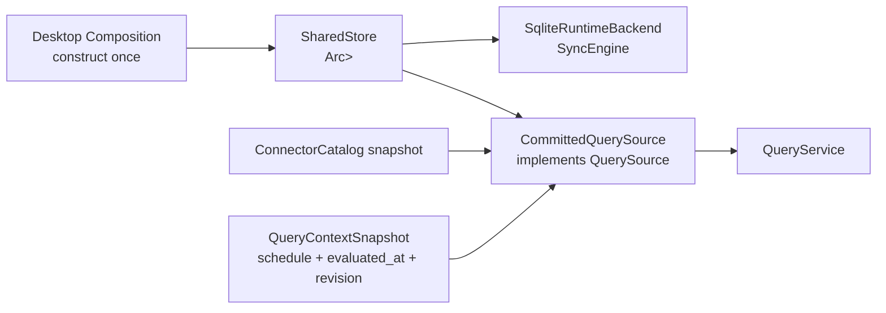

# DEC-G3-01：Committed Query Source 与唯一 SQLite Owner

**状态：** Proposed for independent Review  
**日期：** 2026-08-03  
**关联任务：** `RHM-G3-05P`、`RHM-G3-05A`  
**范围：** Goal 3 Desktop Composition 进入实现前的 Store/Runtime/Query 读写所有权；不包含 Tauri Host effects、RPC/MCP、Provider 实现或外部写操作。

## 1. 决策背景

当前 `QueryService<S>` 已冻结有界查询、cursor、Topology 限制和安全错误，但生产代码中没有 `QuerySource` 实现。`SqliteRuntimeBackend` 同时由 `SyncEngine<Store>` 持有唯一 WriterQueue 和 SQLite connection；若 Desktop Composition 再次 `Store::open` 来查询，会产生第二个 SQLite owner，并破坏“Runtime/Writer/Store 单 owner”的 Goal 3 验收条件。

此外，当前 Store schema 尚无可原子读取的 snapshot revision；`StoreReader` 只提供同步流程需要的 primitive lookup，不能支撑 resource search/detail、Topology、health summary、changes、sync status 和 connector coverage。现有 `QueryService` 还会先调用 `source.metadata()`、再调用具体 source method；这两个调用不能共享同一个 SQLite read transaction，因此必须先修正内部 source contract。

## 2. 决策

采用以下分层：



### 2.1 唯一物理 Store

- Composition 只调用一次 `Store::open`。
- `SharedStore` 是 Runtime crate 中的同步 wrapper，内部为 `Arc<Mutex<Store>>`；clone 只复制 handle，不创建 connection。
- `SqliteRuntimeBackend` 改为持有 `SyncEngine<SharedStore>`。
- `CommittedQuerySource` 持有同一个 `SharedStore` clone。
- Query、recovery、Writer drain 和 WAL checkpoint 全部串行经过同一 Store mutex。
- 不允许 Composition、Adapter、Command 或 QuerySource 自行按 path reopen SQLite。

选择 `Arc<Mutex<Store>>` 是因为 Tauri state/commands 需要可共享的 `Send + Sync` handle，而 `rusqlite::Connection` 本身不作为并发共享接口暴露。实现必须以编译和并发测试证明该 wrapper 满足 trait bounds；若底层平台 trait 阻止该结构，必须回到本决策 Review，不能退化为第二个 connection。

### 2.2 QuerySource 内部 contract 原子返回 metadata + body

Query crate 先做最小内部 contract 调整；外部 QDTO、生成的 TypeScript、Desktop/MCP method 语义不变。

```rust
pub struct SourceSnapshot<T> {
    pub metadata: SnapshotMetadata,
    pub body: T,
}
```

每个 `QuerySource` method 返回 `SourceSnapshot<T>`，删除独立的 `metadata()` 调用。`QueryService` 只负责从同一次 source call 拆出 metadata/body、执行现有 bounds/contract validation 并组装公开 QDTO。

禁止用 thread-local、last-read cache、长生命周期 SQLite transaction 或“metadata 后紧接 query 所以大概率一致”来保留两调用结构。并发 Writer 可能合法插入两次调用之间，只有单 source call 才能证明原子快照。

### 2.3 Store 负责 DTO-neutral query projection

Store crate 新增只读、DTO-neutral 的 query projection API，返回 Core model 或 Store-owned projection structs。它负责 SQL、稳定排序、after key、bounded row fetch、关系邻接和原子 snapshot metadata；它不得依赖 `next-infra-query`。

至少需要：

- projection metadata；
- bounded safe Connection snapshot；
- resource search page；
- resource identity/attributes/relations；
- bounded topology adjacency/frontier；
- health aggregation 的原始 Resource/Connection facts；
- recent changes page；
- connection + recent sync runs；
- relation/resource lookup。

Store 不返回 QDTO，不编码 `niq1:` cursor，也不生成用户错误文案。`QueryService` 继续拥有外部 limit、cursor 和 error contract。

### 2.4 Runtime 负责 QuerySource 映射

Runtime crate 已同时依赖 Core、Store、Query 和 Connector Catalog，因此 `CommittedQuerySource` 定义在 Runtime crate：

- 将 Store projection 映射为 QDTO；
- 保留相同 endpoints 的所有 provider/configured/inferred Relation evidence；
- 使用 Connector Catalog snapshot 生成 Connector Coverage，不把 coverage 伪造为 Store row；
- 使用 immutable QueryContext snapshot 计算 Freshness 与 `next_scheduled_at`；
- 不复制 QueryService 的 bounds、cursor envelope 或 error cleaning。

Query crate 继续只依赖 Core；Store crate 继续只依赖 Core。现有依赖方向 guard 不需要放宽。P0 只改变 QuerySource 的内部返回 envelope，不改变 QDTO schema。

## 3. Snapshot metadata

新增 Store migration 2：单行 `projection_metadata`。

```text
singleton_id       INTEGER PRIMARY KEY CHECK(singleton_id = 1)
committed_revision INTEGER NOT NULL
committed_at       INTEGER NOT NULL
```

- migration 初始化 committed revision `0`。
- 所有会改变 Query 可见结果的 Store transaction，必须在同一 transaction 内将 revision 加一并更新 `committed_at`。
- 至少包括：Connection upsert、Sync commit、running→interrupted recovery，以及未来 Binding/Inference/Coverage persistence。
- `start_sync_run` 会改变 sync status，因此也必须 bump；WAL checkpoint、integrity check 和 unchanged read 不 bump。
- Store metadata 只描述 committed projection；不得单独冒充最终 QDTO `SnapshotMetadata`。
- QuerySource 每个入口在同一个 Store lock/read transaction 内读取 committed revision 和结果，禁止 metadata/result 撕裂。
- 最终 `snapshot_version` 编码为 `nis1:<committed_revision>:<catalog_fingerprint>:<evaluated_at_millis>:<query_context_revision>`；它稳定、opaque，不使用 SQLite `data_version`、文件 mtime 或 `total_changes`。
- 最终 `generated_at` 来自本次 immutable QueryContext 的 `evaluated_at`，由 QuerySource 转为 RFC 3339 UTC string。
- `catalog_fingerprint` 是按 connector type 排序后的 `connector_type@connector_version` canonical join；Connector descriptor/coverage 改变时必须提高 connector version。这样无需让 Query/Store 引入 hashing dependency。
- schedule/freshness context 改变时，即使 SQLite 未写入，也必须提高 context revision；`evaluated_at_millis` 防止进程重启后 revision 从相同初值开始造成 snapshot version 碰撞。

## 4. Freshness policy

Freshness 是 Query 语义，不写回 Resource Health，也不由 React 重算。

`CommittedQuerySource` 接收不可变的 `QueryContextSnapshot`。该 snapshot 包含所有 Connection interval、`evaluated_at`、`next_scheduled_at` 与单调 `query_context_revision`：

- `fresh`：`age <= interval`。
- `stale`：`interval < age <= 3 × interval`。
- `expired`：`age > 3 × interval`。

运算相对于固定 `evaluated_at`，使用 checked/saturating duration，负 age 按 `0` 处理。每个可查询 Connection 必须有合法的非零 interval；缺失或非法 interval 返回内部 source failure，不能猜默认值。disabled Connection 仍保留其最后配置 interval，因此历史 Resource 可以继续计算 Freshness。

Runtime 在 startup、wake、schedule/config change 和显式 query-context refresh 时用 injected Clock 生成新 QueryContext 并提高 revision。Wake 不需要写回全部 Resource；Host 先刷新 QueryContext/invalidate，使 re-query 立即显示新的 stale/expired，再执行每 Connection 最多一次的 bounded catch-up。一次 Query 只能使用一个 immutable context，不能在分页或映射中多次读取 wall clock。

## 5. Locking 与执行边界

- 唯一全局顺序锁为 SharedStore mutex；首版不增加第二个 DB/Writer lock。
- Connector 网络读取、normalization 和 inference 不得持有 Store lock。
- WriterQueue 只在 start/commit 的短 transaction 内持锁。
- QuerySource 在一个短 read transaction 中完成 bounded query；不得跨 UI await、event emission 或 Tauri callback 持锁。
- invalidation 只能在成功 commit 且 mutex 已释放后发送；payload 仍只有 version/minimal scopes。
- Query command 不得等待 scheduled sync，也不得隐式触发 Provider 读取。

## 6. 任务所有权

### `RHM-G3-05P0` — Atomic QuerySource Envelope

- **独占路径：** `crates/next-infra-query/**`；generated TypeScript 只做 drift check，预期无 schema diff。
- **输出：** `SourceSnapshot<T>`、每个 source method 原子返回 metadata/body、Query Service tests。
- **禁止：** 不修改公开 QDTO 字段、Store、Runtime、Tauri 或 cursor/bounds 语义。

### `RHM-G3-05P1` — Store Query Projection

- **依赖：** 本决策进入 `REVIEW`；可与 `P0` 并行，因为路径与 contract 输出不重叠。
- **独占路径：** `crates/next-infra-store/**`。
- **输出：** migration 2、projection metadata bump、DTO-neutral bounded query API、Store tests。
- **禁止：** 不编辑 Query DTO、Runtime、Tauri、generated TS 或 root lockfile。

### `RHM-G3-05P2` — SharedStore 与 CommittedQuerySource

- **依赖：** `P0/P1` 进入 `REVIEW`。
- **独占路径：** `crates/next-infra-runtime/**`。
- **输出：** SharedStore、`SyncEngine<SharedStore>` backend、QDTO mapping、Freshness policy、catalog/schedule integration tests。
- **禁止：** 不编辑 Store SQL、Query contract、Tauri entrypoint 或 manifests。

### `RHM-G3-05A` — Desktop Composition

只有 `P0/P1/P2` Review 后才可开始。Composition 只消费已经验证的 constructors，不得补 SQL、重新实现 QuerySource 或 reopen Store。

## 7. 验收测试

必须以临时 SQLite 文件证明：

1. Composition fixture 只构造一个 `Store`/SharedStore handle。
2. WriterQueue commit 后，QueryService 从同一 connection 读到 Resource/Relation/Change/SyncRun。
3. source metadata 与 body 由一次 source call 返回，并来自同一 transaction；失败 transaction 不 bump。
4. search pagination stable，QuerySource 不超过 Service limit。
5. Topology 保持 depth/node/edge 上限、frontier/truncated 和全部 evidence。
6. Freshness 在 injected clock 下跨 fresh→stale→expired，Health 不变化。
7. recovery 将 running SyncRun 标为 interrupted，并产生新 snapshot revision。
8. read 不观察到 partial commit；Writer drain 后 checkpoint 顺序保持。
9. invalidation 只在成功 commit 后发出，event 不携带完整状态。
10. 错误不含 SQL、DB path、Provider payload 或 Secret。

验证命令：

```bash
rtk cargo test -p next-infra-store --locked
rtk cargo clippy -p next-infra-store --all-targets --locked -- -D warnings
rtk cargo test -p next-infra-runtime --locked
rtk cargo clippy -p next-infra-runtime --all-targets --locked -- -D warnings
rtk cargo test --workspace --all-targets --locked
rtk cargo clippy --workspace --all-targets --locked -- -D warnings
rtk pnpm --dir apps/desktop test:dependency-direction
rtk git diff --check
```

## 8. 拒绝方案

| 方案 | 拒绝原因 |
| --- | --- |
| Desktop QuerySource 再次 `Store::open` | 产生第二 SQLite owner，破坏 Runtime/Writer lifecycle |
| Query crate 直接依赖 Store | 破坏已冻结依赖方向，并把 SQL adapter 塞入共享语义 crate |
| 保留 `metadata()` + query 两次 source call | Writer 可插入两调用之间，无法证明同一 committed snapshot |
| Store 直接返回 QDTO | Store 与传输 contract 耦合，MCP/Desktop schema 变化会侵入 persistence |
| UI fixture/FakeSource 作为 production source | 不读取 committed SQLite，无法证明恢复、commit 和 metadata 语义 |
| `PRAGMA data_version`/mtime 作为 snapshot version | 对同 connection/进程重启语义不可靠，无法原子绑定结果 |
| 每次 Query 写回 Freshness | 读操作变写操作，制造无意义 revision 和 Writer 竞争 |

## 9. 安全边界

本决策不授权真实 Provider 写操作、真实凭据、Keychain item、签名、公证、发布、Codex/Hermes 配置修改或 Goal 4 RPC/MCP 实现。Query projection 仍必须结构上排除 Secret/SecretRef value、raw Provider payload 和未经清洗的错误。
