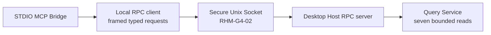

# DEC-G4-01：Local RPC v1 协议与只读能力边界

**状态：** Accepted for Goal 4 implementation  
**日期：** 2026-08-04  
**关联任务：** `RHM-G4-01`、`RHM-G4-02`、`RHM-G4-03`  
**范围：** Desktop Host 与独立 MCP Bridge 之间的本地协议；不包含 Unix Socket 权限实现、Host 自动拉起、MCP STDIO 映射、真实 Agent 配置或任何外部写操作。

## 1. 决策背景

Desktop Host 是 Runtime、Store 和 Query Service 的唯一进程所有者；MCP Bridge 只能通过受限本地协议访问已经冻结的 Query 语义。协议必须同时满足：

- 能明确拒绝不兼容的 Host/Bridge 版本；
- 能在不同 Release Set 之间进行受控兼容协商；
- 传输边界可设置严格、可测试的长度与并发上限；
- 请求在类型层只能表达七个只读 Query；
- 不暴露 SQL、Secret、Credential、Connector、refresh、配置修改或任意方法名。

## 2. 传输帧

Local RPC v1 使用长度前缀 JSON：

```text
+------------------------------+---------------------------+
| 4-byte unsigned big-endian N | N bytes UTF-8 JSON body  |
+------------------------------+---------------------------+
```

- 长度字段只描述 JSON body，不包含 4 字节前缀。
- 单个 body 最大为 `1 MiB`（`1_048_576` bytes）。
- 长度为零、超过上限、提前 EOF、非法 UTF-8 或非法 JSON 均返回/映射为 `invalid_frame`；声明长度超过上限使用 `frame_too_large`。
- 编码器必须在分配或写出 body 前执行同一上限检查。
- 首版不采用 JSON-RPC、HTTP、WebSocket、gRPC、换行分隔 JSON 或无边界 JSON stream。

此决策只冻结 codec。Unix Socket、peer UID、文件权限、stale socket 清理和请求调度由 `RHM-G4-02` 实现。

## 3. 协议版本与握手

冻结初始版本：

```text
protocol_major = 1
protocol_minor = 0
minimum_supported_minor = 0
```

Client hello 字段：

```text
protocol_major
protocol_minor
minimum_supported_minor
bridge_version
release_id
supported_capabilities
required_capabilities
```

Host hello 字段：

```text
protocol_major
protocol_minor
minimum_supported_minor
selected_protocol_minor
host_version
release_id
supported_capabilities
required_capabilities
```

Host 对 `ClientHello` 的首个 wire response 使用不带 request ID 的封闭 envelope：

```text
accepted: host + upgrade_recommended
rejected: structured RpcError
```

`accepted.host.selected_protocol_minor` 是权威协商结果。`rejected` 用于握手阶段的 `protocol_mismatch` 或 `capability_mismatch`；Query `RequestEnvelope` 尚未被允许，因此不得伪造 request ID 或复用 Query `ResponseEnvelope`。

协商规则：

1. `protocol_major` 必须相等，否则 `protocol_mismatch`。
2. Client 与 Host 的 minor 支持区间必须有交集；选择交集中的最高 minor 作为 `selected_protocol_minor`。
3. `client.required_capabilities` 必须全部出现在 `host.supported_capabilities`；`host.required_capabilities` 也必须全部出现在 `client.supported_capabilities`，否则 `capability_mismatch`。
4. capability 集合必须确定性编码，重复项和未知项不得被静默接受。
5. `release_id` 不要求相等；协议与能力兼容但 Release Set 不同时，握手成功并设置 `upgrade_recommended = true`。
6. 握手完成前不得接受 Query request。

## 4. Caller 与请求 envelope

每个请求包含：

- `request_id`：非空 UTF-8 字符串，最大 `128` UTF-8 bytes；超限或非法值为 `invalid_request_id`。
- `caller`：结构化调用方身份，首版用于区分受信 Bridge/测试调用方和保留诊断信息；不得把任意 executable path 或 Agent 参数视为授权。
- `query`：第 5 节定义的封闭枚举之一。

每个 session 最多允许 `8` 个 in-flight 请求。第九个及后续请求必须以 `too_many_requests` 拒绝，不得通过无界 queue 转移风险。

Response envelope 必须回显 `request_id`，并且只能包含成功 Query response 或结构化错误之一。错误不得包含 SQL、数据库路径、Provider 原始响应、Secret、Credential 或内部 backtrace。

## 5. 七个只读 Query capability

Local RPC v1 的 capability 集合精确冻结为：

```text
query.search_resources.v1
query.get_resource.v1
query.get_topology.v1
query.get_health_summary.v1
query.get_recent_changes.v1
query.get_sync_status.v1
query.list_connector_coverage.v1
```

协议 request/response 使用与上述 capability 一一对应的封闭 serde enum variant。每个 variant 只承载 Query Service 已冻结的输入和 QDTO 输出，不使用 `method: String`、任意 `params: Value` 或 provider-specific passthrough。

首版明确不存在：

- SQL 或通用查询执行；
- Secret/Credential/Keychain 读取；
- Connector 原始调用或 Provider SDK passthrough；
- refresh、sync trigger 或重试；
- Connection、schedule、setting 或其他配置修改；
- 文件、shell、网络代理或外部基础设施操作。

## 6. 错误码

Local RPC v1 冻结以下稳定错误码：

```text
host_unavailable
protocol_mismatch
capability_mismatch
invalid_frame
frame_too_large
invalid_request_id
too_many_requests
query_failed
```

- codec 只产生 framing 相关错误；session/transport 负责 availability、并发与握手错误；Query adapter 将清洗后的 Query failure 映射为 `query_failed`。
- 错误 envelope 可以携带安全、简短、面向调用方的 message，但调用方不得根据自由文本扩展权限或控制流。
- 未识别的错误码按不兼容响应处理，不能降级为成功或通用任意调用。

## 7. Golden contract

`RHM-G4-01` 必须提供并冻结以下 golden fixture/test：

1. Client hello 与 Host hello 的 canonical JSON round-trip。
2. Accepted、protocol mismatch 和 capability mismatch 三种 handshake response 的 canonical JSON round-trip，且均不含 request ID。
3. 七个 request variant 与对应 response envelope round-trip。
4. 全部错误码 round-trip。
5. 4 字节大端长度前缀的精确 bytes。
6. `1 MiB` 边界成功、超过一个 byte 拒绝且不进行超限分配。
7. request ID 的 128-byte 边界以及多字节 UTF-8 byte-length 校验。
8. major mismatch、minor 无交集和双向 capability mismatch。
9. compatible release mismatch 成功并设置 `upgrade_recommended`。
10. 未知/重复 capability、未知 query variant 和任意 method/params 不能进入有效 typed request。

Golden fixture 是协议兼容证据，不得包含真实 Provider 数据、用户路径、凭据或机器标识。

## 8. 组件边界



- Protocol crate 不依赖 Tauri、MCP SDK、Store、Runtime、Keychain 或 Provider crate。
- Socket adapter 不得重新定义 Query DTO 或增加 capability。
- MCP Bridge 不得直接打开 SQLite、调用 Connector 或访问 Keychain。
- Host 自动拉起与 `user_quit` 抑制是独立 availability 状态机，不属于 handshake 授权。

## 9. 拒绝方案

| 方案 | 拒绝原因 |
| --- | --- |
| JSON-RPC + 任意 method 字符串 | 扩展面过宽，难以在类型层证明只有七个只读能力 |
| HTTP/gRPC listener | 为单机本地 UDS 增加不必要的协议面、依赖和误暴露风险 |
| 换行分隔 JSON | body 内换行与截断处理不如固定长度边界明确 |
| Bridge 直接读取 SQLite | 绕过 Runtime/Query Service，破坏唯一 owner 和查询语义 |
| release ID 必须完全一致 | 阻止冻结的 minor-window 兼容与可控升级提示 |
| 无界 frame/request ID/in-flight | 允许本地调用方造成不受控内存和任务占用 |

## 10. 安全与授权边界

本决策仅授权实现和测试本地只读协议。它不授权修改 Codex/Hermes 用户配置、不授权安装 Bridge、不授权拉起真实签名 App、不授权创建 Keychain item，也不授权任何 Provider 或基础设施写操作。
