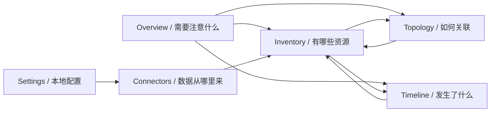

# 界面与可视化设计

**状态：** Proposed（待用户确认视觉方向）  
**范围：** React/TypeScript Desktop UI 的信息架构与交互契约；不包含实现代码、组件库选型或最终视觉稿

本文把“可视化程度高”转化为可验证的产品规则。Next Infra 不是展示资源数量的通用 Dashboard，而是帮助一个基础设施维护者快速判断“哪里异常、数据是否可信、资源如何关联、最近发生了什么”的本地桌面工作台。

## 1. 使用场景与设计意图

### 1.1 具体使用者

使用者是当前 Mac 的唯一维护者。他通常在以下时刻打开应用：

- 日常快速确认个人基础设施是否健康。
- 部署失败、域名异常或远程主机失联后定位链路。
- 切换多个 Provider 控制台前，先确认资源身份和最近变化。
- 让 Codex/Hermes 查询后，在 Desktop UI 中核对证据和完整上下文。

他不需要 NOC 大屏，也不需要团队任务流；他需要的是高信息密度、低噪声和可追溯证据。

### 1.2 必须完成的动作

界面首先服务四个动词：

1. **发现**：找到需要注意的异常、过期数据和同步缺口。
2. **定位**：从一个资源沿有证据的关系定位上下游。
3. **核实**：区分资源真实异常、数据过期和 Connector 读取失败。
4. **回放**：查看何时、由哪个来源观察到什么结构化变化。

### 1.3 体验意图

推荐方向是“冷静、紧凑、证据优先的基础设施图谱”。它应像一张持续更新的工程地图，而不是彩色 KPI 卡片墙，也不是充满动态粒子的监控大屏。

## 2. 领域探索与视觉方向

### 2.1 Domain

与本产品直接相关的领域概念：

- Inventory：当前已知资源清单。
- Topology：依赖、部署、路由和承载关系。
- Observation：某一时间从外部系统获得的观察。
- Freshness：观察是否仍足以代表当前状态。
- Evidence：Provider、人工 Binding 或推断规则提供的关系证据。
- Coverage：Connector 实际覆盖和未覆盖的范围。
- Change：相邻事实版本之间的结构化变化。
- Heartbeat：同步运行、退避和下一次计划。

### 2.2 Color world

颜色来源于实际基础设施工作环境，而不是任意品牌渐变：

- 机架石墨：主画布和密集数据区域。
- 阳极氧化铝灰：层级、边界和非活动状态。
- 遥测青：当前选择、数据流向和可交互焦点。
- 心跳绿：最近一次权威读取成功，但不自动等同于资源健康。
- 检查琥珀：stale、partial、需要核实。
- 故障朱红：外部系统明确报告的异常或 Connector 失败。
- 云雾灰蓝：unknown、disabled、尚未覆盖。

颜色只承载语义，不按 Provider 给整块界面染色。GitHub、Cloudflare 等来源通过名称和单色 glyph 识别，避免“彩虹 Provider Dashboard”。任何状态都同时使用文字或图形，不只依赖颜色。

### 2.3 Signature：Evidence Spine

产品的辨识性元素是 **Evidence Spine（证据脉络）**：

```text
Provider / Connection
        ↓ observed by SyncRun at 10:42
Resource current projection
        ↓ provider | configured | inferred
Related resource / Change
```

它不是装饰时间线，而是稳定的来源—观察—事实—关系链。Evidence Spine 至少出现在：

1. Overview 的注意项展开。
2. Resource Detail 的主信息区。
3. Topology 的边检查器。
4. Timeline 的 Change 详情。
5. Connectors 的 Coverage 与最近同步详情。

### 2.4 明确拒绝的默认方案

| 常见默认 | 问题 | 本项目替代方式 |
| --- | --- | --- |
| 顶部四张大数字 KPI 卡 | 数量本身不能指导下一步 | 以“需要注意的事实”队列和 Freshness/Coverage 带作为首屏主角 |
| 一次加载全局节点图 | 很快成为不可读的 hairball | 以选中资源为中心，depth 1 起步、按需展开、有硬上限 |
| 用 Provider 品牌色区分所有资源 | 与健康、Freshness 语义竞争 | Provider 使用 glyph/标签，颜色留给状态与交互 |
| 把所有内容装进独立卡片 | 打碎资源、关系和证据连续性 | 密集表格、分区画布和 Evidence Spine 形成连续阅读路径 |

## 3. 信息架构



主导航固定为 Overview、Inventory、Topology、Timeline、Connectors、Settings。导航与画布使用同一基础 surface，仅用安静边界分隔；底部持续显示 Runtime、最近同步和数据预算摘要。

全局搜索是资源入口，不是命令执行器。首版不得从搜索框触发 SSH 命令、Provider 写操作或未经确认的本地配置变化。

## 4. 全局桌面框架

```text
┌─────────────────────────────────────────────────────────────────────┐
│ Context bar: 当前范围 / 全局搜索 / 最近观察时间 / 同步状态           │
├──────────────┬──────────────────────────────────────┬───────────────┤
│ Navigation   │ Primary canvas                       │ Inspector     │
│              │ table / topology / timeline          │ Evidence      │
│              │                                      │ Spine         │
├──────────────┴──────────────────────────────────────┴───────────────┤
│ Runtime: active · 6/7 connections fresh · storage 420 MiB           │
└─────────────────────────────────────────────────────────────────────┘
```

- 左侧导航保持稳定，不因为 Provider 切换而改变结构。
- 中央画布负责当前任务，不同时堆叠多个主可视化。
- 右侧 Inspector 在选中 Resource、Relation、Change 或 Connection 时出现；关闭后中央画布获得空间。
- Context bar 始终显示当前过滤范围和数据观察时间，避免截图脱离上下文。
- 关闭主窗口只隐藏窗口；重新显示时保留导航位置，但重新查询权威快照。

## 5. 视觉语义

### 5.1 Health 与 Freshness 必须分开

| 维度 | 回答的问题 | 表达 |
| --- | --- | --- |
| Resource Health | Provider 最后报告的资源状态是什么 | 图标、文字与语义色 |
| Freshness | 这份状态还足够新吗 | 时间标签、时钟形态和 stale/expired 文案 |
| Connector Health | 当前还能否继续读取 | 独立连接状态，不覆盖 Resource Health |
| Coverage | Connector 是否观察了用户关心的范围 | supported/partial/unsupported 矩阵 |

禁止用单一绿色圆点同时表达“资源健康、同步成功、数据新鲜”。例如最后观察为 healthy 但已过期时，应同时显示 `healthy at last observation` 与 `expired`。

### 5.2 Relation 证据

| evidence_type | 线型 | 必须显示 |
| --- | --- | --- |
| `provider` | 实线 | Provider、Connection、字段路径、observed_at |
| `configured` | 双线或带人工标记的实线 | Binding、创建时间 |
| `inferred` | 虚线 | 规则版本、输入版本、confidence |

线型和标签承担主要区分，颜色只用于选择和异常。相同端点存在多条证据时可以视觉合并，但 Inspector 必须列出全部证据，不得抹平来源。

### 5.3 Lifecycle

- `active`：正常视觉权重。
- `tombstoned`：降低实体权重并显示最后一次权威观察，不从图中静默消失。
- `orphaned`：显示 Connection 已删除或停用的原因。
- `unresolved binding`：保留关系占位与缺失端点说明。

## 6. 页面契约

### 6.1 Overview

首屏按决策价值排序：

1. Attention Queue：真实异常、expired、连续同步失败、partial coverage。
2. Observation Strip：各 Connection 的最近成功、下一次计划和覆盖缺口。
3. Critical Paths：用户固定的少量关键资源链，而不是自动选择的随机图。
4. Recent Changes：结构化变化摘要。

资源总数等统计只作为次要上下文，不占据主视觉。

### 6.2 Inventory

Inventory 是高密度表格，不是资源卡片瀑布流：

- 固定显示名称、kind、scope、Health、Freshness、Connection、observed_at。
- 支持组合过滤、稳定排序、分页和保存本地视图。
- 选择一行打开 Inspector；双击或明确动作进入 Resource Detail。
- 长 ID、URN 和原始属性默认折叠，按需复制或展开。
- 大结果集使用分页或虚拟化，不能一次渲染全部资源。

### 6.3 Topology

Topology 默认以一个 Resource 为中心、depth 1、最多 100 nodes / 200 edges；用户逐层展开，硬上限 200 nodes / 400 edges。

- 不提供“加载所有资源”入口。
- 布局优先表达依赖方向；同类节点可以折叠成有数量和范围的 group。
- 节点主体表达资源身份，边表达关系与证据；不要用节点颜色同时编码 Provider、Health 和 Freshness。
- 截断时显示 frontier 和剩余方向，用户明确选择下一步展开。
- 选择边时打开 Evidence Spine；选择节点时打开资源摘要和上下游计数。
- 键盘可在相邻节点间移动；缩放不隐藏当前 focus 和 observed_at。

### 6.4 Resource Detail

从上到下固定为：

1. 身份与当前状态。
2. Evidence Spine 与 Freshness。
3. 上下游关系摘要。
4. 规范化属性。
5. 最近 Change 与版本。
6. Connector Coverage 和无法提供的字段。

Provider 原始响应不是默认页签；临时按需读取的数据必须明确标识“未持久化”和观察时间。

### 6.5 Timeline

- Change 按时间与 SyncRun/Binding/Inference origin 分组，而不是模拟日志终端。
- 默认只显示结构化字段变化；before/after 大字段折叠。
- 可以从 Change 跳转到当时 ResourceVersion 和当前资源。
- 未变化轮询不产生噪声条目。
- 时区明确使用本机时区，同时保留可复制的绝对时间。

### 6.6 Connectors

- Connection 列表同时显示 Health、最近成功、最近尝试、下一次计划和退避。
- Coverage Matrix 按资源模块显示 supported/partial/unsupported 与原因。
- 权限不足、凭据不可用、Provider 故障和网络不可达使用不同错误分类。
- Secret 只允许替换，不能显示或复制现有值。

### 6.7 Settings

只放本地控制：自动登录、MCP 自动拉起授权、保留期、数据预算、诊断导出和 Connection 非秘密配置。自动登录与 MCP 自动拉起必须是两个独立开关；`user_quit` 抑制状态应可见，并通过用户主动启动恢复，而不是让 Agent 清除。

## 7. 状态完整性

每个数据视图都必须设计以下状态：

- `initial_setup`：尚无 Connection，给出本地配置下一步。
- `loading`：保留页面骨架，不用无限全屏 spinner。
- `empty`：查询成功但无匹配资源，展示当前过滤条件。
- `stale` / `expired`：保留最后事实并明确观察时间。
- `partial`：展示已有结果与缺失覆盖，不能伪装为空。
- `error`：区分查询错误、Connector 错误和 Host 不可用。
- `truncated`：展示硬上限和继续查询入口。
- `credential_unavailable`：说明需要用户处理，不循环弹窗。
- `host_unavailable`：说明 Host 未运行、未授权拉起或被显式退出抑制。

任何错误都不能用空白页面或“0 resources”代替。

## 8. 视觉系统建议

该方向在用户确认前不冻结具体色值和组件库，但冻结以下原则：

- **Depth：** borders-only；依靠同色系 surface 的轻微明度变化和低对比边界，不混用大阴影。
- **Typography：** macOS 首版使用系统 UI 字体保证桌面一致性；ID、时间、计数使用系统等宽字体与 tabular numbers。
- **Spacing：** 4 px 基础单位；表格和 Inspector 偏紧凑，主分区保留清晰间隔。
- **Radius：** 小而克制，符合工程工具，不使用大圆角卡片语言。
- **Color：** 一个遥测青交互强调色；健康、警告、故障色只表达语义。
- **Motion：** 只为选择、展开和同步状态提供短过渡；遵守 reduced motion，不使用持续漂浮、粒子和弹跳。
- **Icon：** 单一线性图标体系；图标必须提供含义，不作卡片装饰。

## 9. 可访问性与桌面交互

- 所有状态同时提供文字，不依赖红绿辨识。
- 表格、导航、Topology focus 和 Inspector 支持键盘操作及明确 focus ring。
- 常用路径支持系统习惯快捷键：搜索、返回、刷新当前本地查询、显示/隐藏窗口。
- 手动同步是明确按钮并返回 SyncRun，不把“刷新查询”和“请求 Provider 同步”混成一个动作。
- 外部链接明确标识将离开应用，并只通过系统浏览器打开。
- 文本缩放后关键状态和操作不能被截断；Tooltip 不能成为唯一信息来源。

## 10. 性能与边界

- Inventory、Timeline 和搜索均使用分页；默认 25 或 50 行，单次不超过 100。
- Topology 使用 RFC 规定的默认和硬上限，布局计算不得阻塞 Tauri Command。
- UI Event 只使当前可见查询失效；后台页面不因每次同步全部重渲染。
- 大属性和历史版本按需读取，Provider 临时详情不随 Resource 主查询返回。
- 动画在大量节点下自动降级；数据准确性优先于过渡效果。

## 11. 首个可视化纵切

在接入真实 Provider 前，Fixture 数据应覆盖：

```text
GitHub Repository
  -> Workflow -> Deployment
  -> Dokploy Application -> SSH Host
  -> Supabase Project
  -> Cloudflare DNS Record
```

同时包含 healthy-but-stale、Connector failed、partial coverage、tombstoned、configured relation 和 inferred relation。这样可以在 Goal 3 就验证高可视化信息层级，而不是等到 Goal 7 才发现数据模型无法支持界面。

## 12. 验收标准

- 使用者在 Overview 能区分真实资源异常、数据过期和 Connector 失败。
- 任意 Resource 都能在不加载全局图的情况下查看一跳上下游和关系证据。
- Health、Freshness、Coverage、Lifecycle 和 Relation Evidence 具有互不冲突的视觉语义。
- 页面始终显示数据来源或 observed_at，不把旧快照伪装成实时状态。
- 所有列表、图和历史查询都有默认上限、硬上限、截断和继续路径。
- 空、错、partial、stale、truncated、credential unavailable 和 host unavailable 均有独立状态。
- 首个 Fixture 纵切即可演示 Overview → Topology → Resource Detail → Timeline 的完整核实路径。
- 真实桌面验收覆盖主窗口隐藏/恢复、键盘导航和 WebView 重新查询。

## 13. 待用户确认

在开始 UI 实现前需要确认：

1. 是否接受“冷静、紧凑、证据优先的基础设施图谱”方向。
2. 是否接受默认深色石墨画布；如需要浅色模式，应保持同一语义而不是另做一套风格。
3. Overview 是否允许用户固定少量 Critical Paths，还是首版完全不提供固定功能。
4. Inspector 默认常驻还是仅在选中对象后出现。

这些问题不影响 Rust 架构，但会影响 Goal 3 的 UI 验收，不应在编码时临时决定。
