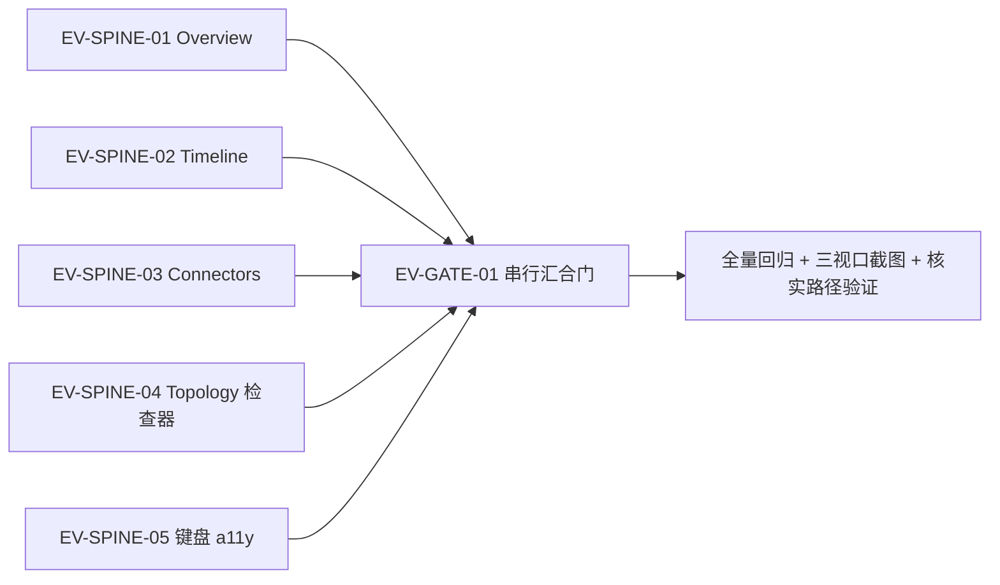

# EV-SPINE 并行任务拆解 — 证据链剩余工作

**日期：** 2026-08-10
**状态：** 已执行完成 — `EV-SPINE-01..05` 全部 `DONE`（EV-SPINE-02 一次重派，relation subject 改为诚实说明态），`EV-GATE-01` `PASSED`（2026-08-10，tsc 零错误 / vitest 32 文件 209 用例全绿 / 浏览器核实路径 + 三视口验证通过）
**范围：** 证据链/检查器优化已完成部分之外的全部剩余工作；仅前端（`apps/desktop`），不涉及 Rust crate、DTO 生成或共享契约修改。

## 1. 背景

证据链核心（`EvidenceSpine` / `EvidenceCard` / `InspectorHost` / format 工具 / 复制 / 折叠 / 空态 / 视觉 QA）已完成并通过验收（tsc 零错误、vitest 30 文件 190 用例全绿、三视口浏览器验证）。本表拆解剩余工作：把 Evidence Spine 复用到规范要求的位置并补强可访问性，全部为可并行任务包。

规范依据：`.interface-design/system.md` §8.2（Evidence Spine 至少复用于 Overview 注意项、Resource Detail、Topology Relation、Timeline Change、Connectors Coverage/SyncRun）、§9（Sync Coverage 语义）、§11（独立状态）、§12（键盘与焦点）。

## 2. 并行可行性论证（文件冲突矩阵）

勘探确认四页面互不重叠；共享/敏感路径单写归属如下，保证 5 个任务零冲突并行：

| 共享/敏感路径 | 唯一 Owner |
| --- | --- |
| `apps/desktop/src/features/evidence/**` | EV-SPINE-05（仅 aria/focus 微修）；其余任务只读消费 |
| `apps/desktop/src/platform/desktop-adapter/mock-desktop-adapter.ts` | EV-SPINE-03（getSyncStatus 补 recent_runs） |
| `apps/desktop/src/ui/InspectorHost.tsx`、`app/AppShell.tsx`、`ui/PrimaryCanvas.tsx` | EV-SPINE-04 |
| `apps/desktop/src/features/overview/**` / `features/timeline/**` / `features/connectors/**` | 各自任务独有 |
| `apps/desktop/tests/accessibility/**` | EV-SPINE-05 |
| `apps/desktop/src/main.test.tsx` | EV-SPINE-04 |

**冻结决策（避免串行设计任务）：**

1. **Connectors 不改 EvidenceSpine 共享契约。** EvidenceSpine 是关系模型（source/target/relations）；Connector 证据链是 `Connector → Connection → SyncRun → Coverage` 线性模型（`prototype/index.html` line 1964）。Connectors 页在其自有目录构建同视觉语言的 provenance 展示，不触碰 `features/evidence/**`。
2. **InspectorHost 关系分支升级为完整 EvidenceSpine。** 勘探确认拓扑边→检查器的选择链路已全通（`TopologyPage.inspectRelation` → `AppShell.inspectRelation` → `InspectorHost` 关系分支），当前只渲染单个 EvidenceCard；`InspectorSelection` 扩展携带 source/target 解析所需信息，由 EV-SPINE-04 拥有该契约。

## 3. 依赖图

5 个实现任务可同一批次并行派发；`EV-GATE-01` 在全部 REVIEW 后串行执行。

## 4. 任务包

### EV-SPINE-01 — Overview 注意力区集成证据链

- **Task ID:** `EV-SPINE-01`
- **Status:** READY
- **Objective:** 每个"优先核验"注意项可展开显示其关系的完整证据链
- **Dependencies:** 已完成 `EvidenceSpine`（props: source/target/relations）；冻结规范 §8.2
- **Exclusive ownership:** `apps/desktop/src/features/overview/**`（含新增 adapter 子类文件）
- **Read-only inputs:** `features/evidence/EvidenceSpine.tsx`、`platform/desktop-adapter/*`、`generated/query/*`
- **Scope:**
  - 注意项渲染处（`OverviewPage.tsx` L292-344，`.overview-attention-list`）为每个注意资源经 `getResource({ resource_id, include: ["relations"] })` 拉取关系
  - 按 `(source_resource_id, target_resource_id)` 对分组 + 解析端点 `ResourceDto`（复用 `ResourceDetailPage.tsx` L41-97 模式）
  - 渲染 `<EvidenceSpine source target relations />`；保留 `onInspectResource` 点击穿透
- **Non-goals:** 不改 AppShell/evidence 组件/mock-desktop-adapter；不改注意项派生逻辑（`buildAttentionItem`）
- **Acceptance:** 注意项（fixture 中 `fixture-resource-beta` = expired）展开显示 provider/configured/inferred 三条证据卡；无关系资源显示空态；现有 8 个 Overview 测试不回归
- **Verification:** `rtk pnpm --dir apps/desktop exec tsc --noEmit`；`rtk pnpm --dir apps/desktop exec vitest run src/features/overview`
- **Stop rule:** 需要改 shared evidence / AppShell / mock-desktop-adapter 时立即停止并回报

### EV-SPINE-02 — Timeline 变更详情集成证据链

- **Task ID:** `EV-SPINE-02`
- **Status:** READY
- **Objective:** 每个 Timeline 变更项可展开显示其关系的证据链（§8.2 "Timeline Change"）
- **Dependencies:** 上游已合并 Timeline 重建（`TimelineItem.tsx`/`TimelineGroup.tsx`/`FieldDiff.tsx`）；`EvidenceSpine`
- **Exclusive ownership:** `apps/desktop/src/features/timeline/**` + 新增 `apps/desktop/src/test/fixtures/timeline-evidence-adapter.ts`
- **Read-only inputs:** `features/evidence/*`；`ui/PrimaryCanvas.tsx`（只读，不改）
- **Scope:**
  - `TimelineItem.tsx` 内加展开器（匹配 FieldDiff 的 `
` 模式）
  - 按 `ChangeSubjectDto` 解析：resource subject → `getResource` 拉 relations；relation subject → 拉两端点资源 + relations
  - 按对分组渲染 `<EvidenceSpine>`；binding subject 无端点解析 → 渲染诚实空态（标注不可解析原因）
- **Non-goals:** 不做 subject→资源详情深链（延后至 EV-SPINE-NEXT，随 EV-GATE-01 后单任务派发）；不改 DTO/Rust
- **Acceptance:** 展开 relation/resource subject 变更项显示证据链；binding subject 显示空态说明；现有 9 个 Timeline 测试不回归
- **Verification:** `rtk pnpm --dir apps/desktop exec tsc --noEmit`；`rtk pnpm --dir apps/desktop exec vitest run src/features/timeline`
- **Stop rule:** 需要改 PrimaryCanvas / AppShell / DTO 时立即停止并回报

### EV-SPINE-03 — Connectors 同步运行/覆盖 provenance 展示

- **Task ID:** `EV-SPINE-03`
- **Status:** READY
- **Objective:** 连接行可展开显示 `Connector → Connection → SyncRun → Coverage` 证据脉络（§8.2 + 原型 line 1964）
- **Dependencies:** 冻结决策 1（独立 provenance 展示，不动 EvidenceSpine 契约）；`SyncStatusDto/SyncRunDto/SyncCoverageDto` 已有字段
- **Exclusive ownership:** `apps/desktop/src/features/connectors/**`；`platform/desktop-adapter/mock-desktop-adapter.ts`（getSyncStatus 补 recent_runs 支持）；新增 `apps/desktop/src/test/fixtures/sync-run-fixture.ts`
- **Read-only inputs:** `generated/query/SyncRunDto.ts` 等；`.interface-design/system.md` §9/§11
- **Scope:**
  - `ConnectorsPage.refresh()`（L212）提升 `recent_run_limit` 并保留完整 `SyncStatusDto`（当前只投影 `recent_runs[0]` 的 4 个字段，其余丢弃）
  - 连接表行内展开显示最近 SyncRun 详情（status/coverage/mode/trigger/counts/errors/warnings）+ 按原型模式渲染 provenance 链
  - 补 §11 缺失状态：`initial_setup`（无连接）、`stale/expired`（observed_at 保留）、`credential_unavailable` 至少文字级呈现
- **Non-goals:** 不改 `features/evidence/**`；不改 DTO 生成路径（`generated/query/**`）
- **Acceptance:** 连接行展开显示同步运行 provenance；mock 返回 fixture recent_runs 后 16 个既有 Connectors 测试不回归 + 新增覆盖
- **Verification:** `rtk pnpm --dir apps/desktop exec tsc --noEmit`；`rtk pnpm --dir apps/desktop exec vitest run src/features/connectors`
- **Stop rule:** 需要改 EvidenceSpine / 生成 DTO 时立即停止并回报

### EV-SPINE-04 — Topology 边检查器升级为完整证据链 + 检查器生命周期

- **Task ID:** `EV-SPINE-04`
- **Status:** READY
- **Objective:** 选中拓扑边/节点后，检查器显示完整 EvidenceSpine（来源→证据→目标），并修 stale selection 与 focus 管理
- **Dependencies:** 冻结决策 2（InspectorSelection 扩展）；勘探确认边选择链路已全通（仅需升级展示）
- **Exclusive ownership:** `apps/desktop/src/ui/InspectorHost.tsx`、`apps/desktop/src/app/AppShell.tsx`、`apps/desktop/src/ui/PrimaryCanvas.tsx`、`apps/desktop/src/main.test.tsx`
- **Read-only inputs:** `features/topology/**`（链路已通，不改）
- **Scope:**
  - `InspectorSelection` 扩展携带 source/target `ResourceDto`（经 `useDesktopAdapter().getResource` 解析）
  - 关系分支渲染 `<EvidenceSpine>` 替代单个 `<EvidenceCard>`
  - `focusTopology`/re-query 时清理 AppShell 中过期的 `selection`（当前仅 TopologyPage 本地 selection 被重置，AppShell 的持久）
  - 检查器打开/关闭的 focus 管理；检查器开/关按钮补 `aria-expanded` 联动 aside
- **Non-goals:** 不改拓扑布局/层级逻辑（`topology-presentation.ts` / `topology-hierarchy-layout.ts`）；不做 Timeline 深链（延后至 EV-SPINE-NEXT，随 EV-GATE-01 后单任务派发）
- **Acceptance:** `main.test.tsx` L308-347 扩展断言 spine 行；新增陈旧选择测试；检查器开/关按钮 aria-expanded 正确联动
- **Verification:** `rtk pnpm --dir apps/desktop exec tsc --noEmit`；`rtk pnpm --dir apps/desktop exec vitest run src/main.test.tsx tests/acceptance`
- **Stop rule:** 需要改 topology feature 内部逻辑时立即停止并回报

### EV-SPINE-05 — 证据组件键盘可访问性测试补强 + 微修

- **Task ID:** `EV-SPINE-05`
- **Status:** READY
- **Objective:** 证据链/检查器全部交互键盘可达且有测试锁定（§12）
- **Dependencies:** 既有 EvidenceSpine/EvidenceCard 交互
- **Exclusive ownership:** `apps/desktop/tests/accessibility/**`（新增 `evidence.keyboard.test.tsx`）+ `apps/desktop/src/features/evidence/**`
- **Read-only inputs:** 其他任务页面（仅测其暴露的 DOM）
- **Scope:**
  - Tab+Enter/Space 测试：拓扑边激活（行为断言，测试文件位于 tests/accessibility/ 不触碰 topology 源码）、EvidenceSpine 展开按钮（补 `aria-controls`）、复制按钮（stub clipboard）、检查器开/关按钮键盘激活（仅行为断言；`aria-expanded` 由 EV-SPINE-04 实现）、`
` 键盘展开后复制
  - `EvidenceCard.css` / `EvidenceSpine.css` 补 `:focus-visible`
  - 使用 `tests/support/renderDesktopFixture.tsx` + `createQueryEvidenceLifecycleSnapshotFixture`
- **Non-goals:** 不改其他页面行为逻辑；不修改 `ui/InspectorHost.tsx` / `app/AppShell.tsx`（aria-expanded 归 EV-SPINE-04）
- **Acceptance:** 新增键盘测试全过；既有 190 测试不回归
- **Verification:** `rtk pnpm --dir apps/desktop exec tsc --noEmit`；`rtk pnpm --dir apps/desktop exec vitest run tests/accessibility src/features/evidence`
- **Stop rule:** 需要改 AppShell 时立即停止并回报（aria 联动只限 evidence 内部）

## 5. 串行汇合门

### EV-GATE-01 — 证据链全功能验收门

- **Task ID:** `EV-GATE-01`
- **Status:** WAITING（5 分支全部进入 REVIEW 后派发）
- **Objective:** 证明证据链在全部四处复用点成立，全量回归 + 三视口视觉证据 + 完整核实路径
- **Dependencies:** `EV-SPINE-01..05` 均处于 REVIEW
- **Scope:**
  - 全量 `rtk pnpm --dir apps/desktop lint`（tsc --noEmit）+ `rtk pnpm --dir apps/desktop test`
  - Playwright 三视口截图更新至 `output/playwright/`（1600×1000 / 900×800 / 390×844）
  - 验证 Overview → Topology → Resource Detail → Timeline 完整核实路径（fixture 纵切）
  - 确认零 console 错误、无横向溢出、窄屏无回归
- **Verification:** `rtk pnpm --dir apps/desktop lint`；`rtk pnpm --dir apps/desktop test`；浏览器回归
- **风险/停止:** 分支失败回派原 Owner；Gate Captain 不顺手重构 Feature

## 6. 派发说明

- 每个任务包派发提示必须包含本表全部字段（Objective/Exclusive ownership/Scope/Non-goals/Acceptance/Verification/Stop rule）。
- 类别：`visual-engineering`；skills：`frontend`、`ui-ux-pro-max`。
- 同批次 5 个全部并行；全部 REVIEW 后由调度者串行执行 `EV-GATE-01`。
- 所有任务不得触碰：`apps/desktop/src/generated/**`（ts-rs 生成物）、Rust crate、`docs/design/` 冻结文档、根 manifest/lockfile。
