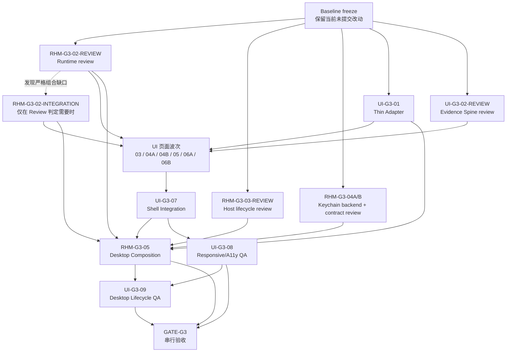

# Goal 3 Luna Worker 并行调度计划

**日期：** 2026-08-03  
**范围：** 仅 Goal 3；未通过 `GATE-G3` 前不派发 Goal 4。  
**目的：** 将当前 Goal 3 收口工作拆成边界明确、可验证、可由 `luna_worker` 执行的任务包。  
**本文件不授权：** 外部基础设施写操作、真实 Secret、用户级 Codex/Hermes 配置、签名、公证或发布。

## 1. 当前基线与保护规则

当前工作树包含尚未提交的 Goal 3 实现：

- Runtime：`crates/next-infra-runtime/**`。
- Host lifecycle：`apps/desktop/src-tauri/src/host/**`。
- Keychain policy/fake backend：`apps/desktop/src-tauri/src/keychain/**`。
- Structured `SecretRef`：`crates/next-infra-core/src/secret.rs` 及 Store round-trip。
- Evidence Spine：`apps/desktop/src/features/evidence/**`。
- Relation Evidence QDTO、生成 binding 与 UI fixtures。
- Desktop `Cargo.toml`、Runtime `Cargo.toml`、`Cargo.lock` 和依赖方向 guard。

所有 worker 必须遵守：

1. 不 reset、覆盖或重建上述未提交实现。
2. 一个 worker 只拥有一个任务包和一组独占路径。
3. 页面 worker 不编辑 Shell route/global CSS、generated bindings 或 fixtures。
4. Host、Adapter、Keychain worker 不编辑 Tauri shared entrypoint/config/capabilities。
5. 根 manifest、`Cargo.lock`、Tauri composition 和 Gate 文件由 Composition/Gate Captain 串行修改。
6. 需要修改共享契约或越过独占路径时立即停止并回报。

## 2. 执行拓扑

最大并发由实际 agent 槽位决定；推荐任一时刻只启动路径完全不重叠的任务。

## 3. 波次 A：基础契约与现有实现收口

### `RHM-G3-02-REVIEW` — Runtime 独立 Review

- **状态：** `READY`。
- **目标：** 判断现有 Runtime 是否完整覆盖 startup recovery、interactive/background、调度、sleep/wake、admission、drain 和 checkpoint；给出 `REVIEW` 或明确缺口。
- **依赖：** `RHM-G3-01` 已进入 `REVIEW`；Core/Store/Sync ports 已冻结。
- **独占路径：** `crates/next-infra-runtime/**`。
- **只读输入：** Core、Store、Sync、Query 契约；Goal 3 验收标准。
- **范围：** Review 当前实现；仅允许在独占路径内增加最小测试或修复状态机缺陷。
- **非目标：** 不接 Tauri、WebView、Socket、MCP 或 Provider；不修改 Store/Sync/Query 契约。
- **验收：** 无 Tauri 类型；关闭顺序可证明；每连接 catch-up 最多一次；输出具体 Review 结论。
- **验证：** `rtk cargo test -p next-infra-runtime --locked`；`rtk cargo clippy -p next-infra-runtime --all-targets --locked -- -D warnings`；`rtk cargo metadata --locked --format-version 1`。
- **停止规则：** 需要修改根 manifest/lockfile、Core/QDTO、Store/Sync/Query 或 shared composition 时停止。

### `RHM-G3-02-INTEGRATION` — Runtime Concrete Backend（条件任务）

- **状态：** `REVIEW`。
- **启动条件：** `RHM-G3-02-REVIEW` 明确判定当前 Runtime 未证明 Store/Writer/Query/maintenance 组合。
- **目标：** 在不依赖 Tauri 的前提下补足可注入 backend 和最小真实 Store/Writer/Query integration evidence。
- **独占路径：** `crates/next-infra-runtime/**`。
- **非目标：** 不提前做 Desktop composition，不修改下游契约。
- **验收与验证：** 由 Review 发现的具体缺口决定；至少保留 Runtime 全测试和严格 Clippy 通过。
- **停止规则：** 需要修改其他 crate 或 shared manifest 时停止并回派。

### `RHM-G3-03-REVIEW` — Host Lifecycle 独立 Review

- **状态：** `READY`。
- **目标：** 按 `DEC-G1-02` 复核现有 Host 状态机，确认 close/hide/restore/reload/second-instance/quit/crash 分支互斥且完整。
- **依赖：** 冻结的 Runtime start/stop contract；允许 fake Runtime。
- **独占路径：** `apps/desktop/src-tauri/src/host/**`。
- **范围：** 状态机和 unit tests；仅修复 Host 纯逻辑缺陷。
- **非目标：** 不接真实 Tauri/AppKit、tray、autostart、entrypoint、config、capabilities 或 UI。
- **验收：** close 不停止 Runtime；WebView reload 不重启 Runtime；crash 不写 `user_quit`；第二实例只请求激活；Quit 顺序固定。
- **验证：** `rtk cargo test -p next-infra-desktop-adapter --locked`；`rtk cargo clippy -p next-infra-desktop-adapter --all-targets --locked -- -D warnings`；`rtk git diff --check`。
- **停止规则：** 需要真实 Tauri effects、shared entrypoint/config 或 Runtime contract 变化时停止并回派 Composition。

### `RHM-G3-04A` — macOS Keychain Backend 实现

- **状态：** `READY-CODE / LIVE-SMOKE-BLOCKED`。
- **目标：** 为现有 `KeychainBackend` port 增加真实 macOS Data Protection Keychain adapter；add 不原地 update，read 禁止 UI，delete 精确限定 namespace。
- **依赖：** `DEC-G1-04`；structured `SecretRef` 和现有 SecretManager policy。
- **独占路径：** `apps/desktop/src-tauri/src/keychain/**`；依赖声明只由 Composition/Gate Captain 串行处理。
- **范围：** `cfg(target_os = "macos")` backend、non-mac unsupported、OSStatus 清洗、fake/contract tests。
- **非目标：** 不创建真实 item，不使用真实 Secret，不签名；不修改 bundle ID/access group 决策。
- **验收：** 显式 Data Protection Keychain、access group、service/account、`synchronizable=false`、`WhenUnlockedThisDeviceOnly`；no-UI read；duplicate add 不 update；错误不泄漏 Secret。
- **验证：** Desktop adapter crate tests/Clippy；真实 Apple Development smoke 保持环境阻塞，不能由 ad-hoc 替代。
- **停止规则：** 需要 bundle ID、Team/profile、entitlement 或根依赖变更时停止并回报 Composition Captain。

### `RHM-G3-04B` — Keychain Contract Review

- **状态：** `BLOCKED`，等待 `RHM-G3-04A`。
- **目标：** 独立复核 SecretRef 元数据、replace rollback/cleanup、锁屏/缺失/签名错误映射和日志脱敏。
- **独占路径：** 只读；Review 报告由调度者单写固化。
- **验收：** fake contract 全通过；真实 smoke 明确标记 `BLOCKED-ENVIRONMENT`；不得把 ad-hoc 测试写成 Keychain 验证通过。

### `UI-G3-01` — Thin Tauri Desktop Adapter

- **状态：** `REVIEW`。
- **目标：** 将 React 请求映射到 bounded Query/local-config Commands；Manual Sync 返回 `sync_run_id`；Event 只做 invalidation 并触发 re-query。
- **独占路径：** `apps/desktop/src/platform/desktop-adapter/**`、`apps/desktop/src-tauri/src/adapter/**`。
- **只读输入：** generated QDTO、Query Service、Runtime/Host registration contracts。
- **非目标：** 无 SQL、Provider SDK、状态推导、Keychain 通用读取或完整 Event payload。
- **验收：** 页面无直接 `invoke/listen`；丢失/乱序事件不破坏权威状态；Command errors 已清洗。
- **验证：** `rtk cargo test -p next-infra-desktop-adapter`；Desktop test/lint/build；binding drift check。
- **停止规则：** 需要编辑 `main.rs`、`lib.rs`、capabilities、root manifest/lock、generated QDTO 或 fixtures 时停止。

### `UI-G3-02-REVIEW` — Evidence Spine 收口

- **状态：** `READY`，由当前实现 owner 增量完成。
- **目标：** Review 并冻结 Current Facts + Evidence Path 的公共展示合同。
- **独占路径：** `apps/desktop/src/features/evidence/**`。
- **保护：** 当前三个未提交 Evidence Spine 文件不得被覆盖或重建。
- **验收：** configured 不伪造 SyncRun；inferred 显示 rule/resource+relation inputs/confidence；相同 endpoints 多 evidence 不丢失；窄屏 drawer 可用。
- **验证：** Desktop focused/full tests、lint、build；viewport 由后续 QA 执行。
- **停止规则：** DTO 缺口回派 QDTO Owner；不得编辑 Shell、fixtures 或 generated binding。

## 4. 波次 B：页面并行实现

以下任务必须等待 `UI-G3-01` 和 `UI-G3-02-REVIEW` 的消费接口冻结。每个任务只修改自己的 feature 目录，可按 agent 槽位分批并行。

| Task ID | 独占路径 | 唯一结果 | 关键验收 |
| --- | --- | --- | --- |
| `UI-G3-03` | `apps/desktop/src/features/overview/**` | Attention → Observation → Critical Path → Changes | 区分 Resource Health、Freshness、Connector failure；显示来源和观察时间 |
| `UI-G3-04A` | `apps/desktop/src/features/inventory/**` | 有界 Inventory、filter/sort/cursor/selection | 单页最多 100；三类状态分离；opaque cursor 不可编辑 |
| `UI-G3-04B` | `apps/desktop/src/features/resource-detail/**` | 资源身份、状态、证据、关系、属性、Change、Coverage | 不显示 raw Provider JSON；expired/tombstoned/orphaned/partial 可核实 |
| `UI-G3-05` | `apps/desktop/src/features/topology/**` | focus-first depth 1 bounded topology | 默认 100/200、硬上限 200/400；Frontier/truncated；三类 evidence 不只靠颜色 |
| `UI-G3-06A` | `apps/desktop/src/features/connectors/**` | Connection health、sync/backoff、coverage、manual sync | Manual Sync 与 UI refresh 分离；Secret/SecretRef 不进入 DOM |
| `UI-G3-06B` | `apps/desktop/src/features/settings/**` | start-at-login、budget、retention、`user_quit` | unsupported capability 明确禁用；start-at-login 与 MCP auto-launch 分离 |

共同只读输入：UI fixture catalog、generated QDTO、Thin Adapter、Evidence Spine、Interface System、HTML prototype。  
共同非目标：不编辑 route registry/global CSS、fixtures、generated bindings、Tauri Host/Keychain；不直接调用 Tauri API。  
共同验证：`rtk pnpm --dir apps/desktop test`；`rtk pnpm --dir apps/desktop lint`；`rtk pnpm --dir apps/desktop build`。Connectors/Settings 另跑 Adapter crate tests。  
共同停止规则：需要共享字段/Adapter 方法/QDTO 或 Shell 修改时立即停止并回派对应 owner。

## 5. 波次 C：串行汇合

### `UI-G3-07` — Shell Integration

- **状态：** `BLOCKED`，等待 `UI-G3-02..06` 全部进入 `REVIEW`。
- **目标：** 由唯一 Shell Owner 接入所有页面、global bounded search、current scope、Inspector 和 restore re-query。
- **独占路径：** `apps/desktop/src/main.tsx`、`apps/desktop/src/app/**`、`apps/desktop/src/styles/**`、`apps/desktop/src/ui/**` 及 Shell tests。
- **非目标：** 不修改 feature 内部实现；Timeline 明确标注 Goal 7 未完成，不能伪装为空。
- **验收：** routes、快捷键、Inspector、re-query 和页面核实路径通过。
- **验证：** Desktop test/lint/build。

### `RHM-G3-05` — Desktop Composition

- **状态：** `BLOCKED`，等待 `RHM-G3-02/03/04`、`UI-G3-01/07` 进入 `REVIEW`。
- **目标：** 组合唯一 Runtime/Writer/SQLite/Query owner，执行真实 Host effects，注册 Adapter/Keychain，并完成真实 Tauri lifecycle smoke。
- **独占路径：** Desktop shared manifests、`src-tauri/src/main.rs`、`src/lib.rs`、`tauri.conf.json`、`capabilities/**`、composition smoke；根 lock/registry 由 Gate Captain 单写。
- **范围：** single-instance、tray/Dock/reopen、autostart、close→hide、restore re-query、Quit drain/checkpoint/stop、唯一 DB owner。
- **非目标：** 不修改页面视觉、Query 语义、Provider、RPC/MCP；不签名、不公证、不写真实 Secret。
- **验收：** 真实 bundle 启动；仅一个 Runtime/Writer/DB owner；第二实例只激活；close 后调度继续；restore 后重新 Query；Quit 顺序可观察。
- **验证：** workspace tests/Clippy；Desktop test/lint/build；`tauri build`；bundle boundary；desktop smoke。
- **停止规则：** 任一依赖未 Review，或需要新共享契约、签名/profile、用户配置、真实 Secret 时停止。

## 6. 波次 D：并行 QA

### `UI-G3-08` — Responsive 与 Accessibility QA

- **状态：** `BLOCKED`，等待 `UI-G3-07`。
- **独占路径：** `apps/desktop/tests/responsive/**`、`apps/desktop/tests/accessibility/**`。
- **目标：** 验证 1600×1000、900×800、390×844；focus、Cmd/Ctrl+K、Escape、Enter/Space、reduced motion、container scroll 和文本状态。
- **限制：** QA 不修改生产文件；缺陷回派原 owner；Topology arrow navigation 留 Goal 7。

### `UI-G3-09` — Real Desktop Lifecycle QA

- **状态：** `BLOCKED`，等待 `RHM-G3-05`、`UI-G3-07/08`。
- **独占路径：** `apps/desktop/e2e/desktop/**`。
- **目标：** 从真实 bundle 验证 close→hide、Runtime continue、restore re-query、second-instance activation、explicit quit 和唯一 DB owner。
- **限制：** 浏览器测试不能替代 App；QA 不修改 Host/Adapter/page/config；macOS 屏幕权限或锁屏失败单列环境归因。
- **验证：** `tauri build`、bundle boundary、desktop smoke 和新增 lifecycle E2E。

## 7. `GATE-G3` 串行验收

只有 `RHM-G3-01..05`、`UI-G3-01..09` 全部进入 `REVIEW` 后才派发 Gate Captain。

Gate Captain 独占 shared manifests/lockfile/entrypoint/capabilities、`tests/gates/goal-3/**` 和 Gate 报告，并验证：

- Query 有界且 Desktop/MCP-ready 语义唯一。
- Event 仅 invalidation，UI 必须重新 Query。
- Runtime、Writer、SQLite 只有一个 owner。
- close→hide 后 Fixture 调度继续。
- restore 不依赖旧 React state。
- second instance 不产生第二个 owner。
- Quit 执行 marker → drain → checkpoint → stop。
- 真实 Tauri bundle smoke 通过。
- Keychain Apple Development smoke 若仍无签名身份，必须标记明确环境阻塞，不能以 ad-hoc 代替。

未通过 `GATE-G3` 不进入 Goal 4。

## 8. 推荐首批派发

在当前工作树上，首批只建议派发以下路径不重叠任务：

1. `RHM-G3-02-REVIEW`。
2. `RHM-G3-03-REVIEW`。
3. `UI-G3-01`。
4. `UI-G3-02-REVIEW`（必须由当前 Evidence owner 增量收口）。

`RHM-G3-04A` 会引入平台依赖和 shared manifest 决策，建议在上述 Review 期间完成设计/实现准备，但由 Composition/Gate Captain 串行落 manifest 与 lockfile。
