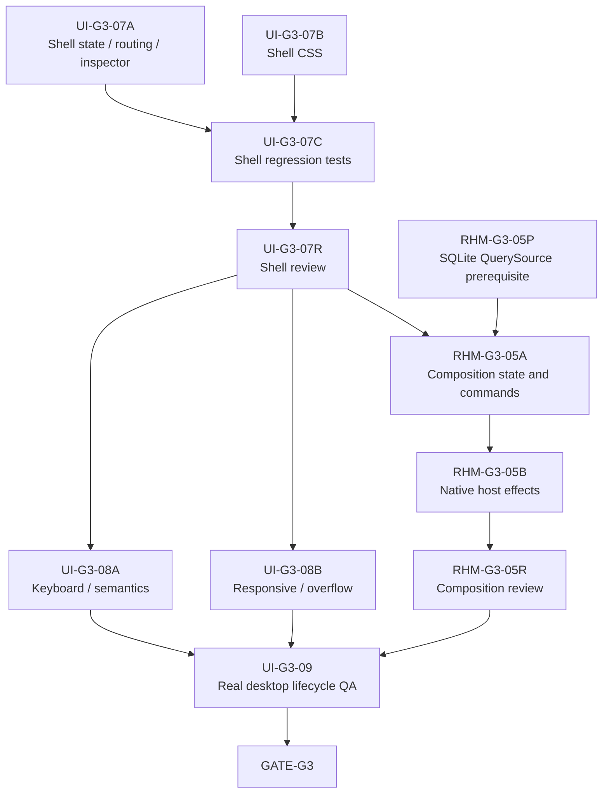

# Goal 3 下一波 Luna Worker 任务拆解

**日期：** 2026-08-03  
**范围：** 仅 Goal 3 收口；`GATE-G3` 通过前不得进入 Goal 4。  
**当前基线：** `UI-G3-02..06` 已进入 `REVIEW`；`UI-G3-07` 有 5 个未提交 Shell 文件；`RHM-G3-05` 尚未开始真实 Desktop Composition。  
**本文件只固化任务边界：** 不实现功能、不访问真实基础设施、不创建真实 Secret、不修改 Codex/Hermes 用户配置、不签名、不公证、不发布。

## 1. 调度结论



允许的最大并发：

1. 立即并行：`UI-G3-07A` 与 `UI-G3-07B`。
2. `UI-G3-07A/B` 完成后：执行 `UI-G3-07C`，再串行 Review。
3. Shell Review 后：`UI-G3-08A`、`UI-G3-08B` 可并行；同时可以推进已解除契约阻塞的 `RHM-G3-05`。
4. `UI-G3-09` 必须等待 Responsive/A11y 和真实 Composition 全部完成。

## 2. 当前已知基线问题

- `apps/desktop/src/app/AppShell.tsx:49` 的 `unsubscribe` 被推断成 `() => undefined`，无法接收 Adapter 的 `Unsubscribe`；lint/build 失败。
- `apps/desktop/src/main.test.tsx` 仍直接渲染 `AppShell`，未注入 `DesktopAdapterProvider`；现有 8 项 Shell 测试失败，当前总计 51/59 通过。
- 新增的 `.shell-search-wrap`、`.shell-search-results`、`.shell-feature-controls`、`.shell-route-page--feature`、`.shell-inspector-facts` 尚无 Shell CSS。
- `topologyFocusId` 没有初始入口；搜索和 Inventory 只进入 Resource Detail，Topology 会一直停留在无 focus 占位状态。
- `InspectorHost` 目前只有摘要 facts，尚未完整呈现 provider/configured/inferred Evidence Spine。
- invalidation subscription 在 Promise 晚于组件卸载返回时可能遗留订阅。
- Context Bar 尚无 Escape 清理/关闭结果行为，且 snapshot/source/time scope 仍是硬编码摘要。
- 当前项目没有签入 Playwright/axe 浏览器依赖；真实 viewport QA 不能假装由 jsdom 完成。
- Runtime 已持有 `SqliteRuntimeBackend { SyncEngine<Store> }`，但还没有明确的 SQLite-backed `QuerySource` concrete implementation；Composition 不能自行发明第二个 DB owner。

## 3. Wave S：Shell Integration 收口

### `UI-G3-07A` — Shell State、Routing、Search 与 Inspector

- **状态：** `REVIEW`。
- **唯一目标：** 让现有页面通过一个稳定的 Shell 状态合同可达，并修复订阅生命周期、Topology focus、route-scoped selection 和 Inspector evidence 路径。
- **独占路径：**
  - `apps/desktop/src/app/AppShell.tsx`
  - `apps/desktop/src/app/routes.ts`
  - `apps/desktop/src/main.tsx`
  - `apps/desktop/src/ui/ContextBar.tsx`
  - `apps/desktop/src/ui/InspectorHost.tsx`
  - `apps/desktop/src/ui/PrimaryCanvas.tsx`
- **只读输入：** `features/**`、Desktop Adapter contract、generated QDTO、fixtures、Interface System。
- **必须完成：**
  - 显式声明 `Unsubscribe` 类型并做 cancel-safe handoff。
  - 为 Topology 提供 Shell-owned 的 bounded focus 入口。
  - 冻结 route 切换时 detail、topology focus、inspector selection 的清理/保留规则。
  - Search 选择可进入 Inventory/Resource Detail，并可打开 Inspector。
  - Inspector 展示 Current Facts 与 Relation provenance；不得在展示层推断 evidence。
  - Timeline 始终明确标记 Goal 7 未实现。
  - 不在 feature 页面直接调用 Tauri API。
- **非目标：** 不编辑 feature 内部实现、QDTO、fixtures、CSS、Tauri Composition 或 manifests。
- **验收：** TypeScript 能编译；所有页面都有明确可达路径；Topology 不再永久卡在 placeholder；卸载后不残留异步订阅。
- **停止规则：** 若需要新增 QDTO/Adapter 方法或改变 feature contract，停止并提交契约缺口，不跨 owner 修改。

### `UI-G3-07B` — Shell CSS 与布局合同

- **状态：** `REVIEW`。
- **唯一目标：** 为现有 Shell 新 class 补齐样式，保持 `.interface-design/system.md` 的三栏、drawer、focus 和内部滚动规则。
- **独占路径：** `apps/desktop/src/styles/shell.css`。
- **只读输入：** Shell JSX、各 feature CSS、Interface System。
- **必须完成：** search dropdown 定位/层级、feature header、Inspector facts、focus-visible、1180/820/560 breakpoints、drawer 边界、避免 Shell 与 feature 双重 padding。
- **非目标：** 不编辑 TS/TSX、feature CSS、测试或设计 token 语义。
- **验收：** 新 class 均有明确规则；搜索结果不被 52px header 裁切；document-level 横向 overflow 不由 Shell 产生。
- **停止规则：** 若 JSX 结构不足以实现布局，只报告需要的 class/attribute，不编辑 JSX。

### `UI-G3-07C` — Shell Regression Tests

- **状态：** `REVIEW`。
- **唯一目标：** 用确定性 Mock Adapter 固化最终 Shell contract。
- **独占路径：**
  - `apps/desktop/src/main.test.tsx`
  - 可新增 `apps/desktop/src/app/*.test.tsx`
  - 可新增 `apps/desktop/src/ui/*.test.tsx`
- **必须完成：** Provider 注入、route active state、bounded search、Inventory → Detail → Inspector、Topology focus/selection、Timeline Goal 7 placeholder、invalidation/window focus re-query、Inspector close/open、route-scoped state。
- **非目标：** 不改生产文件；不把 jsdom 结果写成真实 viewport 或真实 Tauri smoke。
- **验收命令：**

```bash
rtk pnpm --dir apps/desktop test -- --run
rtk pnpm --dir apps/desktop lint
rtk pnpm --dir apps/desktop build
rtk git diff --check
```

### `UI-G3-07R` — Shell Integration Review

- **状态：** `REVIEW`。
- **所有权：** 只读；只允许输出 Review 报告与缺陷路由。
- **通过条件：** 上述命令全部通过；无 feature/generated/fixture/Tauri 越权改动；Shell 的 search、Inspector、Topology 和 re-query 路径可由测试证明。

## 4. Wave A11Y：Shell Review 后的并行 QA

### `UI-G3-08A` — Keyboard 与 Semantic QA

- **状态：** `REVIEW`。
- **独占路径：**
  - `apps/desktop/tests/accessibility/**`
  - `apps/desktop/tests/support/**`
- **覆盖：** Cmd/Ctrl+K、Escape、Enter/Space、focus-visible、landmarks、accessible names、`aria-current`、text-not-color-only、loading/error/empty/partial/stale/expired/truncated 文本、reduced motion。
- **非目标：** QA 不直接修 `src/**`；Topology arrow adjacency 明确保留到 Goal 7。
- **缺陷路由：** Shell 问题回 `UI-G3-07A/B`；页面问题回对应 feature owner；Evidence 问题回 `UI-G3-02`。

### `UI-G3-08B` — Responsive 与 Overflow QA

- **状态：** `REVIEW`。
- **独占路径：**
  - `apps/desktop/tests/responsive/**`
  - 经批准后可用 `apps/desktop/e2e/ui/**`
  - QA screenshots/reports
- **viewport：** 1600×1000、900×800、390×844。
- **硬验收：**
  - `documentElement` 与 `body` 不产生横向 overflow。
  - Inventory、Connectors、Observation Strip、Topology 只在各自容器滚动。
  - 900px Inspector 为可关闭 drawer；390px nav 为 56px icon rail，仍保留 accessible label。
  - 六个 route 全覆盖；Timeline 只验显式 Goal 7 placeholder。
- **工具约束：** 当前未签入浏览器 runner；在没有批准新 harness 前，只能产出测试设计和现有 browser-control 的人工/半自动证据，不能新增依赖或声称真实 viewport 自动化已完成。

## 5. Wave C：RHM-G3-05 Desktop Composition

### `RHM-G3-05P` — SQLite QuerySource 前置决策

- **状态：** `REVIEW`，见 `DEC-G3-01`；Query `P0` 与 Store `P1` 可并行，Runtime `P2` 必须等待两者。
- **阶段证据：** `P0/P1/P2` 已进入 `REVIEW`；Runtime 已完成 SharedStore ownership、CommittedQuerySource、immutable QueryContext、QDTO mapping、bounded Topology 与真实 SQLite integration tests。
- **唯一目标：** 冻结 Composition 如何获得 SQLite-backed bounded `QuerySource`，同时保持唯一 Store/Writer/SQLite owner。
- **必须回答：**
  - QuerySource 由 Store 暴露只读 adapter，还是由 Query crate 提供基于 StoreReader 的 concrete source？
  - 是否需要新增只读 Store API；若需要，由哪个 Contract Owner 修改？
  - Runtime、Query Service 与 Desktop commands 如何共享同一 Store/connection lifecycle？
- **禁止：** Composition 中另开独立 SQLite connection、复制 Query 语义、使用 UI fixture 冒充 production QuerySource。
- **输出：** 一页决策记录、唯一 owner 图、允许修改的 crate/path、最小 integration test contract。
- **后续条件：** 决策进入 `REVIEW` 前，不派 `RHM-G3-05A`。

### `RHM-G3-05A` — Composition State 与 Command Registration

- **状态：** `IN PROGRESS`；任务冻结见 [`RHM-G3-05A-TASK-FREEZE`](./RHM-G3-05A-TASK-FREEZE-2026-08-03.md)。2026-08-04 已采用 `SharedStore::open(path)`，Goal 3 Manual Sync 安全禁用。
- **唯一目标：** 建立唯一 AppState，组合 Store/Writer/Runtime/Query/Adapter/Keychain ports，并注册已有 command/event 名称。
- **建议独占路径：** `apps/desktop/src-tauri/src/composition/**`、`src-tauri/src/lib.rs`；shared manifest/lockfile 只由 Composition Captain 修改。
- **必须保持：** 一个 Runtime、一个 WriterQueue、一个 SQLite owner；event 只做 invalidation；Manual Sync 只 enqueue 并返回 `sync_run_id`；错误不泄漏 Secret/SQL/provider payload。
- **非目标：** 不实现 native tray/window effects，不修改页面、Query 语义或 Provider。
- **串行要求：** 该任务不能与任何其他修改 `src-tauri/src/lib.rs`、manifest 或 lockfile 的 worker 并行。
- **派发前置：** 若未选择真实 Runtime admission queue/consumer，则 `runtime_capabilities.manual_sync=false`，`runtime_manual_sync` 必须安全返回 unavailable，不得伪造 `sync_run_id`。

### `RHM-G3-05B` — Native Host Effects 与 Lifecycle Wiring

- **状态：** `WAITING`，等待 `RHM-G3-05A`。
- **唯一目标：** 将已 Review 的 Host state machine 接到真实 Tauri effects：single instance、close→hide、tray/Dock restore、window recreate/focus、autostart capability、explicit quit。
- **建议独占路径：** `apps/desktop/src-tauri/src/host/effects/**`、`src-tauri/src/main.rs`、Tauri config/capabilities；仍由同一 Composition Captain 串行执行。
- **必须保持：** WebView reload 不重启 Runtime；crash 不写 `user_quit`；Quit 顺序为 marker → Writer drain → WAL checkpoint → Runtime stop。
- **禁止：** 创建真实 Keychain item、签名、公证、发布、修改用户 Agent 配置、执行外部 Provider 写操作。

### `RHM-G3-05R` — Composition Review

- **状态：** `WAITING`。
- **通过条件：** Rust workspace tests/strict Clippy、Desktop test/lint/build、真实 unsigned local bundle boundary，以及可观察的唯一 Runtime/Writer/DB owner。Apple Development Keychain smoke 若仍无身份，继续标记 `LIVE-SMOKE-BLOCKED-ENVIRONMENT`，不得用 ad-hoc 替代。

## 6. Wave D：真实 Desktop QA 与 Gate

### `UI-G3-09` — Real Desktop Lifecycle QA

- **状态：** `WAITING`，等待 `UI-G3-08A/B` 与 `RHM-G3-05R`。
- **独占路径：** `apps/desktop/e2e/desktop/**`。
- **覆盖：** close→hide、后台 Runtime continue、restore re-query、second-instance activation、explicit quit、`user_quit`、WebView reload、唯一 DB owner。
- **限制：** 浏览器/Vite smoke 不能替代真实 App；QA 不直接修 Host/Adapter/page/config。

### `GATE-G3`

只有 `UI-G3-07R`、`UI-G3-08A/B`、`RHM-G3-05R`、`UI-G3-09` 全部进入 `REVIEW` 后才派 Gate Captain。Gate 未通过前，不创建任何 Goal 4 任务实现。

## 7. 推荐下一次实际派发

在当前工作树上，最多同时派两个实现 worker：

1. `UI-G3-07A`：独占 Shell TS/TSX 状态与路由。
2. `UI-G3-07B`：独占 `shell.css`。

第三个槽位只做 `RHM-G3-05P` 的只读契约分析，不修改代码。Shell tests 必须等待最终 props/state contract；Composition 必须等待 QuerySource 决策，不能为了并行度提前落代码。
