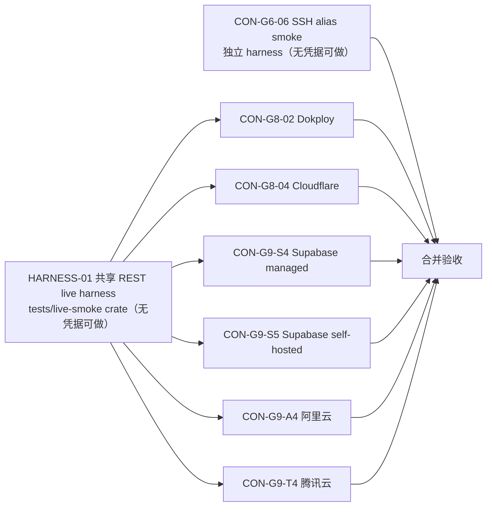

# LIVE-SMOKE 真实 Provider / SSH 只读 smoke 任务拆解（2026-08-07）

**状态：** 波次 0 `DONE`；波次 1：CON-G8-02 / CON-G8-04 / CON-G9-S4 `DONE`（真实实例验收通过，见各自记录）、CON-G9-S5 / CON-G9-A4 / CON-G9-T4 `BLOCKED-EXTERNAL`（无凭据）、CON-G6-06 执行 `BLOCKED-EXTERNAL`（需授权 alias）；P2 连接录入 UI 设计 `DONE`（`DEC-CONNECT-UI-01-connection-entry-flows.md`）
**来源：** `HANDOFF-2026-08-07.md` P1「真实 Provider / SSH 只读 smoke」
**边界：** 真实只读验收；真实响应/凭据**永不**写入 Fixture、文档、日志、Git；凭据只经环境变量（`NEXT_INFRA_<PROVIDER>_*`）进入进程。

## 并行调度

- **波次 0（并行，无需外部凭据）**：HARNESS-01（共享 harness）∥ CON-G6-06（SSH harness + runbook）。文件所有权零重叠。
- **波次 1（并行，各自需要最小只读凭据）**：6 个 REST live 验收任务，全部依赖 HARNESS-01，彼此完全独立（不同凭据/不同 connector/不同验收记录）。凭据未就绪时该任务保持 `BLOCKED-EXTERNAL`，不阻塞其他任务。
- 合并验收：全部任务 `DONE` 后更新 HANDOFF P1 状态。

---

## HARNESS-01：共享 REST live smoke harness

- **Status:** `READY-DESIGN`（无凭据依赖）
- **Objective:** 提供单一环境变量驱动的 live smoke 入口，覆盖 Dokploy / Cloudflare / Supabase-managed / Supabase-self-hosted / 阿里云 / 腾讯云 六条 REST 路径：构造真实 reqwest transport → connector.validate → connector.sync（有界）→ 复用 `next-infra-connector-contract-tests` 的 `check_descriptor/check_outcome/check_batch` 校验 → 输出**安全摘要**（HTTP 状态码计数、资源数、分页/partial 原因、耗时；不含凭据与响应原文）。
- **Dependencies:** 无（各 connector 的 transport trait 已确认：`ManagementTransport`（supabase）、`AliyunTransport`、`TencentTransport`、dokploy/cloudflare 各自 trait；均无 live reqwest 实现，由 harness 补齐）。
- **Exclusive ownership:** 新建 `tests/live-smoke/`（workspace member crate，参考 `tests/integration/*` 结构）+ 根 `Cargo.toml` workspace members（Gate Captain 权限，本任务为唯一 owner）。
- **Scope:**
  1. 为 6 个 REST connector 实现各自 transport trait 的 reqwest live 实现（超时/限流头读取遵循各 connector 契约）。
  2. env 驱动：`NEXT_INFRA_PROVIDER`（dokploy|cloudflare|supabase_managed|supabase_self_hosted|aliyun|tencent）+ 各凭据 env（token / access token / secret id+key / project url+service key…，以 runbook 为准）。
  3. 执行 validate → 有界 sync（Full，scope 用占位 `live-smoke` scope）→ check_* 校验 → 安全摘要打印；非零退出码表示验收失败。
  4. 提供 `--dry-run`（打印将读取的 env 名与配置形状，不联网）。
- **Non-goals:** 不把摘要写入文件/Git（仅 stdout）；不实现增量；不修改任何 connector crate；不处理 SSH（CON-G6-06 独立）。
- **Outputs:** 可执行的 `rtk cargo run -p next-infra-live-smoke -- <provider>`（`--locked`）。
- **Acceptance:** 对每个 provider 的 dry-run 正确显示所需 env；无凭据时明确报缺失项；有凭据时输出安全摘要。
- **Verification:** `rtk cargo test --workspace`、clippy `-D warnings`、fmt、`git diff --check`；对每个 provider 跑一次 dry-run。
- **Stop rule:** 若某 connector 的 transport trait 无法在 harness 内干净实现（需要改 connector 契约），停止回报，不改契约。

## CON-G6-06：SSH alias 只读 smoke

- **Status:** `READY-DESIGN`（harness 部分无凭据；执行需授权 alias）
- **Objective:** 用用户明确授权的 SSH alias 验证：Host Key mismatch 被拒绝、超时语义、macOS launchd 或 Linux systemd probe 摘要；连接失败不伪造资源状态。
- **Dependencies:** 无（SSH 独立于 REST harness；复用现有 OpenSSH transport + probe registry）。
- **Exclusive ownership:** `crates/next-infra-connector-ssh/**`（如需测试辅助）+ 验收记录 `docs/tasks/CON-G6-06-2026-08-07.md`。
- **Scope:**
  1. 确认/补齐 live 执行方式：固定 argv、仅接收 `NEXT_INFRA_SSH_ALIAS`（别名，不接收 host/IP/command/secret）；Host Key 校验不可关闭。
  2. Runbook：用户提供 alias → 执行 validate + 有界 probe（launchd 或 systemd 单探针）→ 记录摘要。
  3. 验收清单：Host Key mismatch 报错且不执行 probe；超时返回且无部分结果；成功时资源仅含该主机摘要；无任意命令路径。
- **Non-goals:** 不修改 SSH config/known_hosts；不执行任意命令；不记录真实主机标识。
- **Outputs:** 执行方式 + Runbook + 验收记录。
- **Acceptance:** 三项行为（mismatch/超时/摘要）在真实 alias 上符合预期。
- **Verification:** 现有 SSH 测试套件 + 真实 alias smoke（用户在场提供）。
- **Stop rule:** 需要放宽 Host Key 校验或添加任意命令时停止（违反安全边界）。

## CON-G8-02：Dokploy live smoke

- **Status:** `READY-DESIGN`（HARNESS-01 完成后可执行；凭据未就绪时 `BLOCKED-EXTERNAL`）
- **Objective:** 最小只读 Token 验证 Dokploy 账户/项目范围、分页、partial 语义（数据库模块保持 unsupported）。
- **Dependencies:** HARNESS-01。
- **Exclusive ownership:** `docs/tasks/CON-G8-02-2026-08-07.md`（验收记录）。
- **Scope:** 用户提供只读 Token（env）→ harness 执行 → 校验资源仅属该账户、分页/partial 符合 descriptor → 记录安全摘要。
- **Non-goals:** 不触碰写 API；不实现 Database 模块。
- **Acceptance / Verification / Stop rule:** 同波次 1 通用约定（见下）。

## CON-G8-04：Cloudflare live smoke

- **Objective:** 最小只读 scoped token 验证账户/域名（zone）范围、分页、partial；敏感字段 allowlist 不泄露。
- **Dependencies:** HARNESS-01；独占 `docs/tasks/CON-G8-04-2026-08-07.md`。

## CON-G9-S4：Supabase managed live smoke

- **Objective:** 最小只读 access token 验证 projects 列表范围、分页与 partial。
- **Dependencies:** HARNESS-01；独占 `docs/tasks/CON-G9-S4-2026-08-07.md`。

## CON-G9-S5：Supabase self-hosted live smoke

- **Objective:** 只读 URL + service key 验证 self-hosted 实例的 service_api 路径、分页与 partial。
- **Dependencies:** HARNESS-01；独占 `docs/tasks/CON-G9-S5-2026-08-07.md`。

## CON-G9-A4：阿里云 live smoke

- **Objective:** 最小只读 AK/SK 验证 ECS/VPC/SLB/DNS/public IP 模块、区域分页、限流与部分失败。
- **Dependencies:** HARNESS-01；独占 `docs/tasks/CON-G9-A4-2026-08-07.md`。

## CON-G9-T4：腾讯云 live smoke

- **Objective:** 最小只读 SecretId/SecretKey 验证 CVM/VPC/CLB/DNS/public IP 模块、区域分页、限流与部分失败。
- **Dependencies:** HARNESS-01；独占 `docs/tasks/CON-G9-T4-2026-08-07.md`。

## 波次 1 通用约定（六个 REST 任务共用）

- **凭据**：仅经环境变量传入（harness dry-run 会列出所需变量名）；不用真实值进命令行/历史/文件。
- **验收记录**（各任务独占文件）：只含结论与计数（HTTP 状态类计数、资源数、分页页数、partial 原因、耗时）；不含 Token/账号标识/主机/响应原文。
- **验收**：validate 通过；资源范围仅属该凭据可见域；分页/限流/partial 行为与 descriptor 声明一致；`check_*` 契约校验零 issue；无 secret 泄漏到摘要。
- **Stop rule**：凭据权限不足无法区分实现缺陷与权限问题时停止并回报；任何写操作需求停止；限流导致无法完成时标记 `BLOCKED-EXTERNAL` 不冒充通过。
- **验证**：`rtk cargo run -p next-infra-live-smoke --locked -- <provider>`（`--locked`）+ 记录输出摘要。

## 合并验收（波次 1 完成后）

- 更新 `HANDOFF-2026-08-07.md` P1 状态；`docs/tasks/README.md` 索引登记 7 个验收记录；本文件状态 → `DONE / ARCHIVED`。

## 需用户确认

1. 波次 0（HARNESS-01 + CON-G6-06 harness 部分）立即派发？（无需凭据）
2. 波次 1 各任务凭据：你手头有哪些 provider 的最小只读凭据可提供？其余保持 `BLOCKED-EXTERNAL`。
