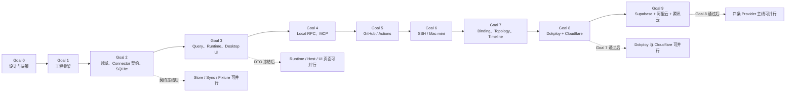

# Luna Worker 并行任务总表

本文将 Next Infra 的未来实施拆解为可交给 `luna_worker` 的有界任务包。它只固化调度、依赖、文件所有权和验收方式，**不授权开始 React、Tauri 或 Rust 开发**。

实现仍受 [`implementation-goals.md`](../design/implementation-goals.md) 约束：Goal 验收门保持串行；只有当前 Goal 的共享契约冻结后，Goal 内部任务才允许并行。

## 1. 调度结论



不能把“Provider 技术上互不依赖”理解为可以跨 Goal 提前开发。例如 GitHub、SSH、Dokploy 和云厂商仍必须依次经过 Goal 5、6、8、9 验收门。

## 2. 状态模型

| 状态 | 含义 |
| --- | --- |
| `READY-DESIGN` | 只读分析或设计决策的前置条件已具备；仍需用户明确派发 |
| `HELD-AUTH` | 工程任务已定义，但用户尚未授权进入 Goal 1 |
| `WAITING` | 已获开发授权，但依赖任务或当前 Goal 验收门尚未通过 |
| `READY` | 已获开发授权，依赖、契约和独占路径均已满足，可安全派发 |
| `RUNNING` | 已分配给唯一 worker |
| `REVIEW` | 实现已交付，等待所属 owner 或 Gate Captain 验收 |
| `BLOCKED` | 需要用户选择、外部凭据、环境能力或上游契约变更 |
| `DONE` | 验收命令及当前 Goal gate 均已通过 |

`READY` 只描述依赖，不扩大授权。当前所有工程包都是 `HELD-AUTH`；只有设计决策包可以被标记为 `READY-DESIGN`。

## 3. 角色与单写规则

| 角色 | 责任 | 禁止事项 |
| --- | --- | --- |
| Contract Owner | 冻结并维护共享 Domain、Connector、Query 或 RPC 契约 | 下游 worker 不得顺手改共享契约 |
| Feature Owner | 只修改任务声明的独占目录 | 不得编辑根 manifest、生成文件、迁移或 route registry |
| Gate Captain | 串行集成当前 Goal，独占共享 manifest、lockfile、registry、entrypoint 和 gate 测试 | 不借集成机会重构 Feature |
| QA Worker | 只增加验收测试和缺陷报告 | 不直接修生产文件；问题回派原 Owner |

全局单写边界：

- 根 `Cargo.toml`、`Cargo.lock`、前端 lockfile、共享 registry：当前 Goal 的 Gate Captain。
- `crates/next-infra-core/**`：Domain Contract Owner。
- SQLite migration 目录和 migration 编号：Store Migration Owner。
- Query DTO、Schema、生成器和生成后的 TypeScript：QDTO Owner；生成文件禁止手改。
- Tauri `main.rs`、`lib.rs`、配置、capabilities：Desktop Composition Captain。
- Local RPC protocol 和 golden fixtures：RPC Contract Owner。
- App route registry 和全局 Shell CSS：Shell Owner。
- 每个 Provider crate 和 fixture 目录：对应 Provider Owner；根 registry 仍由 Gate Captain 修改。

Goal 1 若冻结出不同目录，必须对下述路径做一对一重映射；不得取消独占所有权或让两个 worker 共享同一文件。

## 4. 派发协议

每次派发给 `luna_worker` 的提示必须包含以下内容：

```text
Task ID: <唯一 ID>
Status: READY
Goal gate: <Goal N>
Objective: <唯一可验证结果>
Dependencies: <已经完成的任务和冻结契约>
Exclusive ownership: <允许修改的完整路径>
Read-only inputs: <可读但不可修改的契约>
Scope: <必须完成>
Non-goals: <明确不做>
Outputs: <交付物>
Acceptance: <行为级验收>
Verification: <必须执行的命令>
Handoff: <文件、行为、验证结果、未验证项、基线问题、风险>
Stop rule: 需要修改共享契约或越过独占路径时立即停止并回报。
```

禁止将多个未冻结契约的大任务合并成“完成 Goal N”。一个 worker 只接一个任务包；同一任务只允许一个活跃 owner。

文档中的 `TASK-01..04` 表示同前缀的 01、02、03、04 全部任务；`TASK-02/04` 表示同前缀的 02 与 04；`TASK-*` 表示该前缀的全部已定义任务。实际派发时必须展开成完整 Task ID 列表，不能把缩写当作新的任务 ID。

## 5. Goal 内波次

| Goal | 串行冻结 / 入口 | 可并行任务 | 串行汇合 |
| --- | --- | --- | --- |
| 1 | `DEC-G1-01/02/04` 并行 → `DEC-G1-03` → `DEC-G1-05` 合并 → `DEC-G1-06` 独立 Review → `RHM-G1-01` | Bootstrap 后 `UI-G1-01` 与 `UI-G1-02`；随后 `UI-G1-03` | `GATE-G1` |
| 2 | `RHM-G2-01` Domain | `RHM-G2-02` Migration 与 `CON-G2-01` Connector API | Store、Sync、Normalizer、Fixture、Contract Tests 分支 | `GATE-G2` |
| 3 | `RHM-G3-01` Query/QDTO | Runtime、Host、Keychain、Adapter、UI Foundation | 页面分支 → Shell 集成 → QA | `GATE-G3` |
| 4 | `RHM-G4-01` RPC Contract | Unix Socket、STDIO MCP、Host Availability | Agent/security E2E | `GATE-G4` |
| 5 | GitHub transport/descriptor | Repository 分支与 Actions 分支 | GitHub 纵切 | `GATE-G5` |
| 6 | OpenSSH transport/probe registry | 通用、macOS、Linux probe | SSH security/partial 纵切 | `GATE-G6` |
| 7 | Domain contract → QDTO contract | Migration、Inference、Topology/Timeline query 分支；Binding 在 migration 后开始 | UI/QA 与 Core replay | `GATE-G7` |
| 8 | `DEC-G8-01` scope | Dokploy 链与 Cloudflare 链 | 跨 Provider topology replay | `GATE-G8` |
| 9 | Provider-specific transport | Supabase managed/self-hosted、Aliyun、Tencent 四条主线；各云产品模块再并行 | Coverage Matrix 与真实只读验证 | `GATE-G9` |

详细任务包：

1. [Runtime、Host 与 MCP](./runtime-host-mcp.md)
2. [Connector 与 Provider](./connectors.md)
3. [Desktop UI](./desktop-ui.md)
4. [独立 Review 报告](./REVIEW-2026-08-02.md)

## 6. 设计决策包

这些任务只修改设计文档，完成后也不自动授权开发。

### `DEC-G1-01` — 工具链与 crate 拓扑冻结

- **状态：** `READY-DESIGN`
- **目标：** 固定 Rust、Node/pnpm、Tauri 与官方插件版本；固定 workspace、`next-infra-runtime`、Desktop App 和 MCP Bridge 的目标边界。
- **依赖：** 当前环境基线和 RFC。
- **独占路径：** `docs/design/decisions/DEC-G1-01-toolchain-and-crates.md`；不创建工程文件。
- **非目标：** 不初始化 workspace，不安装依赖，不替用户批准支持周期。
- **输出：** 决策矩阵、crate 依赖图、版本验证方式、升级触发条件。
- **验收：** Core/Store/Sync/Query/Runtime 不依赖 Tauri；Bridge 是独立二进制且不会被打进错误的 app target。
- **验证：** 设计链接检查、crate 图环路审查、未决标记扫描。
- **停止条件：** 需要用户选择版本支持范围或发布策略时只列选项，不代替用户决定。

### `DEC-G1-02` — Desktop 生命周期策略冻结

- **状态：** `READY-DESIGN`
- **目标：** 固定单实例、close→hide、托盘恢复、自动登录、后台启动、显式退出、睡眠/唤醒和 `user_quit` 状态机。
- **依赖：** RFC 生命周期章节。
- **独占路径：** `docs/design/decisions/DEC-G1-02-desktop-lifecycle.md`。
- **非目标：** 不实现 Tauri lifecycle、launch agent 或 smoke test。
- **输出：** 状态机、清除/保留 `user_quit` 的唯一规则、macOS smoke 路径。
- **验收：** WebView reload、窗口 close、Host crash、用户 Quit 和系统登录启动的语义不混淆。
- **验证：** 状态表完整性检查和跨文档术语扫描。

### `DEC-G1-03` — Bridge 安装、协议与升级策略冻结

- **状态：** `READY-DESIGN`
- **目标：** 固定 Bridge 安装位置、可信 App 记录、Host/Bridge 原子升级、协议兼容窗口和自动拉起授权。
- **依赖：** `DEC-G1-01/02` 的候选结论。
- **独占路径：** `docs/design/decisions/DEC-G1-03-bridge-install-and-upgrade.md`。
- **非目标：** 不安装 binary、不修改 Codex/Hermes 配置、不实现协议。
- **验收：** 任意可执行路径和 Agent 参数不能授予启动权限；版本不兼容时拒绝连接。
- **验证：** 安装/升级/降级场景表和 threat review。

### `DEC-G1-04` — Keychain、签名与发布边界冻结

- **状态：** `READY-DESIGN`
- **目标：** 固定 Keychain service/account 命名、签名 ACL、锁屏/后台不可用语义、首版签名/公证/更新边界。
- **依赖：** 当前 macOS 环境报告。
- **独占路径：** `docs/design/decisions/DEC-G1-04-keychain-signing.md`。
- **非目标：** 不创建 Keychain item、不签名或公证 App、不处理真实 Secret。
- **验收：** SQLite 只保存 `SecretRef`；开发签名、Developer ID 和后台访问分别有真实验证路径。
- **验证：** secret-flow diagram review、命名冲突检查和环境阻塞项扫描。

### `DEC-G1-05` — Goal 1 决策合并

- **状态：** `WAITING`，等待 `DEC-G1-01..04`。
- **目标：** 由单一 Decision Captain 将四份结论合并到权威 RFC、架构、安全和实施目标，消除冲突与未决项。
- **依赖：** `DEC-G1-01..04` 完成；涉及产品选择时已有用户结论。
- **独占路径：** 执行期间独占受影响的 `docs/design/*.md` 和设计 Review 报告；不改四份源决策文件。
- **非目标：** 不创建工程、不安装依赖、不替用户做尚未决定的产品选择。
- **输出：** 更新后的权威设计、决策追踪表和待独立 Review 的候选 readiness 结论。
- **验收：** 版本、crate 图、生命周期、Bridge、Keychain、签名和 binding pipeline 无相互矛盾或阻塞级 TBD。
- **验证：** 全部设计链接、术语、未决标记和跨文档一致性检查。
- **风险/停止：** 冲突不能仅在 decision note 中保留；无法决定时维持 `BLOCKED`，不允许 `RHM-G1-01` 开始。

### `DEC-G1-06` — Goal 1 独立只读 Review

- **状态：** `WAITING`，等待 `DEC-G1-05`。
- **目标：** 由未参与四项决策和合并的全新 worker 独立判断 Goal 1 是否具备无歧义、可验证的工程入口。
- **依赖：** `DEC-G1-05` 完成并停止写入权威设计。
- **独占路径：** 只读，无写路径；Review 报告由调度者在 reviewer 完成后单写固化。
- **非目标：** 不修文档、不替用户做产品选择、不创建工程文件。
- **输出：** blocker/major/minor 清单、可执行依赖序列、`READY` 或 `BLOCKED` 结论。
- **验收：** reviewer 能独立回答版本、crate ownership、生命周期、Bridge、Keychain、binding 和验证路径；无 blocker 才可给出 `READY`。
- **验证：** reader questions、链接/术语/未决标记检查，并与四份源 decision notes 交叉核对。
- **风险/停止：** 发现问题回派 `DEC-G1-05`，同一 reviewer 不负责修复后自我批准。

### `DEC-G6-01` — SSH 稳定身份与探针预算冻结

- **状态：** `READY-DESIGN`
- **目标：** 固定 SSH Host 的稳定 `external_id`、alias/hostname/IP 各自角色，以及连接、命令、输出和批次上限。
- **依赖：** Goal 2 identity contract 的设计结论。
- **独占路径：** `docs/design/decisions/DEC-G6-01-ssh-identity-and-probe-budget.md`；Goal 6 前由当时的 Decision/Gate Captain 串行同步权威文档。
- **非目标：** 不连接真实主机、不修改 SSH config、不运行 probe。
- **验收：** 易变 IP 或展示名不能单独成为稳定身份；Host Key 验证不可关闭。
- **验证：** identity examples、collision cases 和 probe budget table review。

### `DEC-G8-01` — Dokploy Database 范围对齐

- **状态：** `READY-DESIGN`
- **目标：** 解决 Connector 契约包含 Database、而 Goal 8 范围未包含 Database 的冲突。
- **依赖：** 当前 Connector 契约和 Goal 8 scope。
- **独占路径：** `docs/design/decisions/DEC-G8-01-dokploy-database-scope.md`；Goal 8 前由当时的 Decision/Gate Captain 串行同步 Connector 契约与实施目标。
- **非目标：** 不实现 Dokploy Database，不调用 Dokploy API。
- **默认安全结论：** 在用户批准扩围前，`dokploy.database` 在 Coverage 中标记为 `unsupported`，不静默实现。
- **输出：** 同步修订 Connector 契约、Goal 8 或明确的已知缺口。
- **验收：** 两份权威文档不再给执行者相互矛盾的 scope。
- **验证：** 对 `Dokploy`、`Database` 和 Goal 8 的跨文档一致性扫描。

## 7. Gate Captain 任务

每个 Goal Gate 都是串行任务，只有所有必需分支处于 `REVIEW` 才能派发。

Gate Captain 必须：

1. 检查独占路径和依赖方向，没有跨 owner 偷改。
2. 统一处理 manifest、lockfile、registry、entrypoint 和生成物整合。
3. 运行 Goal 文档列出的全部验证，并记录未执行项。
4. 在真实 bundle、SQLite 或 Agent 路径属于验收条件时执行真实路径，不能用单元测试替代。
5. 将失败回派给原 Owner；Gate Captain 不顺手重构生产模块。
6. 报告当前 Goal 是否通过，以及下一 Goal 是否可进入。

### `GATE-G1` — 工程骨架验收门

- **目标：** 证明 Goal 1 骨架、target 边界和生成契约整体可用，并给出是否允许进入 Goal 2 的唯一结论。
- **依赖：** `RHM-G1-01`、`UI-G1-01..04` 均处于 `REVIEW`。
- **独占路径：** Goal 1 shared manifests/lockfiles、Desktop/MCP target wiring、`tests/gates/goal-1/**` 和验收报告。
- **非目标：** 不创建数据库表、Provider、MCP tools 或业务页面。
- **验收：** 真实 Tauri App 启动并退出；Core 独立测试；Mock/Empty Adapter 启动；Rust→TS binding drift guard；独立 Bridge target；无 Provider SDK/credential。
- **验证：** Goal 1 的 format/clippy/test/Desktop build/Tauri build 全部执行。
- **风险/停止：** toolchain、签名或 target ambiguity 失败时区分环境和实现根因；未通过不得进入 Goal 2。

### `GATE-G2` — Domain、Connector 与 SQLite 验收门

- **目标：** 证明领域、Connector、Normalizer、Writer 与 SQLite 在原子性和恢复语义上形成一个闭环。
- **依赖：** `RHM-G2-01..05`、`CON-G2-01..05`、`UI-G2-01` 均处于 `REVIEW`。
- **独占路径：** Goal 2 registry/manifests/lockfile、`tests/gates/goal-2/**` 和验收报告。
- **非目标：** 不接真实 Provider，不启动 Tauri/WebView。
- **验收：** stable identity/version、single Writer、cursor atomicity、partial/tombstone、crash recovery 和 no-FTS5 tests 全部通过。
- **验证：** Core、Store、Sync、Normalizer、Fixture、Contract、pipeline suites。
- **风险/停止：** 共享契约缺口回派 Contract Owner；Gate Captain 不在 integration 层打补丁。

### `GATE-G3` — Query、Runtime 与 Desktop 纵切验收门

- **目标：** 证明共享 Query、常驻 Runtime、真实 Host 生命周期和最小 UI 纵切可共同运行。
- **依赖：** `RHM-G3-01..05`、`UI-G3-01..09` 均处于 `REVIEW`。
- **独占路径：** Goal 3 shared manifests/entrypoint/capabilities、`tests/gates/goal-3/**` 和验收报告。
- **非目标：** 不实现 Local RPC、MCP 或真实 Provider。
- **验收：** 有界 Query、invalidation-only Events、单实例、close→hide、Runtime continue、restore re-query、Quit drain/checkpoint、真实 macOS smoke。
- **验证：** Query/Runtime/Desktop Adapter/workspace tests、UI tests/build、Tauri build、desktop smoke。
- **风险/停止：** Vite/browser tests 不能替代真实 bundle；未通过不得进入 Goal 4。

### `GATE-G4` — Local RPC 与 MCP 验收门

- **目标：** 证明 Agent 通过受限本地协议调用同一 Query Service，且不能越权或复活显式退出的 Host。
- **依赖：** `RHM-G4-01..05`、`UI-G4-01` 均处于 `REVIEW`。
- **独占路径：** MCP/Bridge shared manifests/entrypoint/install metadata、`tests/gates/goal-4/**` 和验收报告。
- **非目标：** 不默认改用户级 Codex/Hermes 配置，不提供写工具。
- **验收：** secure UDS、protocol mismatch、bounded read-only tools、trusted auto-launch、persistent `user_quit`、真实 Codex query；Hermes 未安装则明确 blocked。
- **验证：** Local RPC/MCP/workspace/security/E2E tests 和获授权后的真实 Agent acceptance。
- **风险/停止：** 用户级配置与 App 安装是外部状态，必须有单独授权和恢复步骤。

### `GATE-G5` — GitHub / Actions 验收门

- **目标：** 证明 GitHub/Actions 首个真实 Provider 纵切符合只读、部分覆盖和证据契约。
- **依赖：** `CON-G5-01..04`、`UI-G5-01` 均处于 `REVIEW`。
- **独占路径：** GitHub registry/manifests/lockfile、`tests/gates/goal-5/**` 和验收报告。
- **非目标：** 不保存 logs/artifacts/secrets，不做写操作。
- **验收：** Repo → Workflow → Run 纵切；ETag/429/permission/partial 不误删；Desktop/MCP 语义一致。
- **验证：** GitHub conformance、pipeline、UI/MCP vertical 和已配置时的 live read-only tests。
- **风险/停止：** 未配置账户时 live 项标记 blocked，不能冒充通过；未通过不得进入 Goal 6。

### `GATE-G6` — SSH / Mac mini 验收门

- **目标：** 证明固定 OpenSSH probes 可安全读取 macOS/Linux 摘要，且连接失败不会伪造资源状态。
- **依赖：** `CON-G6-01..05`、`UI-G6-01` 均处于 `REVIEW`。
- **独占路径：** SSH registry/manifests/lockfile、`tests/gates/goal-6/**` 和验收报告。
- **非目标：** 无任意命令、自动接受 Host Key 或真实主机 fixture。
- **验收：** Host Key mismatch、fixed argv、timeouts/output limits、probe partial、macOS/Linux schema 和 Freshness 语义全部通过。
- **验证：** SSH security/conformance/pipeline/UI acceptance 和可用时的本机 alias smoke。
- **风险/停止：** live smoke 只引用既有 alias，不记录真实连接信息；未通过不得进入 Goal 7。

### `GATE-G7` — Binding、Topology 与 Timeline 验收门

- **目标：** 证明人工配置与推断证据可解释、可重放，并通过有界 Topology 与 Timeline 核实。
- **依赖：** `RHM-G7-01..08`、`UI-G7-01/02` 均处于 `REVIEW`。
- **独占路径：** Goal 7 migration/registry/manifests/lockfile、Shell route integration、`tests/gates/goal-7/**` 和验收报告。
- **非目标：** 不自动合并资源，不推断时间邻近因果，不取消 topology hard limit。
- **验收：** configured/provider/inferred evidence 可追溯；Binding unresolved；bounded frontier；Timeline 无重复未变化轮询；键盘路径可用。
- **验证：** Binding/Inference/Query/UI replay 和 Desktop acceptance。
- **风险/停止：** migration、QDTO、route registry 仅由各单写 owner 或本 Gate 串行集成；未通过不得进入 Goal 8。

### `GATE-G8` — Dokploy、Cloudflare 与跨平台拓扑验收门

- **目标：** 证明两条 Provider 主线可以汇合成来源明确的 Repo → Deployment → Host → DNS 代表链。
- **依赖：** `DEC-G8-01`、`CON-G8-01..05`、`UI-G8-01` 均处于 `REVIEW`。
- **独占路径：** Goal 8 registry/manifests/lockfile、`tests/gates/goal-8/**` 和验收报告。
- **非目标：** 不静默加入 Dokploy Database，不在 UI/Connector 猜跨平台关系。
- **验收：** secret allowlist、Cloudflare scoped token、Repo → Deployment → Host → DNS replay、evidence provenance 和 hard limits 通过。
- **验证：** 两个 Provider conformance、cross-provider replay、UI/MCP acceptance。
- **风险/停止：** `DEC-G8-01` 未决时保持 blocked；未通过不得进入 Goal 9。

### `GATE-G9` — Provider 基础覆盖最终验收门

- **目标：** 证明 Supabase 和两家云厂商按 module 提供真实只读覆盖，并完成六页最终回归。
- **依赖：** `CON-G9-S1..S3`、`CON-G9-A0..A3`、`CON-G9-T0..T3`、`CON-G9-04/05`、`UI-G9-01/02` 均处于 `REVIEW`；未配置的 live Provider 项必须保持有解释的 `BLOCKED`，不能伪装通过或让 Goal 9 通过。
- **独占路径：** Goal 9 registry/manifests/lockfile、`tests/gates/goal-9/**` 和验收报告。
- **非目标：** 不宣称支持整个云厂商，不实现外部操作。
- **验收：** managed/self-hosted Supabase 分离；每个云产品 module 单列；三种 health/coverage 不混合；六页逐页与真实 Desktop 回归完成。
- **验证：** 全部 Provider conformance、coverage catalog、live read-only report、UI/desktop regression。
- **风险/停止：** 未配置凭据与实现失败分开；Goal 9 只读系统稳定后，操作能力仍需新的 Goal 10 RFC 和用户授权。

## 8. 当前可执行边界

- 已完成：任务拆解和三条 lane 的只读分析。
- 可继续派发：首波可并行派发 `DEC-G1-01`、`DEC-G1-02`、`DEC-G1-04`、`DEC-G6-01`、`DEC-G8-01`；`DEC-G1-03` 等待前两项，`DEC-G1-05` 串行合并，`DEC-G1-06` 由新 worker 独立 Review。所有派发仍需要用户单独指示。
- 暂停：所有 `RHM-*`、`CON-*`、`UI-*` 和 `GATE-*` 工程任务，状态均为 `HELD-AUTH`。
- 开发入口：用户明确批准 Goal 0 并授权进入 Goal 1 后，必须先取得 `DEC-G1-06` 的无 blocker `READY` 结论，再派发 `RHM-G1-01`；不得直接从页面或 Provider 任务开工。
