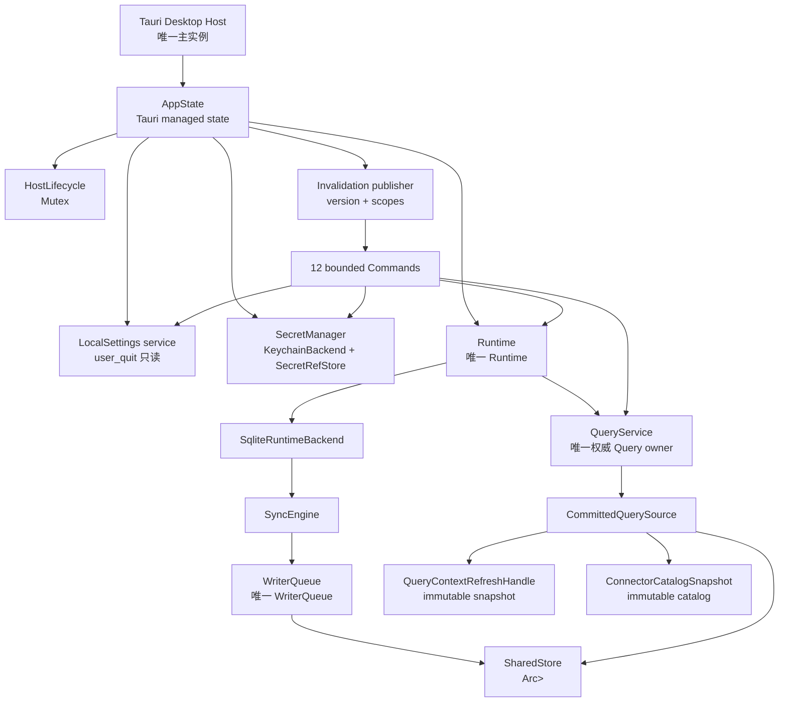

# RHM-G3-05A：Composition State 与 Command Registration 任务冻结

**日期：** 2026-08-03  
**状态：** `DECISION REQUIRED`  
**范围：** Goal 3 Desktop Composition 的只读任务冻结；本文件不代表实现已完成。

本冻结基于 `RHM-G3-05P0/P1/P2A/P2B`、`UI-G3-01`、Host lifecycle review 和 Keychain review。目标是让一个 Composition Captain 能在不创建第二个 SQLite owner、不伪造 Manual Sync 成功、不扩大 Secret 边界的前提下实现唯一 `AppState`。在下列决策关闭前，不派发 05A 实现：

1. `SharedStore::open(path)` 是否作为 Runtime 的小构造器落地。
2. Manual Sync 是先安全禁用，还是先补 Runtime admission queue/consumer。

证据入口：[`DEC-G3-01`](../design/decisions/DEC-G3-01-committed-query-source.md)、[`RHM-G3-05P2A`](./RHM-G3-05P2A-2026-08-03.md)、[`RHM-G3-05P2B`](./RHM-G3-05P2B-2026-08-03.md)、[`UI-G3-01`](./UI-G3-01-2026-08-03.md)、[`DEC-G1-02`](../design/decisions/DEC-G1-02-desktop-lifecycle.md)。

## 1. 唯一 ownership



冻结规则：

- `Store` 只能打开一次；`SharedStore` clone 只复制 `Arc` handle，不创建 connection。
- Runtime、WriterQueue、SQLite owner 都只能存在一个。Command、Adapter、QuerySource 不得按路径重新打开 SQLite。
- Query 读取必须经过 `QueryService`；Command 不复制 cursor、limit、Topology、Freshness 或错误清洗规则。
- 当前 `DesktopQueryAdapter<S>` 持有 `QueryService<S>`，而 Runtime 也按值持有 QueryService。实现时必须优先让 Command 借用 `Runtime::query()`；若需要 owning wrapper，只能 clone `CommittedQuerySource`（共享同一 `SharedStore` 与 context），不得产生第二 Store/Writer/SQLite owner。
- Keychain、settings、Host lifecycle 和 invalidation publisher 均为 AppState 的受限 ports/service；它们不能反向把 Tauri 类型带入 Core/Store/Sync/Query/Runtime。

## 2. 前置决策：Store 构造器

### 推荐选择

优先新增 Runtime 层的最小构造器：

```rust
SharedStore::open(path: &Path) -> Result<SharedStore, StoreError>
```

该构造器内部只调用一次 `Store::open(path)`，再包装为 `SharedStore`。这样 Desktop Composition 继续只依赖已经冻结的 `next-infra-runtime`，不需要为了打开 SQLite 直接新增 `next-infra-store` normal dependency；`apps/desktop/scripts/check-cargo-dependencies.mjs` 的依赖白名单也不需要放宽。

### Decision point

`DEC-G3-01` 当前文字写作“Composition 只调用一次 `Store::open`”。`SharedStore::open` 不改变唯一物理 owner，但会把打开动作封装到 Runtime crate，因此属于 API/ownership 表述变化。接受该推荐前，必须由 Decision/Gate Captain 更新 `DEC-G3-01` 或明确兼容解释；05A 不得擅自改代码或静默改变决策。

禁止的替代方案：

- Desktop 直接 `Store::open` 并另建 Query connection。
- Query crate 依赖 Store。
- 每个 Command 自行按 database path reopen。

## 3. Command / Event 精确矩阵

命令名必须与 `RealDesktopAdapter` 已冻结的字符串完全一致。

| # | 名称 | Tauri args | Rust input | 返回 | 唯一 owner / 调用 | 错误与安全契约 |
| --- | --- | --- | --- | --- | --- | --- |
| 1 | `query_list_connections` | 无 | 无 | `ConnectionSnapshotDto` | `Runtime::query().list_connections()` | 硬上限 200；不返回 config、SecretRef 或 Provider payload |
| 2 | `query_search_resources` | `{ request }` | `SearchResourcesCommand` | `ResourcePageDto` | Query Service | Service 负责 cursor、limit、Freshness、错误 envelope |
| 3 | `query_get_resource` | `{ request }` | `GetResourceCommand` | `ResourceDetailDto` | Query Service | bounded relations/changes；截断事实不得静默伪装完整 |
| 4 | `query_get_topology` | `{ request }` | `GetTopologyCommand` | `TopologyDto` | Query Service | depth/node/edge 采用现有硬上限；返回 frontier/truncated |
| 5 | `query_health_summary` | 无 | 无 | `HealthSummaryDto` | Query Service | 只读 committed projection；不因 Query 改写 Health |
| 6 | `query_recent_changes` | `{ request }` | `RecentChangesCommand` | `ChangePageDto` | Query Service | opaque cursor；只返回清洗后的 field changes |
| 7 | `query_sync_status` | `{ request }` | `SyncStatusCommand` | `SyncStatusDto` | Query Service + QueryContext | recent run 有界；`next_scheduled_at` 来自 immutable context |
| 8 | `query_connector_coverage` | 无 | 无 | `ConnectorCoverageSnapshotDto` | Query Service + catalog snapshot | theoretical coverage 与 Sync Coverage 分离 |
| 9 | `runtime_manual_sync` | `{ connectionId }` | `connection_id: &str` | `ManualSyncResult { sync_run_id }` | Runtime admission port | 只 enqueue；不得等待 Provider；无真实 admission queue 时不能返回成功 id |
| 10 | `local_settings_get` | 无 | 无 | `LocalSettings` | LocalSettings service | 返回 `start_at_login`、budget、retention、当前 `user_quit` |
| 11 | `local_settings_update` | `{ settings }` | `LocalSettings` | `LocalSettings` | LocalSettings service | `user_quit` 输入只读，不能清除/覆盖；start-at-login 与 MCP capability 分离 |
| 12 | `runtime_capabilities` | 无 | 无 | `RuntimeCapabilities` | AppState capability snapshot | `manual_sync` 只有存在真实 admission consumer 时才为 true；unsigned/adhoc 不开启 MCP auto-launch |

唯一事件：

| 名称 | Payload | 发送时机 | 禁止内容 |
| --- | --- | --- | --- |
| `next-infra://query-invalidated` | `{ version: string, scopes: string[] }` | Store transaction 成功提交，并释放 `SharedStore` mutex 后 | 完整资源/关系、SyncRun body、Secret/SecretRef、SQL、DB path、Provider response |

事件必须是 invalidation-only。丢失、重复、乱序事件不能改变权威状态；UI 收到后重新调用上述 Query Commands。失败 transaction、rollback 或未提交 Writer 不得发事件。

## 4. Manual Sync：当前阻塞与两种方案

当前代码只有 `ManualSyncPort::enqueue_manual_sync` 抽象和错误清洗 helper；没有真实 admission queue、consumer、clock loop 或 Connector/Normalizer 执行者。`SyncEngine::start` 需要已加载的 `Connection`、`Scope` 和 `SyncRunStart`，不能直接当作“入队”替代品。

### 方案 A：Goal 3 安全禁用（推荐默认）

- `runtime_capabilities.manual_sync = false`。
- `runtime_manual_sync` 返回稳定的 `sync_unavailable`/`runtime_unavailable` `ErrorEnvelope`。
- 不返回伪造的 `sync_run_id`，不写 running SyncRun，不发 invalidation。
- UI 保持明确的 unavailable 状态；不能把 disabled/failure 当作已排队。

### 方案 B：新增 Runtime admission queue prerequisite

在 05A 之前新增一个 Tauri-independent Runtime contract：

1. Queue 接受已验证的 `ManualSyncRequest`，生成真实 `SyncRunId`。
2. Consumer 在 Runtime admission open 时加载 Connection、调用 `SyncEngine::start(trigger=user)`，再交给 Connector/Normalizer。
3. 成功 commit 或结构化 fail 后释放 Store mutex，再发送 invalidation。
4. Shutdown、sleep、duplicate active run、missing Connection 和 queue failure 都返回结构化安全错误。

该方案需要 Runtime crate 变更和独立测试；在 consumer 未存在前不得把 capability 标为 true。

## 5. Local Settings / Capabilities 规则

- `user_quit` 是 Host marker 的观察值。`local_settings_get` 可以返回它；`local_settings_update` 必须忽略输入中的 `user_quit` 变更，或返回安全 validation error，绝不能清除显式 Quit latch。
- `start_at_login` 只控制官方 autostart LaunchAgent；不得等同 MCP auto-launch。
- `mcp_auto_launch` 只来自可信 Integration Record/capability；未签名或 ad-hoc 环境固定为 false。
- `manual_sync` 只在方案 B 的真实 queue/consumer 可观察时为 true。
- budget/retention 必须在本地配置 service 中验证；Command 不得直接改 SQLite schema、Provider 或 Keychain。
- Settings Command 不得读取或返回 Secret 值、SecretRef 内部标识或 Provider config raw JSON。

## 6. 可并行任务与文件所有权

并行只允许发生在下列互不重叠路径；共享入口由单一 Composition Captain 串行消费结果。

| 子任务 | 独占路径 | 依赖 | 交付 | 验证命令 | Gate |
| --- | --- | --- | --- | --- | --- |
| `RHM-G3-05A-D1` Store constructor decision | 仅文档；`DEC-G3-01` 由 Decision Captain 单写 | P2A/P2B review | 接受/拒绝 `SharedStore::open` 并同步 ownership wording | `rtk proxy rg -n "SharedStore::open|Store::open" docs`；`rtk git diff --check` | `DEC-G3-01` review |
| `RHM-G3-05A-RUNTIME` Runtime constructor/context | `crates/next-infra-runtime/**` | D1；无 Store/Query/Tauri 越权 | `SharedStore::open`（若接受）、显式 context/schedule 注入 | `rtk cargo test -p next-infra-runtime --locked`; `rtk cargo clippy -p next-infra-runtime --all-targets --locked -- -D warnings` | Runtime review |
| `RHM-G3-05A-ADAPTER` Command façade | `apps/desktop/src-tauri/src/adapter/**` | Query/Runtime contracts | 12 command input/output wrappers、safe errors、Manual Sync capability gate | `rtk cargo test -p next-infra-desktop-adapter --locked`; `rtk cargo clippy -p next-infra-desktop-adapter --all-targets --locked -- -D warnings` | Adapter review |
| `RHM-G3-05A-SETTINGS` Local settings | `apps/desktop/src-tauri/src/settings/**` | Host marker semantics | settings persistence/validation; read-only `user_quit`; separated capabilities | `rtk cargo test -p next-infra-desktop-adapter --locked`; `rtk pnpm --dir apps/desktop lint` | Settings review |
| `RHM-G3-05A-KEYCHAIN-CONTRACT` Keychain port bridge | `apps/desktop/src-tauri/src/keychain/**` only | Keychain review; no live item | fake `SecretRefStore`/CAS contract or explicit unavailable mapping | `rtk cargo test -p next-infra-desktop-adapter --locked`; strict Clippy | Keychain contract review; live smoke remains blocked |
| `RHM-G3-05A-CAPTAIN` Composition integration | `apps/desktop/src-tauri/src/main.rs`, `src/lib.rs`, `src/composition/**`, `tauri.conf.json`, `capabilities/**`, Desktop/root manifests and lockfile | D1/runtime/adapter/settings decisions | one `AppState`, one registration list, one event publisher; no native 05B effects | `rtk cargo test --workspace --all-targets --locked`; `rtk cargo clippy --workspace --all-targets --locked -- -D warnings`; `rtk pnpm --dir apps/desktop test`; `rtk pnpm --dir apps/desktop lint`; `rtk pnpm --dir apps/desktop build`; dependency-direction and `rtk git diff --check` | `RHM-G3-05R` |
| `RHM-G3-05B` Native Host effects | `apps/desktop/src-tauri/src/host/effects/**`, then Captain-owned `main.rs`/config | 05A review | single instance callback, close→hide, tray/Dock restore, autostart, quit effects | Tauri build + real bundle smoke | `RHM-G3-05R` / `UI-G3-09` |
| `RHM-G3-GATE` Gate evidence | `tests/gates/goal-3/**` and report | 05A/05B/UI reviews | owner count, command/event, quit order, bundle boundary | workspace/desktop tests, Clippy, bundle boundary, lifecycle smoke | `GATE-G3` |

### 串行单写规则

`RHM-G3-05A-CAPTAIN` 是唯一允许修改以下文件的 worker：

- `apps/desktop/src-tauri/src/main.rs`
- `apps/desktop/src-tauri/src/lib.rs`
- `apps/desktop/src-tauri/Cargo.toml`
- 根 `Cargo.toml`、`Cargo.lock`、`apps/desktop/package.json`、`apps/desktop/pnpm-lock.yaml`
- `apps/desktop/src-tauri/tauri.conf.json`
- `apps/desktop/src-tauri/capabilities/**`
- `apps/desktop/src-tauri/src/composition/**`

任何子任务需要越过上述路径，必须停止并回派 Captain；不得并行编辑、回滚或重排 Captain 的改动。

## 7. 非目标与安全边界

- `RHM-G3-05A` 不实现 05B native tray/window/single-instance/autostart effects、AppKit sleep/wake observer 或真实 lifecycle smoke。
- 不创建真实 Keychain item，不读取真实 credential，不签名、公证、发布或修改用户级 Agent/Codex/Hermes 配置。
- 不实现 Goal 4 Local RPC/MCP，不新增 Provider SDK 或外部写操作。
- 不改变 Query DTO、Query semantics、Store SQL/migrations、Connector behavior 或 UI 页面。
- Apple Development Keychain smoke 若无有效签名身份，必须继续标记 `LIVE-SMOKE-BLOCKED-ENVIRONMENT`，不得以 ad-hoc 代替。

## 8. 05A 通过条件

状态只有在以下证据齐全后才能从 `DECISION REQUIRED` 进入 `REVIEW`，不得直接标为 `DONE`：

1. Store constructor decision 已关闭，且唯一 Store/SharedStore/Runtime/Query ownership 可由测试观察。
2. 12 个 command 与 1 个 event 的名称、输入、输出、错误和 Secret boundary 与本矩阵一致。
3. Manual Sync 明确选择方案 A 或 B；没有真实 consumer 时绝不返回成功 `sync_run_id`。
4. `user_quit` 只能被读取；start-at-login 与 MCP capability 已分离。
5. Invalidation 只在成功 commit、mutex 释放后发送 version/scopes。
6. 05B、真实 Keychain、签名发布和 Goal 4 均保持非目标/独立 Gate。
7. Rust workspace、strict Clippy、Desktop test/lint/build、dependency-direction 和 `git diff --check` 均通过；真实 unsigned bundle boundary 由 05R/`GATE-G3` 单独验收。
