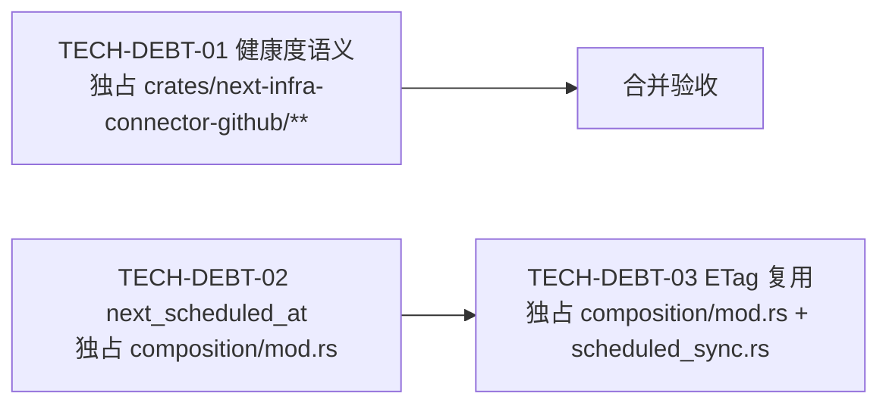

# TECH-DEBT 技术债任务拆解（2026-08-07）

**状态：** 三项全部 `DONE / ARCHIVED`（2026-08-07 验收通过）

## 完成记录

- **TECH-DEBT-01 健康度语义**：`Collector::finish()` 在 `primary_failure` 为 None 时返回 `SyncOutcome::Complete`（Full→`AuthoritativeFull` 覆盖、Targeted→`Targeted` 覆盖），有界纵切无截断/失败时健康度显示 healthy。
- **TECH-DEBT-02 next_scheduled_at**：`committed_query_context` 从 Scheduler 条目取 next_due；open 注册后 + 每次 tick 后刷新；Connectors 页"下次计划"显示真实时间。**修复实现期死锁**：driver tick 与 next_due 收集必须在同一 guard 内完成后再释放（std Mutex 不可重入），否则首次 tick 自锁挂死定时同步。
- **TECH-DEBT-03 ETag 复用**：`AppState` 持有 `Arc<GitHubConnector>` 单实例，建连/手动/定时全路径复用；同一次运行内第二次起未变化数据走 304 回放缓存（App 重启丢缓存为已知边界）。

验证基线：`cargo test --workspace` 358 passed；clippy/fmt/diff clean；前端 88 tests + build 通过。

## 并行调度结论



- **波次 1（并行）**：TECH-DEBT-01 与 TECH-DEBT-02 并行——文件所有权完全不重叠（01 只在 connector crate；02 只在 composition）。
- **波次 2（串行）**：TECH-DEBT-03 在 02 之后——03 与 02 都改 `composition/mod.rs`，遵守单写规则必须串行（02 较小，先完成）。
- 若用户更偏好最大并行度，可合并 02+03 为单一"Desktop 组合层"任务，与 01 并行。

---

## TECH-DEBT-01：GitHub 健康度语义（有界视图完整 = Healthy）

- **Status:** `READY-DESIGN`
- **Objective:** 当一次 GitHub 同步的有界纵切**没有**任何模块触达上限/失败时，返回 `SyncOutcome::Complete`，使 composition 现有映射（Partial→Degraded，否则→Healthy）自然给出 Healthy。小范围连接不再永远显示"降级"。
- **Dependencies:** 无（connector crate 自洽；`SyncOutcome::Complete` 已有 ssh 先例）。
- **Exclusive ownership:** `crates/next-infra-connector-github/**`（connector.rs、descriptor.rs 及全部测试）。
- **Scope:**
  1. `Collector::finish()`：`primary_failure.is_none()` 时返回 `SyncOutcome::Complete { batch }`（含 `SyncCoverage::Complete`），不再兜底 `bounded_failure`；有模块 bounded/失败时维持 Partial + warnings。
  2. 更新受影响测试：connector.rs 单测（`full_vertical_*` 现在为 Complete：3 资源、无 failure；`child_permission_*`、304 缓存测试、targeted 测试按新语义调整）、`tests/connector_pipeline.rs`（首轮 sync 断言 Complete）、`tests/actions_contract.rs`（如涉及）。
  3. 验证 `outcome.validate_for(request)` 对 Complete 的契约约束（参照 ssh connector.rs:245 的用法）。
- **Non-goals:** 不改 composition 健康映射；不改 warnings/errors 机制；不改有界预算与截断逻辑本身；不把"触达上限"误判为 Complete。
- **Outputs:** connector 行为变更 + 测试更新；运行记录在 Complete 时无 bounded warnings。
- **Acceptance:** 选中仓库无截断/失败时，同步运行状态 `succeeded`（Complete）、连接健康度 `healthy`；存在截断/失败时仍为 partial/degraded 且有 warnings。
- **Verification:** `rtk cargo test --workspace`、clippy `-D warnings`、fmt、`git diff --check`；前端 `lint/test/build`（如 UI 测试引用健康度，同步更新）。
- **Stop rule:** 若 `SyncOutcome::Complete` 与 `SyncCoverage::Complete` 的契约校验与现有语义冲突（如 missing-evidence 语义依赖 Partial），停止回报，不改契约。

## TECH-DEBT-02：next_scheduled_at 展示（"下次计划"列显示真实时间）

- **Status:** `READY-DESIGN`
- **Objective:** QueryContext 的 `next_scheduled_at` 从 Scheduler 实际条目取值，Connectors 页"下次计划"列不再永远"未计划"。
- **Dependencies:** 无（P0-2 已提供 Scheduler 条目与 `QuerySchedule::new(interval, Option<Timestamp>)`）。
- **Exclusive ownership:** `apps/desktop/src-tauri/src/composition/mod.rs` + 其 `#[cfg(test)]`。
- **Scope:**
  1. `AppState::refresh_query_context()` 与 `AppState::open()`：构建 `QueryContextSnapshot` 时从 `runtime.scheduler().entries()` 取每连接 `next_due_at`，传入 `Some(...)`（保留 interval 与现有校验，`QuerySchedule::new` 语义确认）。
  2. open() 中注册调度条目后补一次 context refresh（首帧即有值）。
  3. 驱动线程在每次 tick 产生 due 计划后刷新 context（next_due 已推进）；tick 线程闭包在 composition 内，无需改 scheduled_sync.rs 纯逻辑。
  4. 更新 `composition_rehydrates_query_context_for_persisted_connections` 断言（`next_scheduled_at == None` → 有值）。
- **Non-goals:** 不改前端 ConnectorsPage 渲染（已支持 `nextScheduledAt` 展示）；不改 Scheduler/Runtime；不做倒计时。
- **Outputs:** SyncStatusDto.next_scheduled_at 为真实 next_due；UI"下次计划"显示时间。
- **Acceptance:** 建连后"下次计划"显示 ≈ now + 间隔；到期触发后推进到下一间隔；purge 后连接消失无残留。
- **Verification:** 同 01（desktop crate 测试 + workspace）。
- **Stop rule:** 若 `QuerySchedule::new` 的校验（如要求 next_scheduled_at ≥ evaluated_at）与调度语义冲突，停止回报。

## TECH-DEBT-03：跨运行 ETag 复用（共享 Connector 实例）

- **Status:** `READY-DESIGN`（依赖 02 完成）
- **Objective:** 定时/手动同步复用同一 `GitHubConnector` 实例，`page_cache`（ETag+页体）与 `route_cache` 跨运行存活，未变化数据走 304 复用缓存，不再每 15 分钟全量下载。
- **Dependencies:** TECH-DEBT-02（同文件单写）。
- **Exclusive ownership:** `apps/desktop/src-tauri/src/composition/mod.rs` + `scheduled_sync.rs`。
- **Scope:**
  1. `AppState` 新增字段 `github_connector: GitHubConnector<ReqwestGitHubTransport>`（Clone 已验证），`open()` 创建一次。
  2. `sync_github` / `spawn_github_sync`（scheduled_sync.rs）签名增加 connector 参数（Arc 或 clone 传入），所有触发路径（建连、手动、定时驱动）共用实例。
  3. 确认 `fetch_cached` 的 ETag 路径跨运行生效（第二次同步同端点发 `If-None-Match`，304 回放缓存页）。
  4. 补充/调整测试：scheduled_sync.rs 与 composition 测试适配新签名；新增"同一实例两次同步，第二组请求全部 304"的覆盖（现有 `second_full_sync_reuses_all_cached_pages_on_304` 是 connector 层，保留）。
- **Non-goals:** 不做 SQLite 持久化缓存（App 重启丢缓存，可接受并记录）；不改 discovery 的独立 client；不改预算/截断逻辑；不引入全局状态。
- **Outputs:** 同一次 App 运行期间，第二次起的同步对未变化数据全部 304。
- **Acceptance:** 连续两次手动同步，第二次 `provider_request_summary` 中 3xx 计数 = 端点数（全部 304），无新增资源版本；App 重启后首次同步全量（记录为已知边界）。
- **Verification:** 同 01；另外跑 connector 层 304 测试确认语义一致。
- **Stop rule:** 若共享实例与单飞守卫/并发产生死锁或数据竞争（如并发手动+定时同步触碰同一 Mutex 缓存），停止回报改设计。

---

## 合并验收（波次 2 后）

```bash
rtk cargo test --workspace
rtk cargo clippy --workspace --all-targets -- -D warnings
rtk cargo fmt --all -- --check
rtk git diff --check
rtk pnpm --dir apps/desktop lint && rtk pnpm --dir apps/desktop test && rtk pnpm --dir apps/desktop build
```

真实路径验证（用户在场）：重新建连小仓库 → 健康度 `healthy`（01）→ 连接器页"下次计划"显示时间（02）→ 连续两次手动同步第二次全 304（03）。

## 需用户确认

1. 按"波次 1 并行（01+02）→ 波次 2（03）"派发，还是合并 02+03 单任务并行 01？
2. 三个任务是否立即派发（各一个 worker，按 §4 派发协议）？
